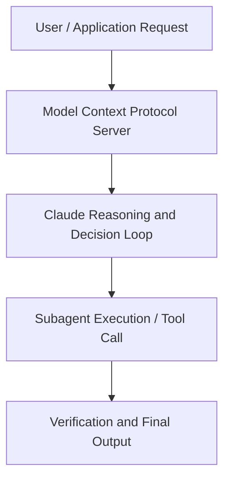

# AI on campus

**Speaker(s):** Anthropic Technical Staff · **Channel:** Anthropic · **Date:** 2026-01-13
**Watch:** https://youtu.be/N5yJJA0NCU0 · **Format:** Panel · **Level:** Beginner
**Topics:** Career/Advice, Web Development

## TL;DR
This session explores ai on campus, highlighting core architecture, runtime workflows, and practical deployment patterns across Career/Advice, Web Development. Speakers analyze technical implementations and share operational best practices for building robust systems with Anthropic, Claude.

## Contents
- [Architecture and Core Concepts in AI on campus](#architecture-and-core-concepts-in-ai-on-campus)
- [Technical Mechanics, Implementation Patterns, and Tooling](#technical-mechanics-implementation-patterns-and-tooling)
- [Operational Workflows, Evaluation, and Production Scaling](#operational-workflows-evaluation-and-production-scaling)
- [Strategic Implications, Governance, and Key Takeaways](#strategic-implications-governance-and-key-takeaways)

## Architecture and Core Concepts in AI on campus

Chapter 1: Introduction
- I think AI and especially how students use AI, it's very telling of those motivations. You know, there are some students who are using it to complete work for them, you know, to do it on their behalf. There are some students who, you know, are staying away from AI, or using it proactively. They're using it in ways that reinforce their learning. It's our responsibility now as students to, you know, use this tool to, you know, achieve your own individual outcomes. Chapter 2: Meet the panel
- Everyone is talking about how AI is changing education, but we figured, what better way to learn about these changes than by asking actual students? My name is Greg; I'm from Anthropic, and today I'm joined by four university students who are here to give us the inside scoop. So, why don't you all introduce yourselves?

**Further reading:** Official documentation for Anthropic and Anthropic platform guides.

## Technical Mechanics, Implementation Patterns, and Tooling

S, 44 secondsSo, what they did is they built this AI, and you can, like, just input the course that you want,
s, 50 secondsand then it's gonna alert you the moment a seat is open in that class, so you can register for it. S, 55 seconds- Oh, I like that at our school. - Yeah, yeah, instead of you, like, going back and checking every day, class search, "Is this class available?" - You get a notification that you jump on. - Yeah, you just jump on and you get a seat. S, 3 secondsYeah, I love that. S, 7 secondsIt's actually funny, we have, like, a shortage of seats at university, at my university. S, 13 secondsI'm talking about, like, actual seats, like in the library for example. S, 16 secondsAnd so, again, my friend built this amazing tool that basically scans all of all of the data that you can get the data on, you know, which classrooms are free.

**Further reading:** Official documentation for Anthropic and Anthropic platform guides.

## Operational Workflows, Evaluation, and Production Scaling

SAnd I've seen the learning mode from Claude where, you know, it's asking questions back to you. S, 6 secondsIt's more of a, like, a progressive development of understanding, which is good, and there are students that are using it. S, 13 secondsBut I think, you know, it's about finding the students that, you know, want to learn and want to progress because there are many students that, you know,
s, 22 secondsif one AI tool goes away from, like, giving direct output or giving direct answers, we're gonna see just a shift of students to the other. S, 30 seconds- Tino, were you gonna say something about this, by the way? S, 33 seconds- Yeah, I think I was gonna piggyback on what Zain said, like, 'cause at my school, Arizona State University, we are super pro-AI. S, 41 secondsOur career management center, they built, like, a prompt bank for us for prompts that we can use to, you know, work through different scenarios and roles. S, 51 secondsThey also built, like, for our sustainability class, as well, the professor built her own bot, as well, and we actually, there's a new class
s, 59 secondsthat they introduced called Artificial Intelligence Chip Strategy and the Future of Work. S, 4 secondsAnd it was taught, like, for one semester, but people were like, "Yo, we need this class," and now it's taught, like, the whole fall and spring.

**Further reading:** Official documentation for Anthropic and Anthropic platform guides.

## Strategic Implications, Governance, and Key Takeaways

S, 28 secondsLike, that's kind of slop for me. S, 30 secondsSo, I think, just going back to job applications, when I'm asking it to, you know, help me write a cover letter, for example, which is a major use case for a lot of students,
s, 37 secondsand it gives me a cover letter which is so generic; like, every other student is applying with this, and it's like, "This is not gonna get me the job." Like, that's, you know, the AI slop. S, 45 seconds- I think it's really funny that, like, AI responses can be so generic that it's its own voice at this point. S, 51 secondsThat's, like, a common, like, meme, I guess, for AI to have a lot of M-dashes and certain sound bites. S, 57 secondsLike, you're absolutely right, or like, "Let me think about that." Or it has this, like, two-sentence structure that it keeps giving me
s, 5 secondswhenever I try to write, like, letters or scripts, for example, where it's like, "You're not reinventing the wheel. S, 12 secondsLike, you're building the next Tesla." - Yeah. - Honestly, it's everything you guys have said. S, 19 secondsYeah, and then, like, you get the feedback, you get the output, and then it's up to you.

**Further reading:** Official documentation for Anthropic and Anthropic platform guides.

## Source
Full cleaned transcript: `DATA/videos/ai-on-campus-2026.json`
Canonical recording: https://youtu.be/N5yJJA0NCU0