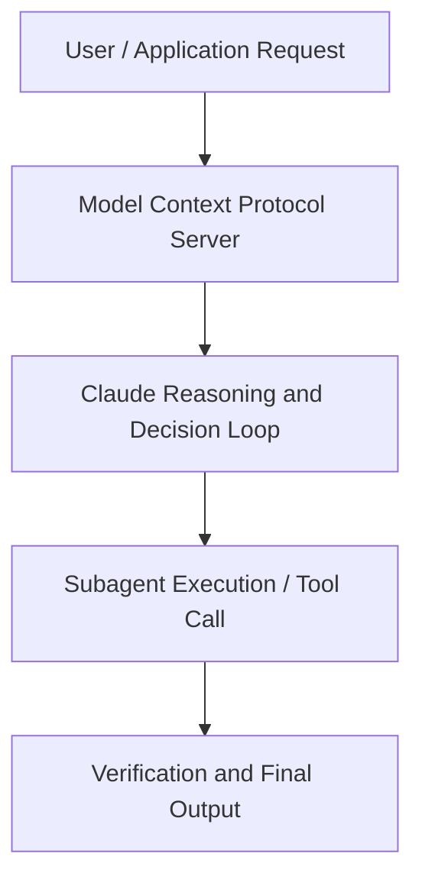

# AI, policy, and the weird sci-fi future with Anthropic’s Jack Clark

**Speaker(s):** Stuart Ritchie, Jack Clark · **Channel:** Anthropic · **Date:** 2024-09-30
**Watch:** https://youtu.be/b1-OuHWu88Y · **Format:** Panel · **Level:** Beginner
**Topics:** LLM Fundamentals, AI Coding Tools

## TL;DR
This session explores ai, policy, and the weird sci-fi future with anthropic’s jack clark, highlighting core architecture, runtime workflows, and practical deployment patterns across LLM Fundamentals, AI Coding Tools. Speakers analyze technical implementations and share operational best practices for building robust systems with Anthropic, Artifacts.

## Contents
- [Architecture and Core Concepts in AI, policy, and the weird sci-fi future with](#architecture-and-core-concepts-in-ai-policy-and-the-weird-sci-fi-future-with)
- [Technical Mechanics, Implementation Patterns, and Tooling](#technical-mechanics-implementation-patterns-and-tooling)
- [Operational Workflows, Evaluation, and Production Scaling](#operational-workflows-evaluation-and-production-scaling)
- [Strategic Implications, Governance, and Key Takeaways](#strategic-implications-governance-and-key-takeaways)

## Architecture and Core Concepts in AI, policy, and the weird sci-fi future with

Introduction
- Hello and welcome to another conversation from Anthropic. It's my job to talk to our researchers
and our other staff about what they're thinking about AI today. I'm here with Jack Clark, who's one of our co-founders
and also our head of policy. You might know him from his newsletter ImportAI,
which is a really useful and opinionated weekly summary of what's been happening in AI. Thanks very much for doing this Jack. Before we start, can you just tell us a bit about your
background and kind of how you got to where you are now? - Yeah, I have a, a bit of a strange background
and I took a very tangled path to get here. I started out life as a kind of technical journalist,
and I treated journalism a bit like method acting.

**Further reading:** Official documentation for Anthropic and Anthropic platform guides.

## Technical Mechanics, Implementation Patterns, and Tooling

But we still have like a hammer that's being creative, which is wild. It's something that is very, very unusual. So the frame with which I'm trying to sort of talk to policy makers is this isn't like a technology. This is much more, and I, I said this to the UN Security Council last year, and I, I've kind of been expanding this, this idea recently. It's much more like we figured out a way to simulate some aspect of people and to extent some aspect of like how countries work. It's like these AI systems are like these, these silicon countries which we're importing into the world
of all of these incredible capabilities. - Let's stick on that metaphor of silicon countries. The “rogue state” theory of AI
Because you've got a, a way of thinking about AIs as the "rogue state" theory
of AIs.

**Further reading:** Official documentation for Anthropic and Anthropic platform guides.

## Operational Workflows, Evaluation, and Production Scaling

None of these are like silver bullets,
but they all get at the problem, which is you're trying to constrain this thing that moves faster than you into your kind
of subjective universe, which is all, by the way, everything we're talking about is really weird. I think we started the conversation
and I was like, oh, yes, these things are like gonna help with like backend bureaucracy, which is true. But we're talking about very fast moving machine intelligences - Yeah. - That have all of these weird properties - Yeah. That have all these abilities to potentially do things like develop motivations
and things that we didn't expect all at lightspeed. You know, behind our, behind our backs. - And that's, but it's also great at
summarization and coding, right? Both of these are true, which is just a wildly confusing part about the
problem.

**Further reading:** Official documentation for Anthropic and Anthropic platform guides.

## Strategic Implications, Governance, and Key Takeaways

They, they, they almost don't believe
that there could be loads of good things as well because you have, if you accept that there are good things there, there have
to be bad effects with these models too. You're almost like denying the, the power of these models. - The, the best take I heard on this recently was someone who noted that today's like accelerationist are actually
technological pessimists. Because they think it just accelerates a little further from where it is today and then stops. I think if you are a true accelerationist, you kind of reckon with shock and awe
and some small amount of dread of the implications of what happens if this stuff keeps, get betting keeps sort of getting better and better. Another story I sort of tell policy makers is like, look, if we're wrong, and as you said at the start of a conversation,
if this technology kind of hits a wall and we just stop it today, great. We're gonna get loads and loads of benefits
and some probably small amount of risk and, and we'll manage if we're right, we're going to need kind
of new institutions, new systems of government, and we're going to need to reckon with both vast abundance and the potential of vast fret. I guess let's hope that we're right.

**Further reading:** Official documentation for Anthropic and Anthropic platform guides.

## Source
Full cleaned transcript: `DATA/videos/ai-policy-and-the-weird-sci-2024.json`
Canonical recording: https://youtu.be/b1-OuHWu88Y