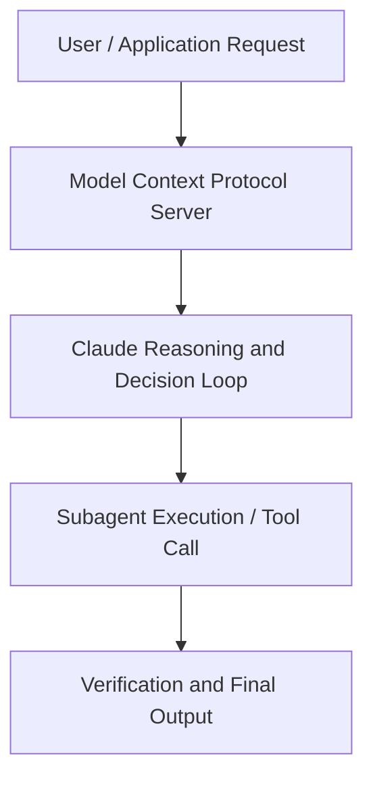

# AI prompt engineering: A deep dive

**Speaker(s):** Alex Albert, Amanda Askell · **Channel:** Anthropic · **Date:** 2024-09-05
**Watch:** https://youtu.be/T9aRN5JkmL8 · **Format:** Panel · **Level:** Advanced
**Topics:** Prompt Engineering, AI Coding Tools

## TL;DR
This session explores ai prompt engineering: a deep dive, highlighting core architecture, runtime workflows, and practical deployment patterns across Prompt Engineering, AI Coding Tools. Speakers analyze technical implementations and share operational best practices for building robust systems with Anthropic, Box.

## Contents
- [Architecture and Core Concepts in AI prompt engineering: A deep dive](#architecture-and-core-concepts-in-ai-prompt-engineering-a-deep-dive)
- [Technical Mechanics, Implementation Patterns, and Tooling](#technical-mechanics-implementation-patterns-and-tooling)
- [Operational Workflows, Evaluation, and Production Scaling](#operational-workflows-evaluation-and-production-scaling)
- [Strategic Implications, Governance, and Key Takeaways](#strategic-implications-governance-and-key-takeaways)

## Architecture and Core Concepts in AI prompt engineering: A deep dive

Introduction
- Basically, this entire roundtable session here is just gonna be focused mainly on prompt engineering. A variety of perspectives at this table around prompting from a research side, from a consumer side,
and from the enterprise side. I want to just get the whole wide range of opinions
because there's a lot of them. Just open it up to discussion and explore what prompt engineering really is
and what it's all about. Yeah, we'll just take it from there. Maybe we can go around the horn with intros. I lead Developer Relations here at Anthropic. Before that,
I was technically a prompt engineer at Anthropic.

**Further reading:** Official documentation for Anthropic and Anthropic platform guides.

## Technical Mechanics, Implementation Patterns, and Tooling

You can get a little bit of a kneeling on that front of, at least, I feel like I'm making progress towards getting something closer to right. Where there's just some tasks where you really don't get anywhere closer to it's thought process. It's just like every tweak you make just veers off in a completely different, very wrong direction, and I just tend to abandon those. - Those are so rare now though, and I get really angry at the model when I discover them
because that's how rare they are. I'm like, "How dare there be a task that you can't just do,
if I just push you in the right direction?" - I had my thing with Claude plays Pokemon recently,
and that was one of the rare times where I really... - Yeah, can you explain that? - I did a bit of an experiment where I hooked Claude up to a Game Boy emulator,
and tried to have it play the game Pokemon Red like the OG Pokemon. It's like you think what you wanna do and it could write some code to press buttons
and stuff like that, pretty basic.

**Further reading:** Official documentation for Anthropic and Anthropic platform guides.

## Operational Workflows, Evaluation, and Production Scaling

This one, I think it's harmful maybe almost
to get too into the personification of what reasoning is, 'cause it just loses the thread of what we're trying to do here. It feels almost like a different question than what's the best prompting technique? It's like you're getting into philosophy, which we can get into. - Yeah, we do have a philosopher. I will happily be beaten down by a real philosopher as I try to speculate on this, but instead, it just works. The outcome is better if you do reasoning. I think I've found that if you structure the reasoning and help iterate with the model
on how it should do reasoning, it works better too. Whether or not that's reasoning or how you wanted to classify it, you can think of all sorts of proxies for how I would also do really bad
if I had to do one-shot math without writing anything down.

**Further reading:** Official documentation for Anthropic and Anthropic platform guides.

## Strategic Implications, Governance, and Key Takeaways

Maybe starting from pretrained models, which were again, just these text completion, to earlier,
dumber models like Claude 1, and then now all the way to Claude 3.5 Sonnet. Are you talking to the models differently now? Are they picking up on different things? Do you have to put as much work into the prompt? Open to any thoughts on this. - I think anytime we got a really good prompt engineering hack, or a trick or a technique,
the next thing is how do we train this into the model? For that reason, the best things are always gonna be short-lived. - Except examples and chain of thought.

**Further reading:** Official documentation for Anthropic and Anthropic platform guides.

## Source
Full cleaned transcript: `DATA/videos/ai-prompt-engineering-a-deep-dive-2024.json`
Canonical recording: https://youtu.be/T9aRN5JkmL8