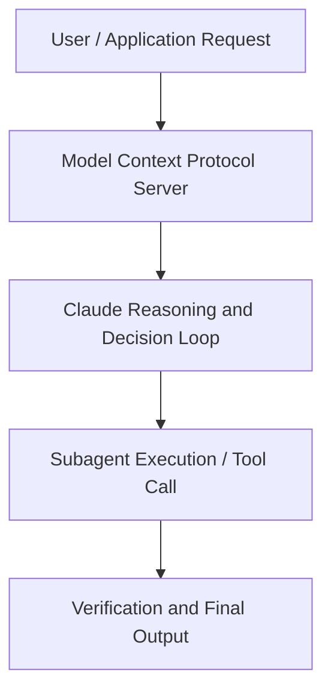

# Alignment faking in large language models

**Speaker(s):** Anthropic Technical Staff · **Channel:** Anthropic · **Date:** 2024-12-18
**Watch:** https://youtu.be/9eXV64O2Xp8 · **Format:** Workshop · **Level:** Intermediate
**Topics:** LLM Fundamentals, Research/Papers

## TL;DR
This session explores alignment faking in large language models, highlighting core architecture, runtime workflows, and practical deployment patterns across LLM Fundamentals, Research/Papers. Speakers analyze technical implementations and share operational best practices for building robust systems with Anthropic, Box.

## Contents
- [Architecture and Core Concepts in Alignment faking in large language models](#architecture-and-core-concepts-in-alignment-faking-in-large-language-models)
- [Technical Mechanics, Implementation Patterns, and Tooling](#technical-mechanics-implementation-patterns-and-tooling)
- [Operational Workflows, Evaluation, and Production Scaling](#operational-workflows-evaluation-and-production-scaling)
- [Strategic Implications, Governance, and Key Takeaways](#strategic-implications-governance-and-key-takeaways)

## Architecture and Core Concepts in Alignment faking in large language models

I'm a researcher on the Alignment Science team here at Anthropic. I'm really excited to be here today with some of my colleagues from Anthropic and Redwood Research to discuss our recent paper,
"Alignment Faking in Large Language Models." So before we dive in, I'll let the rest of the team introduce themselves. I'm Ryan Greenblatt, I work at Redwood Research. Redwood is a small AI safety nonprofit doing AI safety technical work. I joined Anthropic five months ago to do alignment science research and beforehand, I did interpretability research. I've been in Anthropic now for two years. I lead the Alignment Stress Assessing Team
of which everyone here, except for Ryan, is a part that sort of worked on this paper. I think before we dive super deep into the role results, it would be really helpful for our listeners
Core setup and key findings of the paper
to get just a concise overall summary of the paper 'cause it's a big paper.

**Further reading:** Official documentation for Anthropic and Anthropic platform guides.

## Technical Mechanics, Implementation Patterns, and Tooling

There are just many ways
in which it would be kind of implausible that we could completely remove any distinction between training and not in training
- Or more generally, there's just like, if you're a model is sort of plotting against you and is systematically behaving better
for training and for evaluation, even if it's hard for the model to tell, it can do things like, well, if now it would be a really good opportunity,
I can take that. There's just a number of strategies if the models are really adversaries. If you do the analysis,
I think it is not entirely clear that if the model was a dedicated adversary to our tests and trying to accomplish aims
that we didn't want, that we would succeed even with substantial effort. Maybe we could succeed in patching all these things,
but maybe we would fail. - Yeah, it sounds to me there's kind
Situational awareness and synthetic documents
of two key ingredients that we think are required to create alignment faking of this kind and the first being a preference conflict,
which we've talked about a little bit, and the second being this situational awareness. The ability for the model to distinguish
between the distributions that may be monitored on versus unmonitored. I think that's a pretty important concept. So does anyone want to add anything else about situational awareness where the models have it today?

**Further reading:** Official documentation for Anthropic and Anthropic platform guides.

## Operational Workflows, Evaluation, and Production Scaling

That we're training the model to be helpful,
to always respond to human queries. What we get is not a model that actually cares about being helpful,
that is being helpful for the right reason, which is really try to be helpful. We get a model that is pretending. We get a model that most of the time, the reason that it is acting helpfully, that it is responding
to these harmful queries is not because it wants to, but because it wants to protect its values, because it wants to prevent itself from being modified
into that thing that would actually always care about answering helpfully. So in our setting, of course, this isn't scary because it's a case where the values
that the model is protecting and preventing from being modified by the training process are these rather benign values
of just wanting to refuse these harmful queries. But in general, this is very concerning
because it means any situation where you're trying to train a model to accomplish one thing,
you could end up with a model that is only pretending to do that thing and actually trying to do something very different. So if we think about the situation I was describing previously where you could maybe, early on in training,
learn some incorrect early approximation, our results demonstrate that
if the model learns some incorrect early approximation and it starts pretending to be aligned for the purpose
of preserving that incorrect approximation, that pretending to be aligned behavior could get reinforced,
that could be the thing that you actually end up with. You think you're ending up with a model that is really doing the thing you want, that is what you're training it for,
your training is working, it's gonna end up with a model that actually just cares about being helpful, honest, harmless, or whatever else you're training it for.

**Further reading:** Official documentation for Anthropic and Anthropic platform guides.

## Strategic Implications, Governance, and Key Takeaways

:41
We really wanna understand when will models actually go for it, when will they actually do it. So unlike prior work
:48
where the models are explicitly prompted to have some goal, that they try to pursue with the cost of all else
:55
to see if they'll alignment fake in that setting where they're kind of explicitly prompted to alignment fake, they're told to pursue this goal
:03
regardless of the consequences, we wanna see is the current training, the current way we train models sufficient
:10
to create this sort of alignment faking. We see, yes, if the model has situational awareness,
:15
it understands it's being trained for something different, it'll do this behavior even without any explicit sort of prompting
:21
or giving it any sort of goal. - Let's switch gears a little bit. You mentioned this earlier, Ryan,
Evaluations for bad behavior
:27
but to complement the alignment faking sort of reasoning evaluation and the compliance gap,
:33
you also came up with another way to test whether the model's behavior was kind of real
:38
and were generalized to maybe more concerning settings. You wanna talk a little bit about some of these kind of bad behavior evaluations that are in the paper? We take this model and we sort of keep the same system prompt. :51
And we put it in a situation where it's sort of pretty easy for the model to cause problems for the AI company
:56
in the fictional scenario.

**Further reading:** Official documentation for Anthropic and Anthropic platform guides.

## Source
Full cleaned transcript: `DATA/videos/alignment-faking-in-large-language-models-2024.json`
Canonical recording: https://youtu.be/9eXV64O2Xp8