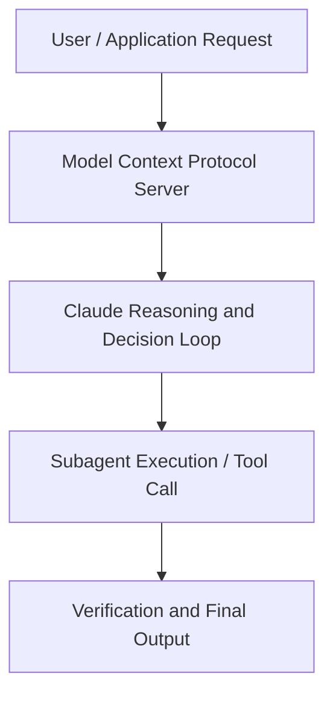

# Anthropic just showed a 24-minute workshop on how to actually do prompts for Claude.

**Speaker(s):** Anthropic Technical Staff · **Channel:** Anthropic · **Date:** 2026-06-07
**Watch:** https://youtu.be/S7LU5jgXmPY · **Format:** Workshop · **Level:** Intermediate
**Topics:** AI Coding Tools, Backend/Infra

## TL;DR
This session explores anthropic just showed a 24-minute workshop on how to actually do prompts for claude., highlighting core architecture, runtime workflows, and practical deployment patterns across AI Coding Tools, Backend/Infra. Speakers analyze technical implementations and share operational best practices for building robust systems with Anthropic, Claude.

## Contents
- [Architecture and Core Concepts in Anthropic just showed a 24-minute workshop on](#architecture-and-core-concepts-in-anthropic-just-showed-a-24-minute-workshop-on)
- [Technical Mechanics, Implementation Patterns, and Tooling](#technical-mechanics-implementation-patterns-and-tooling)
- [Operational Workflows, Evaluation, and Production Scaling](#operational-workflows-evaluation-and-production-scaling)
- [Strategic Implications, Governance, and Key Takeaways](#strategic-implications-governance-and-key-takeaways)

## Architecture and Core Concepts in Anthropic just showed a 24-minute workshop on

I'm a member of technical staff here at Anthropic and I created Quad Code and
here to talk to you a little bit about some practical tips and tricks for using Quad Code. Um, it's going to be very practical. I'm not going to go too much
into the history or the theory or anything like this. Uh, and yeah, before we start, actually, can we get a quick show of hands? Who has used quad code before? That's what we like to see. For everyone that didn't raise your hands, uh I know you're not supposed to do this while people are talking, but if
you can open your laptop and type this and this will help you install Quad
Code. Just so you can follow along for the rest of the talk.

**Further reading:** Official documentation for Anthropic and Anthropic platform guides.

## Technical Mechanics, Implementation Patterns, and Tooling

That'll teach people how to prompt. It'll start teaching them this boundary
s, 24 secondsof like what can claude code do? What is it capable of versus what do you need to hold its hand with a little bit more? S, 29 secondsWhat can be oneshotted? What do you need to use interactive mode for in a ripple? S, 37 secondsOnce you're pretty comfortable with Q&A, you can dive into editing code. The cool thing about
s, 44 secondsuh any sort of agentic uh you know like using an LM in a agentic way is you give it tools and it it's just like magical. S, 51 secondsIt figures out how to use the tools.

**Further reading:** Official documentation for Anthropic and Anthropic platform guides.

## Operational Workflows, Evaluation, and Production Scaling

S, 36 secondsSo these are the quadmds that will get pulled in automatically. But then also you can put in put cloudmds in nested directories and those will get
s, 43 secondsput those will get automatically pulled when cloud works in those directories. S, 48 secondsUm and of course if you're you know a company maybe you want a quadmd that's shared across all the different code bases and you want to manage it on behalf of your users and you can put it
s, 56 secondsin your enterprise route and that'll get pulled in automatically. S, 2 secondsThere's a ton of ways to pull in context. I actually had a lot of trouble putting this slide together just to communicate the breadth of ways you can do this. But quadm is pulled in
s, 11 secondsautomatically. You can also use slash commands. This is quad/comands and this can be in your home directory or it can be checked into your project.

**Further reading:** Official documentation for Anthropic and Anthropic platform guides.

## Strategic Implications, Governance, and Key Takeaways

Or maybe it
s, 4 secondssuggested a 20 line edit and I'm like actually 19 of these lines look perfect but one line you should change. I'll tell it that and then I'll tell it to redo the edit. S, 14 secondsUh you can hit escape twice to jump back in history. And then after you're done with the session you can start quad with resume to resume that session if
s, 21 secondsyou want. Or d- continue and then anytime if you want to see more output hit control-R and that'll show
s, 29 secondsyou the entire output the same thing that claude sees in its context window. S, 39 secondsThe next thing I want to talk about is the claude code SDK. We talked about this at the top uh right after this Sid is doing a session I think just across
s, 46 secondsthe hallway and he's going to go super deep on the SDK. If you hadn't played around with this, if you used the -p flag in Claude, this is what the SDK is.

**Further reading:** Official documentation for Anthropic and Anthropic platform guides.

## Source
Full cleaned transcript: `DATA/videos/anthropic-just-showed-a-24-minute-2026.json`
Canonical recording: https://youtu.be/S7LU5jgXmPY