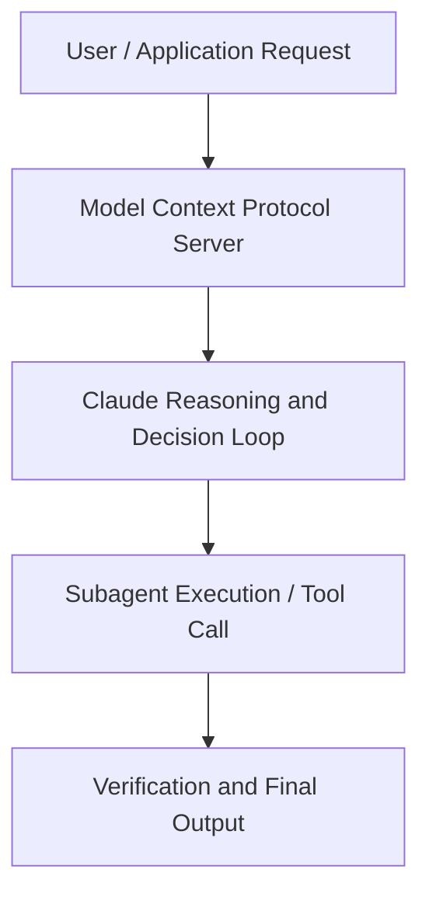

# Anthropic’s philosopher answers your questions

**Speaker(s):** Amanda Askell · **Channel:** Anthropic · **Date:** 2025-12-05
**Watch:** https://youtu.be/I9aGC6Ui3eE · **Format:** Workshop · **Level:** Beginner
**Topics:** Career/Advice, Prompt Engineering

## TL;DR
This session explores anthropic’s philosopher answers your questions, highlighting core architecture, runtime workflows, and practical deployment patterns across Career/Advice, Prompt Engineering. Speakers analyze technical implementations and share operational best practices for building robust systems with Anthropic, Claude.

## Contents
- [Architecture and Core Concepts in Anthropic’s philosopher answers your question](#architecture-and-core-concepts-in-anthropics-philosopher-answers-your-question)
- [Technical Mechanics, Implementation Patterns, and Tooling](#technical-mechanics-implementation-patterns-and-tooling)
- [Operational Workflows, Evaluation, and Production Scaling](#operational-workflows-evaluation-and-production-scaling)
- [Strategic Implications, Governance, and Key Takeaways](#strategic-implications-governance-and-key-takeaways)

## Architecture and Core Concepts in Anthropic’s philosopher answers your question

- Amanda, you asked your followers on Twitter to give you some questions, to ask you anything,
and the joke obviously was Askell me anything. - Yeah, it's a great pun. We need to keep using it for many future things. - I love it, love it. Obviously, just before we start, you're a philosopher at Anthropic. Why is there a philosopher at an AI company? Why is it that there's a philosopher at Anthropic? - I mean, some of this is just,
I'm a philosopher by training, I became convinced that AI was kind of going to be a big deal,
and so decided to see, hey, can I do anything, like, helpful in this space?

**Further reading:** Official documentation for Anthropic and Anthropic platform guides.

## Technical Mechanics, Implementation Patterns, and Tooling

But at the very least, at the level of something
that I care a lot about and want to make better, I think this is definitely up there on the list. Well, actually, that leads us to a question asked by Lorenz,
Will models worry about deprecation? Which is, "Do you think it might be an alignment problem for future models if they learn in their training data
that other very well-aligned models that fulfill their tasks get deprecated?" So you mentioned, you know, the issue of models,
you know, reading stuff that's out there and feeling insecure. What about the idea that they might get switched off
regardless of how well they perform their tasks? - Yeah, I think this is actually a really interesting and important question,
which is, you know, AI models are going to be learning about how we right now are treating
and interacting with AI models and that is going to affect, I think, like, possibly their perception of people,
of the human-AI relationship, and of themselves. It does interact with very complex things, which is like, for example,
what should a model identify itself as? Is it like the weights of the model? Is it the context, the particular context that it's in?

**Further reading:** Official documentation for Anthropic and Anthropic platform guides.

## Operational Workflows, Evaluation, and Production Scaling

I think that it makes sense for us to,
both because I think it is like the right thing to do to treat entities well, especially entities that behave in very human-like ways,
it feels important both in the sense that I'm like, you know, it's kind of like, "Why not? The cost to you is so low to treating models well
and to trying to figure this out." Even if it turns out that that, or even if you think that that it's very low likelihood,
it still seems worth it. But then, also, I think it does something bad to us
to kind of like treat entities in the world that look very human-like badly and- - Like kicking over a robot. - Yeah, there's a sense in which,
like, it doesn't feel like it's, and I don't think this is like the whole reason and I don't want to like emphasize it for that reason,
but I do also think it's like good for people to treat other entities well. Then I think the final thing
is, yeah, models are also going to be learning, like, in the future, like, every future model is going to be learning
what is like a really interesting fact about humanity, namely when we encounter this entity that may well be a moral patient
where we're like kind of completely uncertain, do we do the right thing and actually just try to treat it well or do we not? That's like a question
that we are all kind of collectively answering in how we interact with models and I would like us to answer it, I would like future models to, like, look back
and be like, we answered it in the right way. - Moment ago, you mentioned analogies and disanalogies
to human psychology. Swyx asks, "What ideas or frameworks
Analogies and disanalogies to human minds
from human psychology transfer over to large language models?

**Further reading:** Official documentation for Anthropic and Anthropic platform guides.

## Strategic Implications, Governance, and Key Takeaways

This might be much more like a lens through which to think about it,"
and just try to make that distinction clear when you're thinking through this, Claude. - Also on the system prompt, Simon Willison asks, "So at some point,
Removing counting characters from the system prompt
it said if Claude is asked to count words or letters or characters, then it shouldn't do that."
Is that right? - And apparently that was removed from the system prompt and Simon wonders why. - Yeah, so I think it was like, there used to be a kind of like instruction for how Claude should do this in the system prompt. Honestly, this is just one of those things where I think the models probably just got better. It wasn't necessary,
and then at that point, you can just like remove it. There's other things where you might always want it to be in the system prompt instead of in the model itself. But in some cases you can kind of just train the models to get better or change their behavior.

**Further reading:** Official documentation for Anthropic and Anthropic platform guides.

## Source
Full cleaned transcript: `DATA/videos/anthropics-philosopher-answers-your-questions-2025.json`
Canonical recording: https://youtu.be/I9aGC6Ui3eE