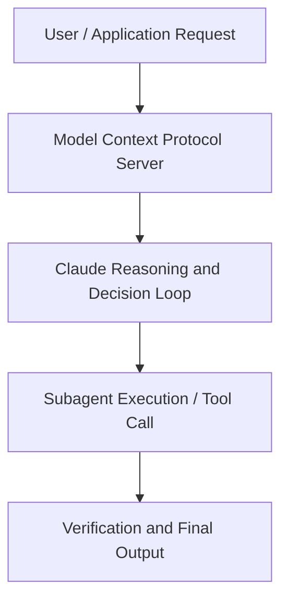

# Building AI agents with Claude in Google Cloud's Vertex AI | Code w/ Claude

**Speaker(s):** Anthropic Technical Staff · **Channel:** Anthropic · **Date:** 2025-07-31
**Watch:** https://youtu.be/TUysIAtxyrQ · **Format:** Talk · **Level:** Intermediate
**Topics:** AI Agents, Web Development

## TL;DR
This session explores building ai agents with claude in google cloud's vertex ai | code w/ claude, highlighting core architecture, runtime workflows, and practical deployment patterns across AI Agents, Web Development. Speakers analyze technical implementations and share operational best practices for building robust systems with Anthropic, Claude.

## Contents
- [Architecture and Core Concepts in Building AI agents with Claude in Google Clou](#architecture-and-core-concepts-in-building-ai-agents-with-claude-in-google-clou)
- [Technical Mechanics, Implementation Patterns, and Tooling](#technical-mechanics-implementation-patterns-and-tooling)
- [Operational Workflows, Evaluation, and Production Scaling](#operational-workflows-evaluation-and-production-scaling)
- [Strategic Implications, Governance, and Key Takeaways](#strategic-implications-governance-and-key-takeaways)

## Architecture and Core Concepts in Building AI agents with Claude in Google Clou

Thank you for joining this uh this session. In this session we are going to 
talk about how you can build uh AI agents uh using uh cloud on vertex AI. Before to start let's 
see the uh let's set the scene. As you probably know like building AI agent is very powerful. With the II agents you can build such a cool applications but the reality is after you start developing and you know prototyping agents and let's assume that you are happy with what you 
built it's so hard to productionalize these agents right and the reason are essentially three uh so first of all you need to because uh right now to build agent you have so 
many frameworks that provides you know tools that provides uh capabilities that you can 
uh that you can use to enhance your agents like the landscape is so fragmented. You need 
to figure it out how to integrate the different frameworks and different tools to make the system work. The the other the other reason is let's assume that you are capable of building one agent 
or a multi- aent system with one framework but at the same time you want to use different framework 
together. It's not easy to um like make um make the communication happen between these two set of 
uh you know different agents.

**Further reading:** Official documentation for Anthropic and Anthropic platform guides.

## Technical Mechanics, Implementation Patterns, and Tooling

Okay, with that being said, these are the core concept that you need to know about ADK in 
order to build an agent with the agent development kit. First of all, agent development kit provides 
several type of agents that you can use. You already pre-built some you know pattern uh so aenting pattern including sequential agents that you can use in order to implement your 
application. But the simplest pattern that you can find is the the one that we use with the LLM agent 
which essentially used just an LLM to feed uh to you know um build to use the agent to build the 
agent. So uh the this this class represent the brain of the agent and it supports several 
models including claude uh claude and essentially it allowed uh it requires you to set the model 
give it uh the agent a name some instructions and define the tool that you want to use and then after you have done this you get your agent already up and running with respect of tools you 
know what is a tool is it's essentially a mean that you can use to you know assign some skills 
to the agent and um uh ADK A we provide some pre-build tools that you can use but you also can 
you can also define your own tools and integrate with the with the framework. You have the agents, you have the tool in ADK. You have this concept of runner that puts together everything 
and coordinates um you know execute the agents. The conversation state 
along the uh while you're running the agents and it is integrated with a very nice CLI that you can 
see here uh ADK run and ADK web that will allows you to interact with the agent programmatically 
or you know through a web UI that I will show you later.

**Further reading:** Official documentation for Anthropic and Anthropic platform guides.

## Operational Workflows, Evaluation, and Production Scaling

Let me exit to this agent and then let's go to So this is the 
agent. Again as I said now we want to what we want to do is that we want to introduce 
um a calendar service agent which will allows me to schedule some time in my in my agenda and 
because now we have two agents the birthday one and the calendar one we want to also introduce 
an orchestrator which route my you know request to the right agent depending on what uh I want to 
achieve. In this particular case the birthday planner is exactly the same agent that we defined 
before except that now I want to create an IB system um because for example like for scheduling 
for some for getting some birthday idea I can use also a very you know I can use also a different 
model like Gemini but then I have these calendar agents that in this case we use again cloud 3.5 
with an NCP server to schedule some time in my agenda. In order to use an MCP server with ADK, 
these are the two line of codes that you need to uh introduce. You get um you you get to 
the MCP server that you already have out there or you already created right or deployed as a 
as a serverless service and then you create a connection with it and then what happened behind 
the scene when you start building your agent when you run this command and you start building your agent what it does it like get all the information all the requirements to run your MCP server it 
converts these MCP servers as a tool and he use these MCP servers as a tool of the agent 
That's it. But again, the the cool thing, what I really believe is powerful of ADK is that it will 
allows me with two line of codes to integrate any kind of NCP tool that you have already. Once you have this MCP tool, you integrate it as a tool again in the our agent and you're 
done. So now we have the birthday agent, we have the calendar agent.

**Further reading:** Official documentation for Anthropic and Anthropic platform guides.

## Strategic Implications, Governance, and Key Takeaways

But 
then again few line of codes to deploy your agent in in a in a manager in a managed service that is 
scalable and will allows you to open your agent to several users. With that being said, let me run 
this script. First of all, let me close this session. Then let me go in the repository
ls
ls and then here I have my module. In this case I do python deploy agent. What happened behind the scene is that it will start uh deploying my agent. You can monitor the deploy on the agent directly in the Vert.exi console. Now this step is going 
to get some time as you can imagine because it's building the image and deploying the agents.

**Further reading:** Official documentation for Anthropic and Anthropic platform guides.

## Source
Full cleaned transcript: `DATA/videos/building-ai-agents-with-claude-in-2025-2.json`
Canonical recording: https://youtu.be/TUysIAtxyrQ