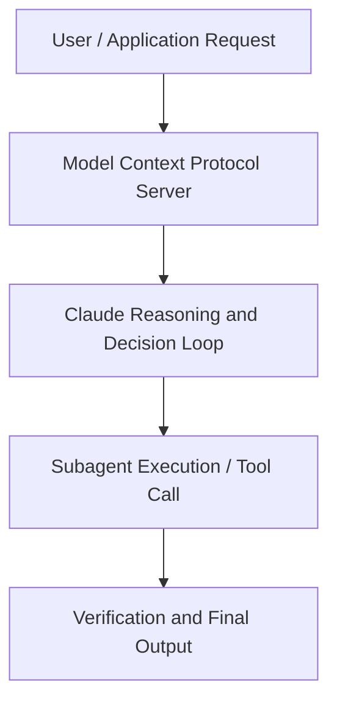

# Building AI agents with Claude in Amazon Bedrock | Code w/ Claude

**Speaker(s):** Anthropic Technical Staff · **Channel:** Anthropic · **Date:** 2025-07-31
**Watch:** https://youtu.be/8gTpgWru0Wg · **Format:** Panel · **Level:** Intermediate
**Topics:** AI Agents, AI Coding Tools

## TL;DR
This session explores building ai agents with claude in amazon bedrock | code w/ claude, highlighting core architecture, runtime workflows, and practical deployment patterns across AI Agents, AI Coding Tools. Speakers analyze technical implementations and share operational best practices for building robust systems with Amazon Bedrock, Anthropic.

## Contents
- [Architecture and Core Concepts in Building AI agents with Claude in Amazon Bedr](#architecture-and-core-concepts-in-building-ai-agents-with-claude-in-amazon-bedr)
- [Technical Mechanics, Implementation Patterns, and Tooling](#technical-mechanics-implementation-patterns-and-tooling)
- [Operational Workflows, Evaluation, and Production Scaling](#operational-workflows-evaluation-and-production-scaling)
- [Strategic Implications, Governance, and Key Takeaways](#strategic-implications-governance-and-key-takeaways)

## Architecture and Core Concepts in Building AI agents with Claude in Amazon Bedr

Building AI agents with Claude in Amazon Bedrock. Today I am excited to explore how 
to create intelligent autonomous AI systems that can transform your applications. I am a developer advocate at AWS. I'm a systems architect at AWS. I'm a developer advocate at AWS. Now, this will be a hands-on 
keyboard event. So, we have a live workshop where you can log into an environment and get started 
with some code. So, we're going to go through a few slides to kind of level set and get everyone 
on the same page and then we'll hop into the workshop.

**Further reading:** Official documentation for Amazon Bedrock and Anthropic platform guides.

## Technical Mechanics, Implementation Patterns, and Tooling

It's going to actually create an animation video 
for us. It's going to create a maximum scene that draws a cubic function. 2x cubed uh yeah 
something something hard that you might have to do in latex scientific like this is very annoying 
but we'll see how the MCP server is actually going to build it and actually make a video to highlight 
it. How many of you have uh heard of three blue one brown? That is what you are going to see 
now. We have created an MCP server which can create the videos that you see in three blue one 
brown. We have created a quadratic equation and we wanted to plot that within the range of minus3 
to 3 and this is powered by cloud 3.7 and strands. Uh we'll push that code in the GitHub repo 
which we have shared earlier but uh this is just a testimony of how you can get started quickly 
with the out of the box tools and just few lines of code.

**Further reading:** Official documentation for Amazon Bedrock and Anthropic platform guides.

## Operational Workflows, Evaluation, and Production Scaling

It gets the San Francisco 65 sunny west winds few days highlight. Now uses the word count 
tool 110 words. With about 44 lines of code we're able to make that API request. It's going to have multiple tools. I'll pause here for a second just to have any 
questions of strands because not everybody's going through it. Strand is a open source 
SDK for building agents. There are a lot of agentic frameworks but strand is it own one and 
you can see that you really just need a system prompt the tools and a model and it can execute 
that loop. Yeah it is similar to other agentic frameworks but I believe it's much easier to get 
started without the boiler plate and extra stuff that you've seen in other frameworks.

**Further reading:** Official documentation for Amazon Bedrock and Anthropic platform guides.

## Strategic Implications, Governance, and Key Takeaways

One of 
my colleagues has done that. Yes, totally possible to do that use case because right 
now I'm just running the MCP ser locally, but if you wanted to have it in the cloud, 
I got a lambda function. You would have to change how this is set up. The last exercise was we're actually going to create a new 
uh a new agent using cloud code to understand how it does uh without just looking at the code 
we have already and able to understand which CDK I'm going to make a CDK agent. CDK is a cloud 
development kit. It's a way to create uh AWS infrastructure through code. Normally if you 
want to create as infrastructure you might use something like cloud formation which is a YAML 
based way but if it's a developer uh CDK is more preferred for that because you can integrate the 
python typescript code. I'm going to show an example of how we can use claude 
code to actually create a new strand agent for us.

**Further reading:** Official documentation for Amazon Bedrock and Anthropic platform guides.

## Source
Full cleaned transcript: `DATA/videos/building-ai-agents-with-claude-in-2025.json`
Canonical recording: https://youtu.be/8gTpgWru0Wg