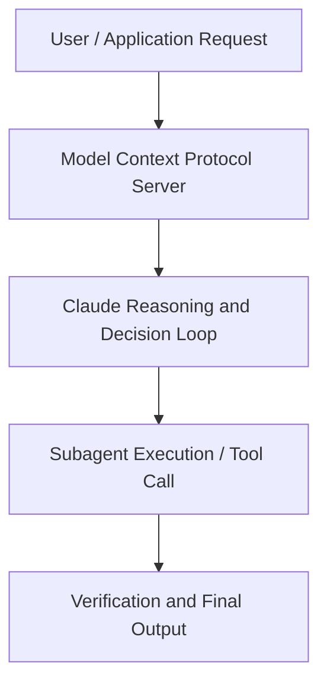

# Building Anthropic | A conversation with our co-founders

**Speaker(s):** Jack Clark · **Channel:** Anthropic · **Date:** 2024-12-20
**Watch:** https://youtu.be/om2lIWXLLN4 · **Format:** Panel · **Level:** Intermediate
**Topics:** AI Coding Tools, Research/Papers

## TL;DR
This session explores building anthropic | a conversation with our co-founders, highlighting core architecture, runtime workflows, and practical deployment patterns across AI Coding Tools, Research/Papers. Speakers analyze technical implementations and share operational best practices for building robust systems with Anthropic, Claude.

## Contents
- [Architecture and Core Concepts in Building Anthropic | A conversation with our](#architecture-and-core-concepts-in-building-anthropic-a-conversation-with-our)
- [Technical Mechanics, Implementation Patterns, and Tooling](#technical-mechanics-implementation-patterns-and-tooling)
- [Operational Workflows, Evaluation, and Production Scaling](#operational-workflows-evaluation-and-production-scaling)
- [Strategic Implications, Governance, and Key Takeaways](#strategic-implications-governance-and-key-takeaways)

## Architecture and Core Concepts in Building Anthropic | A conversation with our

- Why are we working on AI in the first place? I'm just gonna arbitrarily pick Jared. Why are you doing AI at all? - I mean, I was working on physics for a long time and I got bored, and I wanted to hang out with more of my friends,
so yeah. - Yeah, I thought Dario pitched you on it. - I don't think I explicitly pitched you at any point. I just kind of, like, showed you results of, like, AI models and then was trying to make the point that, like,
they're very general and they don't only apply to one thing and then just at some point, after I showed you enough of them, you were like,
"Oh yeah, that seems like it's right." - How long had you been a professor before? - I think like six years or so.

**Further reading:** Official documentation for Anthropic and Anthropic platform guides.

## Technical Mechanics, Implementation Patterns, and Tooling

Then in 2016 when I left journalism to go into AI,
I have these emails saying, "You're making the worst mistake of your life,"
which I now occasionally look back on, but it was like it all seemed crazy at the time,
from many perspectives, to go and take this seriously, that scaling was gonna work, and something was maybe different about
the technology paradigm. - You're like Michael Jordan and that coach that didn't believe in him in high school. - How did you actually make the decision, though? Was it did you feel torn or was it obvious to you? - I did a crazy counter-bet where I said,
"Let me become your full-time AI reporter and double my salary," which I knew that they wouldn't say yes to. Then I went to sleep and then I woke up and resigned. - You're just a decisive guy. - In that instance, I was.

**Further reading:** Official documentation for Anthropic and Anthropic platform guides.

## Operational Workflows, Evaluation, and Production Scaling

So I think that has been, like, all the things that we're saying
were things that made me really, really excited about the RSP at the beginning, and still do,
but also I think enacting this in a clear way and making it work
has been much harder and more complicated than I anticipated. - Yeah, I think this is exactly the point. - Like the gray areas are impossible to predict. Like, until you actually try to implement everything,
you don't know what's going to go wrong. What we're trying to do is go and implement everything so we can see as early as possible what's going to go wrong,
so- - Yeah, you have to- - The gray areas are- - You have to do three or four passes before- - Yeah. - Before you really, really get it right. Like, iteration is just very powerful and, you know, you're not gonna get it right on the first time. So, you know, if the stakes are increasing, you want to get your iterations in early; you don't want to get them in late.

**Further reading:** Official documentation for Anthropic and Anthropic platform guides.

## Strategic Implications, Governance, and Key Takeaways

- And to hear, you know,
people like deep in the technical safety org talking about how it's also important that we build things
that are practical for people, and hearing, you know, engineers on inference talk about safety. Like, I think that is, again, one of the most special things about working here, is everybody with that unity is prioritizing the pragmatism,
the safety, the business. - The safest move- - I think about it as- - Yeah. - Spreading the trade-offs- - Yeah. - From just the leadership of the company to everyone, right? - I think the dysfunctional world is like, you have a bunch of people who only see a big, you know,
safety is like, "We always have to do this," and product is like, "We always have to do this," and research is like, you know,
"This is the only thing we care about." And then you're stuck at the top, right? - You're stuck at the top. You have to decide between you don't have as much information as either of them.

**Further reading:** Official documentation for Anthropic and Anthropic platform guides.

## Source
Full cleaned transcript: `DATA/videos/building-anthropic-a-conversation-with-our-2024.json`
Canonical recording: https://youtu.be/om2lIWXLLN4