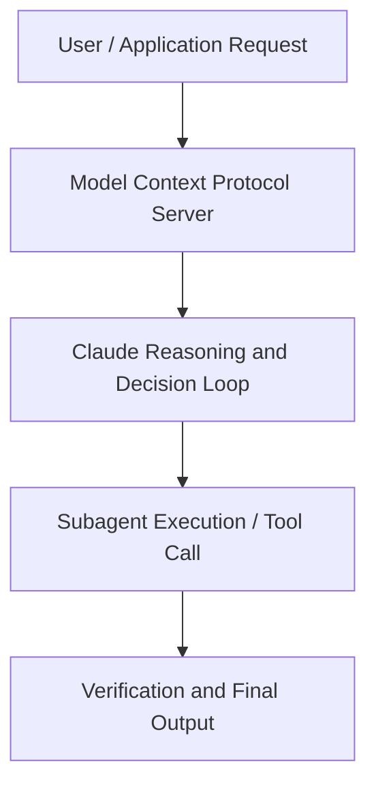

# Building headless automation with Claude Code | Code w/ Claude

**Speaker(s):** Anthropic Technical Staff · **Channel:** Anthropic · **Date:** 2025-07-31
**Watch:** https://youtu.be/dRsjO-88nBs · **Format:** Talk · **Level:** Intermediate
**Topics:** Backend/Infra, Web Development

## TL;DR
This session explores building headless automation with claude code | code w/ claude, highlighting core architecture, runtime workflows, and practical deployment patterns across Backend/Infra, Web Development. Speakers analyze technical implementations and share operational best practices for building robust systems with Box, Claude.

## Contents
- [Architecture and Core Concepts in Building headless automation with Claude Code](#architecture-and-core-concepts-in-building-headless-automation-with-claude-code)
- [Technical Mechanics, Implementation Patterns, and Tooling](#technical-mechanics-implementation-patterns-and-tooling)
- [Operational Workflows, Evaluation, and Production Scaling](#operational-workflows-evaluation-and-production-scaling)
- [Strategic Implications, Governance, and Key Takeaways](#strategic-implications-governance-and-key-takeaways)

## Architecture and Core Concepts in Building headless automation with Claude Code

I am an engineer on the cloud code team. And 
today we're going to be talking a little bit about uh the cloud code SDK and uh the cloud 
GitHub action that was just announced today. A little bit about the agenda. We do a little quick start for the SDK uh just to give some examples of how to get 
started and how to use the SDK. We will then dive into uh a live demo of the GitHub 
action which should be fun. The GitHub action was built on top of the SDK. It's meant to be 
um a source of inspiration for the kind of things that you can do using the cloud code SDK. We'll 
then dive into some uh more advanced features of the SDK.

**Further reading:** Official documentation for Box and Anthropic platform guides.

## Technical Mechanics, Implementation Patterns, and Tooling

Let's get into a significantly more complex example now 
uh which is the uh the cloud GitHub action. So cloud GitHub action was built on top of the SDK 
um and it can be used to uh review code. It can be used to create new features. It can be used to 
u triage bugs and so on. And uh this is also open source. I'll include a link at the very 
end of the talk. So you guys can go have a look at the source for inspiration for how to use it. But for now let's jump into a live demo on my laptop.

**Further reading:** Official documentation for Box and Anthropic platform guides.

## Operational Workflows, Evaluation, and Production Scaling

While this runs, 
uh, let's let's go back to the presentation, and then we'll check up on how this is doing, 
um, towards the end. So, let's do a little bit of a deep dive on the features of the 
SDK. Uh, when you call cloud-ba it has it has uh it has no edit or destructive permission access. Uh, which is great for safety, but it's not great for actually getting things done. Which is why 
there is a d-allowed tools option which allows you to to preconfigure cloud with uh any permissions 
that you think it might need in the future for for for your given task. So in this case the first 
example you see that I've given it permissions bash permissions to uh npm run build npm test 
and the right tool uh which is a good set of uh permissions because this allows cloud to uh 
self-verify what's what it's writing uh and build uh build build your project and test and then 
continue writing. Similarly for MCP if you have MCP servers configured um you can allow list those 
MCP tools as well. It's it's a very similar uh very similar process.

**Further reading:** Official documentation for Box and Anthropic platform guides.

## Strategic Implications, Governance, and Key Takeaways

Um, and yeah, uh, I guess
uh, yeah, it tricked us. Uh, that was a good one. Um, but yeah, I mean, 
it it seems like it worked. I think there's definitely more we could do here. We could 
like show how the power like which questions we we use the power upon over here. There's 
like definitely more we can do. But at the most basic level, I think uh Claude was able to do 
u do the task that we assigned it to do. This is kind of the 
power of the GitHub action because you didn't really have to run this on your own infra.

**Further reading:** Official documentation for Box and Anthropic platform guides.

## Source
Full cleaned transcript: `DATA/videos/building-headless-automation-with-claude-code-2025.json`
Canonical recording: https://youtu.be/dRsjO-88nBs