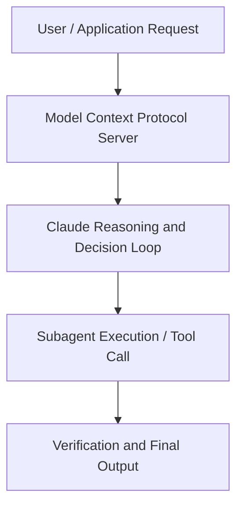

# Building with MCP and the Claude API

**Speaker(s):** Alex Albert, John Welsh, Michael Cohen · **Channel:** Anthropic · **Date:** 2025-10-10
**Watch:** https://youtu.be/aZLr962R6Ag · **Format:** Talk · **Level:** Beginner
**Topics:** AI Agents, Web Development

## TL;DR
This session explores building with mcp and the claude api, highlighting core architecture, runtime workflows, and practical deployment patterns across AI Agents, Web Development. Speakers analyze technical implementations and share operational best practices for building robust systems with Anthropic, Asana.

## Contents
- [Architecture and Core Concepts in Building with MCP and the Claude API](#architecture-and-core-concepts-in-building-with-mcp-and-the-claude-api)
- [Technical Mechanics, Implementation Patterns, and Tooling](#technical-mechanics-implementation-patterns-and-tooling)
- [Operational Workflows, Evaluation, and Production Scaling](#operational-workflows-evaluation-and-production-scaling)
- [Strategic Implications, Governance, and Key Takeaways](#strategic-implications-governance-and-key-takeaways)

## Architecture and Core Concepts in Building with MCP and the Claude API

- Yeah, I'm never actually writing anything anymore. - It was just you reading
Claude the whole time. I lead Claude Relations here at Anthropic. Today we're talking about MCP and the Claude API,
and I'm joined by my colleagues. I'm an engineer on the API team here at Anthropic. - I'm John and I work on the Model Context Protocol team
here at Anthropic. - To kick us off here today,
I really wanna give a high level overview
of just what is MCP. - MCP is the Model Context Protocol,
and it's a way of providing external context to models.

**Further reading:** Official documentation for Anthropic and Anthropic platform guides.

## Technical Mechanics, Implementation Patterns, and Tooling

I feel like a lot of folks still have kind of intuitions
that were based in how it was, you know, earlier this year
and early 2025 or something around that. But the protocols moving so fast and things are changing. What's the current state in your guys' mind of MCP? - I feel like a big aha moment for me at least,
was when we released remote MCP support. Some of the initial quirks of the protocol
were that you had to run everything effectively by yourself,
which prevented providers of MCP servers like Asana
from being able to host their own servers
that you could just access very, very quickly. It made the setup process very, very yeah, clunky. I think that, yeah, a very big step change
in my opinion,
was when we kind of provided first-class support
for remote hosted MCP servers,
that drastically reduced the set of process,
so that end users can just get started fairly quickly. - And now we have a registry of these servers,
so people can actually upload these to the registry
and then we authorize them or we approve them and-
- Yeah, totally.

**Further reading:** Official documentation for Anthropic and Anthropic platform guides.

## Operational Workflows, Evaluation, and Production Scaling

- I think that the main one that I try to give developers
when I talk is that MCP servers and tools
are really at its core prompts. So we've kind of learned
that if you're writing AI-powered applications,
it's really important to be careful and precise
about the language that you use
when you're prompting the model. This extends to everything about defining your MCP server,
like defining your tool names appropriately,
giving them descriptions. Maybe your description has a few short examples
in the description of how to use it,
giving appropriate parameter names. This is all stuff that's gonna affect your model's behavior
when it interacts with the MCP server. An example though that I had was
I was making an image generation server
and I had a tool called Generate Image,
and then it had a field called Description, and that's it. Then, you tell Claude like,
"Hey, generate me an image of a cute puppy,"
and it'll go along, call the tool,
be like, "Description, cute puppy."
Great. If you go and change that,
and you say like,
"This tool calls the XXX diffusion model, version Y
and should be prompted in this style for best results,"
use this kind of descriptive language,
do all of this.

**Further reading:** Official documentation for Anthropic and Anthropic platform guides.

## Strategic Implications, Governance, and Key Takeaways

- One of the biggest use cases that I've found personally
is Anthropic is often an information highway. There's just so much information all over the place
between our Slack and our docs and our code base
and getting the latest status on how the project
that I'm currently on is going is not often very, very easy
to understand from just a single source. What I've gotten in the habit of doing
is I will either on Claude AR or on Claude code
set up my MCP servers to connect
to all these various locations
and I'll just ask it,
"Hey, here's a couple of examples of past project updates
that I've written myself. Can you go find information from the last week
and generate a status update using the same exact format?"
And I would say that the success rate on that
is much, much higher than I originally thought. - Am I reading your status updates then in your Slack
and those are all Claude-generated? - Yeah, I'm never actually writing anything anymore. - It was just you reading
Claude the whole time. - I found a couple of angles from hacking around
my home hardware.

**Further reading:** Official documentation for Anthropic and Anthropic platform guides.

## Source
Full cleaned transcript: `DATA/videos/building-with-mcp-and-the-claude-2025.json`
Canonical recording: https://youtu.be/aZLr962R6Ag