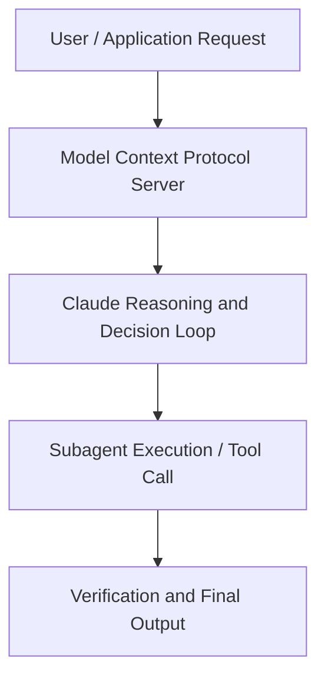

# Claude for Financial Services Keynote

**Speaker(s):** Anthropic Technical Staff · **Channel:** Anthropic · **Date:** 2025-08-01
**Watch:** https://youtu.be/50AhIyybR0M · **Format:** Fireside Chat · **Level:** Intermediate
**Topics:** Web Development, Product/Startup

## TL;DR
This session explores claude for financial services keynote, highlighting core architecture, runtime workflows, and practical deployment patterns across Web Development, Product/Startup. Speakers analyze technical implementations and share operational best practices for building robust systems with Anthropic, Anthropic API.

## Contents
- [Architecture and Core Concepts in Claude for Financial Services Keynote](#architecture-and-core-concepts-in-claude-for-financial-services-keynote)
- [Technical Mechanics, Implementation Patterns, and Tooling](#technical-mechanics-implementation-patterns-and-tooling)
- [Operational Workflows, Evaluation, and Production Scaling](#operational-workflows-evaluation-and-production-scaling)
- [Strategic Implications, Governance, and Key Takeaways](#strategic-implications-governance-and-key-takeaways)

## Architecture and Core Concepts in Claude for Financial Services Keynote

Please welcome to the stage head of revenue at Anthropic Kate Jensen. Thank you so much for being here today. I'm Kate Jensen, the head of revenue at Anthropic, and I
am so excited to welcome you to the future of finance powered by Claude. I want to invoke a scene that's probably familiar to many of you in the audience today. You're furiously checking that last
model. You have a 100 tabs open. Prep call ready for a 6 a.m. Today, that's all about to change.

**Further reading:** Official documentation for Anthropic and Anthropic platform guides.

## Technical Mechanics, Implementation Patterns, and Tooling

S, 4 secondsOur solution is built on three main pillars of what comprises of an agent. Now, something I always think about is that the models we interact with today are the worst they will ever be. S, 23 secondsEven so, Claude today is not just state-of-the-art for code. Claude has been specifically trained for finance
s, 32 secondsdomain knowledge and excels at tasks like data analysis at scale, financial reasoning, and even Excel manipulation. S, 43 secondsNow the research product flywheel is a critical part of an enthropic strategy. S, 52 secondsWe firmly believe in working with customers like yourselves to really understand where the models are working,
swhere the gaps are, and to borrow a term we use internally, hill climb, to improve the next generation of our model capabilities. S, 12 secondsThe finest agent benchmark published by our friends at vowels.ai has picked up a lot of traction in the
s, 20 secondsindustry and is well representative of many financial reasoning tasks. S, 26 secondsYou can see cla and sonnet far outperform competitors.

**Further reading:** Official documentation for Anthropic and Anthropic platform guides.

## Operational Workflows, Evaluation, and Production Scaling

I'm curious to hear from you. So, I mean, our AI strategy is really to be a leading user of AI in investment management. Uh, and that just
s, 45 secondsmeans embedding AI into everything I do, I think, in in a in a responsible way. S, 51 secondsUm so that means uh creating efficiency gains, reducing costs, uh enhancing returns and really improving risk
s, 58 secondsmanagement. I think the what's changed is that we have a coordinated strategy with really dedicated dedicated organizational support um and a
s, 7 secondsdedicated AI team that uh helps out in in the organization and this is really driven from the top right. It's uh we
s, 14 secondshave this AI maniac at at the top of the fund uh Nikolai Tongen and uh he is just
s, 21 secondsall in on uh on on the change that we see in society right so his leadership his enthusiasm about AI is really really
s, 30 secondssetting the scene internally in the fund and and driving the cultural adaptation that we see I think that's just absolutely crucial thank you fro and not surprisingly this
s, 38 secondskind of top down buyin is critical if you're trying to drive adoption and really meaningful change across the Oregon. I think the frozen Nikolai has
s, 47 secondsdone an amazing job of that. Lloyd, how about you as it relates to to your firm both internally and with your portfolio companies?

**Further reading:** Official documentation for Anthropic and Anthropic platform guides.

## Strategic Implications, Governance, and Key Takeaways

S, 25 secondsI'll be like, "Claude, I want you to optimize the following prompt." And I'll be like, "I need to come up with activities for my kids." And then Claude will rewrite it. S, 34 secondsthen I get like the world's greatest to-dos. Um, so that's that's another good hack. Ask ask Claude to write your prompts for you. But deciding where to
s, 43 secondsstart is another thing we hear a lot about, right? For folks in the audience, some of you are smaller firms, a lot of your massive firms, but okay, there's a lot. You've heard a lot from
s, 52 secondsthis group. Transformation across the or top down leadership.

**Further reading:** Official documentation for Anthropic and Anthropic platform guides.

## Source
Full cleaned transcript: `DATA/videos/claude-for-financial-services-keynote-2025.json`
Canonical recording: https://youtu.be/50AhIyybR0M