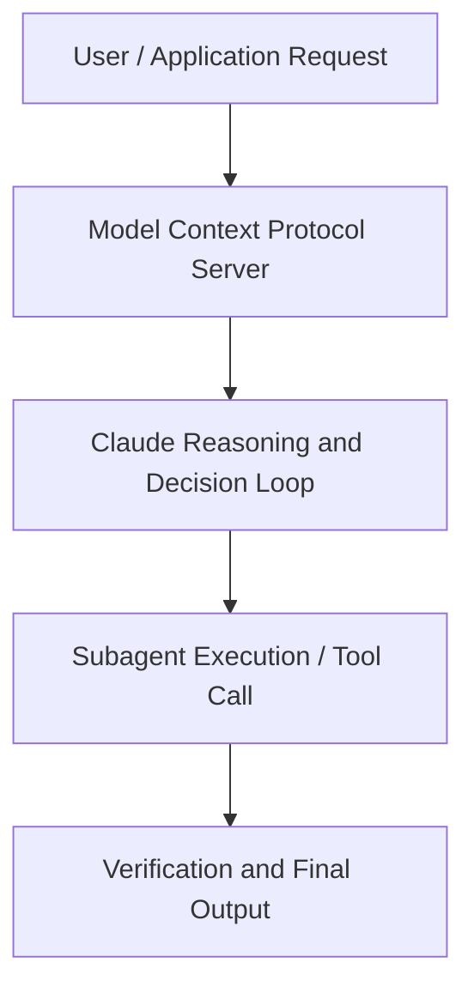

# Claude for Work: Unlocking the Power of Claude with Research and the Google Workspace Integration

**Speaker(s):** Scott White, Hannah Moran · **Channel:** Anthropic · **Date:** 2025-04-30
**Watch:** https://youtu.be/ExIR0iUgqpM · **Format:** Workshop · **Level:** Intermediate
**Topics:** Web Development, Research/Papers

## TL;DR
This session explores claude for work: unlocking the power of claude with research and the google workspace integration, highlighting core architecture, runtime workflows, and practical deployment patterns across Web Development, Research/Papers. Speakers analyze technical implementations and share operational best practices for building robust systems with Artifacts, Claude.

## Contents
- [Architecture and Core Concepts in Claude for Work: Unlocking the Power of Claud](#architecture-and-core-concepts-in-claude-for-work-unlocking-the-power-of-claud)
- [Technical Mechanics, Implementation Patterns, and Tooling](#technical-mechanics-implementation-patterns-and-tooling)
- [Operational Workflows, Evaluation, and Production Scaling](#operational-workflows-evaluation-and-production-scaling)
- [Strategic Implications, Governance, and Key Takeaways](#strategic-implications-governance-and-key-takeaways)

## Architecture and Core Concepts in Claude for Work: Unlocking the Power of Claud

Thank you for joining us today with our latest research and Google integration capabilities. I lead product for cloud.ai uh across all of our segments. And I've been at Enthropic for almost two
years. I'm going to pass it to Hannah now. We're really excited to share this with you today. I'm part of the applied AI team. Uh, so I work directly with customers to help them be successful using our claude products. Before we start, I just want to do a few housekeeping notes.

**Further reading:** Official documentation for Artifacts and Anthropic platform guides.

## Technical Mechanics, Implementation Patterns, and Tooling

Marketing teams and product development teams use it for competitive analysis, comparing
s, 45 secondsthe set of capabilities uh and maybe prices that you have that are um discoverable through internal
s, 52 secondsdocumentation and comparing that against external documentation. Doing
sresearch on customers that you're talking to or prospects that you're talking to, leveraging your email, your calendar, external web data, and
s, 9 secondsinternal documentation about other companies that might look similar to the prospect that you're talking to, and creating comprehensive account plans that leverage all of that information. S, 20 secondsUh we also see teams doing all of their project status updates uh leveraging this uh integration across email and
s, 28 secondsdocuments uh to then produce um those outputs that they share internally. This is a very flexible set of
s, 34 secondscapabilities that power a wide variety of different use cases at businesses and help people both automate a lot of the
s, 42 secondstoilsome things that they might do manually connecting the dots across these systems today but also do a lot of the things that they otherwise wouldn't
s, 51 secondshave been able to do. As a product manager, I think about things like leveraging customer feedback uh and getting the transcripts of all of the
s, 59 secondscalls from our customers that are linked to calendar invites and automatically being able to get all of the customer feedback from those directly. That's the
s, 8 secondskind of thing that I historically just wouldn't have had the time to do. But now with something like research and these integrations, I can do in under a
s, 15 secondsminute. As I mentioned, research leverages our integration with the Google Workspace ecosystem.

**Further reading:** Official documentation for Artifacts and Anthropic platform guides.

## Operational Workflows, Evaluation, and Production Scaling

Um, so
s, 52 secondsI'm asking Claude to focus on reputable data sources and recent information. I don't want the information to be more than a year old. So Claude will
sagain go and do uh multiple searches on the internet. Make sure that the information that's relevant uh for me and this question that I'm asking is
s, 8 secondswhat it's going to report back. While it's building this um a couple of other things I want to mention. So, you may
s, 17 secondshave seen in the information um that Claude was presenting from my drive where it had quotes or where it referred
s, 24 secondsto specific facts or information from notes files. It actually gave me a link to that Google doc. So, if I wanted to, I could click into the Google doc and go
s, 33 secondsread the details or maybe read the meeting notes from the entire meeting to make sure I had the full context.

**Further reading:** Official documentation for Artifacts and Anthropic platform guides.

## Strategic Implications, Governance, and Key Takeaways

Those are two different ways that we'll be expanding the set of integrations
s, 24 secondsthat are available for research. Moving on, I see one question about what
s, 32 secondsuh is Claude for work relative to the other plans. S, 35 secondsClaude for work is the umbrella term for the work uh plans that we offer, but we offer two different work plans. One is
s, 44 secondsour team plan uh which is available self-s serve uh and we have the enterprise plan which has a slightly
s, 51 secondsdifferent set of features and capabilities as well as administrative tools. We have two different plans but both of them are sort of within the cloud for work umbrella. S, 2 secondsScott, I see several questions about um being able to verify the information that Claude is presenting and what it's
s, 9 secondsusing to create these docs and summaries. Um, and I just want to uh reiterate that when you use Claude to do
s, 16 secondsresearch through your documents or through external documents, Claude will always site where it's drawing the information from. Um, I didn't show in
s, 24 secondsthe demo actually clicking into any of that, but your internal documents will also be cited.

**Further reading:** Official documentation for Artifacts and Anthropic platform guides.

## Source
Full cleaned transcript: `DATA/videos/claude-for-work-unlocking-the-power-2025.json`
Canonical recording: https://youtu.be/ExIR0iUgqpM