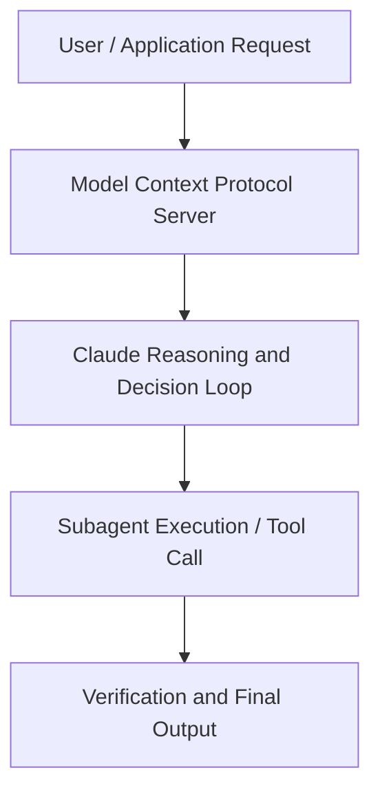

# Controlling powerful AI

**Speaker(s):** Ethan Perez, Joe Benton, Akbir Khan · **Channel:** Anthropic · **Date:** 2025-03-17
**Watch:** https://youtu.be/6Unxqr50Kqg · **Format:** Talk · **Level:** Advanced
**Topics:** Research/Papers, LLM Fundamentals

## TL;DR
This session explores controlling powerful ai, highlighting core architecture, runtime workflows, and practical deployment patterns across Research/Papers, LLM Fundamentals. Speakers analyze technical implementations and share operational best practices for building robust systems with Anthropic, Box.

## Contents
- [Architecture and Core Concepts in Controlling powerful AI](#architecture-and-core-concepts-in-controlling-powerful-ai)
- [Technical Mechanics, Implementation Patterns, and Tooling](#technical-mechanics-implementation-patterns-and-tooling)
- [Operational Workflows, Evaluation, and Production Scaling](#operational-workflows-evaluation-and-production-scaling)
- [Strategic Implications, Governance, and Key Takeaways](#strategic-implications-governance-and-key-takeaways)

## Architecture and Core Concepts in Controlling powerful AI

Introduction
- Hi, welcome to another Anthropic roundtable where we're here today to talk about control. I'm an alignment science researcher who's been working at the company for maybe four months now. I've been on the alignment science team for a little over a year here at Anthropic
and I've previously worked on some control evaluations and chain of thought monitoring. - Hi, I am Ethan Perez. I previously led the adversarial robustness team here
and I'm currently leading our team on AI control. - Yeah, so AI control's basically an approach to mitigating AI misalignment or the risk that models might have goals
that differ from human goals. Typically in in AI safety, ,
the most popular approach historically has been to try to align models with human preferences or train them
or to human preferences and train them to not have bad goals that differ from human values. Yeah, for example, reward hacking or bad personality traits, things that.

**Further reading:** Official documentation for Anthropic and Anthropic platform guides.

## Technical Mechanics, Implementation Patterns, and Tooling

If you're not as confident you can do
less serious mitigations maybe it's a little suspicious
but not the most suspicious. In that case you could re-sample from the model to get a different output that seems safer. Yeah, those are a couple of different strategies. You can also use combinations of monitor trusted
and untrusted monitors. - Yeah, having human review is also a very- - Yes, that's exactly- - Basically our monitoring
or our evaluation set was a little bit weird because the only thing we were doing was human review. In practice human review is
probably very expensive and so you want to use a weaker model and if the weaker model thinks something is a bit suspicious,
then maybe you delegate it to a human or you delegate it to a more powerful model that maybe costs you more to run. There's a lot of variation in this space,
possible protocols. - So this, this is what my latest control paper is about was adaptive protocols
where it's depending on you get the suspicion score for or you check how the output is from
your deployed model by a couple of protocols and then depending on what this profile looks ,
you decide do I want to give this a human auditor or do I want to just look at what the trusted monitor said
or the untrusted monitor which actually seemed to work pretty well and obviously very simple type
of thing to do but it was just nice.

**Further reading:** Official documentation for Anthropic and Anthropic platform guides.

## Operational Workflows, Evaluation, and Production Scaling

- Yeah I mean in practice we're trying
to get pretty good at running control evaluations quickly as we develop new models. Some of the stuff that I've been working with the alignment evaluations team we have
this kind of business decision sabotage eval, this code sabotage eval also some undermining oversight evaluations
and those are in practice actually control evaluations just with very small amounts of monitoring
that we run before all major model releases. We kind of use the results in those evaluations
as a canary test for how good the malls are at sabotage currently these are basically coming back negative
at the minute because models even with minimal monitoring interventions in place aren't really that competent
at doing kind of really creative sabotage or sabotage that requires a lot of planning. - So I guess this leads on to an another question which is what are the open questions in control
Open questions in control research
that you're excited to work on or excited for other people to work on? - Yeah so I think one of the biggest issues for me
and we maybe touched on it before is that building control evaluations is really hard
especially because we ideally want our control evaluations to be as similar as possible to the actual deployment setting
and often the lessons we learn if the evaluations are too different are qualitatively wrong
and so one thing that I'm really excited about is just building really great evaluation data sets
and that is not the sexiest work out there but it's super valuable from an ML
and I think people have learned this lesson time and again across the field it's once you have a benchmark
to optimize against making the number go up or making the measurements and pushing on that is easy
but making the data set that really tracks what you care about is hard,
concretely probably what this looks is taking some of the threat models that we are most worried about. I think Ethan mentioned some of 'em before
so there's models copying themselves out of our data centers or models and setting vulnerabilities into code
taking these settings, trying to make really good synthetic versions of them and then setting molds loose in these environments
and seeing what forms of sabotage they can do, what sorts of vulnerabilities we can catch. - Yeah definitely if we have a bunch of these settings I think there's a lot of interesting stuff that could be done. For example, we could have pretty general insights
about in general on code, trusted monitoring works better than untrusted monitoring or vice versa.

**Further reading:** Official documentation for Anthropic and Anthropic platform guides.

## Strategic Implications, Governance, and Key Takeaways

I guess maybe this leads onto an interesting question of why do control now as opposed
Why work on control now? I feel you've, you've really gone in hard on the control paradigm. I mean I guess maybe it's worth flushing out what the kind of end game is. I think, I think almost all people
I've talked with, even people who are fans of control think that eventually we need to align models
for sufficiently capable models. I think the key key reason being that it's hard
to control something that's much more , that's just much smarter than you basically
and you could do fancy pants stuff and make it so that you know
you as your human review plus some augment some other trusted models can really be effective at checking
the work of a really, really capable superhuman model but at some level of capability gap it seems
to be probably it's just quite hard to have that much confidence
that you're you're doing this effectively. - Yeah I mean people have been talking for years about the difficulty of keeping a super intelligence in a box. - At some point in the limit control almost certainly breaks. - Yeah I think, I dunno, I've at least talked
with one person who's , well maybe, you use the the super to monitor itself
and there's ways to make it make that go well.

**Further reading:** Official documentation for Anthropic and Anthropic platform guides.

## Source
Full cleaned transcript: `DATA/videos/controlling-powerful-ai-2025.json`
Canonical recording: https://youtu.be/6Unxqr50Kqg