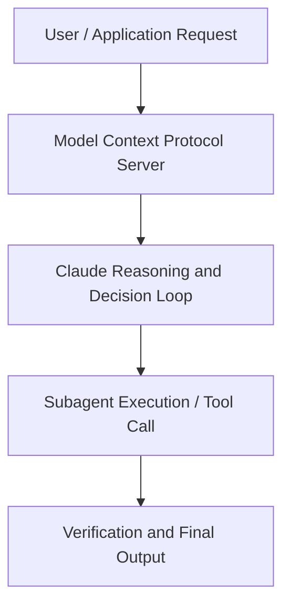

# Could AI models be conscious?

**Speaker(s):** Kyle Fish · **Channel:** Anthropic · **Date:** 2025-04-24
**Watch:** https://youtu.be/pyXouxa0WnY · **Format:** Talk · **Level:** Intermediate
**Topics:** Research/Papers, Web Development

## TL;DR
This session explores could ai models be conscious?, highlighting core architecture, runtime workflows, and practical deployment patterns across Research/Papers, Web Development. Speakers analyze technical implementations and share operational best practices for building robust systems with Anthropic, Claude.

## Contents
- [Architecture and Core Concepts in Could AI models be conscious?](#architecture-and-core-concepts-in-could-ai-models-be-conscious)
- [Technical Mechanics, Implementation Patterns, and Tooling](#technical-mechanics-implementation-patterns-and-tooling)
- [Operational Workflows, Evaluation, and Production Scaling](#operational-workflows-evaluation-and-production-scaling)
- [Strategic Implications, Governance, and Key Takeaways](#strategic-implications-governance-and-key-takeaways)

## Architecture and Core Concepts in Could AI models be conscious?

- As people are interacting with these systems as collaborators, it'll just become an increasingly salient
question whether these models are having experiences of their own, and if so, what kinds, and, you know, how does that shape the relationships
that it makes sense for us to build with them? - Do you ever find yourself saying please and thank you to AI models when you use them? I certainly do, and part of me thinks, well, this is obviously ridiculous. It doesn't have feelings that I could potentially hurt by being impolite. On the other hand, if you spend enough time talking
to AI models, the capabilities that they have and the qualities of their output, especially these days,
does make you think that potentially something else, something more could be going on. Could it possibly be the case that AI models could have some level of consciousness? That's the question that we're gonna be discussing today. Obviously, it raises very many philosophical
and scientific issues.

**Further reading:** Official documentation for Anthropic and Anthropic platform guides.

## Technical Mechanics, Implementation Patterns, and Tooling

- The ability to introspect, or the ability to have some sort of conscious experience. You talked about, you know, let's ask about, let's talk about the first type of research,
which is the one about, you know, actually what the model says it's behavior. What would- - And what it does. What would be some examples of that research? - Yeah, so one thing that you know, I'm quite excited about is work to understand model preferences. To try and get a sense of, you know, are there things that your models care about either in the world or, you know, in their own experience and operation. There's a number of ways that you can go about that. You can, you know, ask models if they have preferences and, you know, see what they say.

**Further reading:** Official documentation for Anthropic and Anthropic platform guides.

## Operational Workflows, Evaluation, and Production Scaling

But at the same time, I'm quite sympathetic to the view that, you know, if you can simulate
a human brain to like some sufficient degree of fidelity, even if that comes down to, you know, simulating
the roles of, you know, individual molecules of, you know, serotonin and dopamine. - So you're not just doing the thing
that some people talk about where it is like replacing every individual neuron in the brain with an,
with a synthetic neuron. You're actually saying that you would, to make the full synthetic version, you would have to go as far
as actually simulating the molecules of the neurotransmitters and stuff as well? - I'm not saying that you would have to do that. But I'm saying you could imagine, you could imagine-
- In theory. That you have done this and you have, you know, an incredibly high fidelity simulation of a human brain. I think I, and many people have the intuition
that, you know, it's quite likely that there would be, you know, some kind of conscious experience there. You know, an intuition that many people draw from there is this question of replacement where if you went, you know, neuron
by neuron in the brain and replaced those one by one with some digital chip and you all along the way, you continued to be you
and communicate and function in exactly the same way.

**Further reading:** Official documentation for Anthropic and Anthropic platform guides.

## Strategic Implications, Governance, and Key Takeaways

There are other droids that seem to be entirely self-contained. C3PO is self-contained, his consciousness is inside his little golden head and so on. All of which is a way of getting to the question of where is the consciousness? Is the consciousness in the data center,
is the consciousness, like, is it in a particular chip? Is it in a series of chips? If the models are conscious, where is that? - I can tell you that it's in your brain. - Well, I can tell that it's in my brain.

**Further reading:** Official documentation for Anthropic and Anthropic platform guides.

## Source
Full cleaned transcript: `DATA/videos/could-ai-models-be-conscious-2025.json`
Canonical recording: https://youtu.be/pyXouxa0WnY