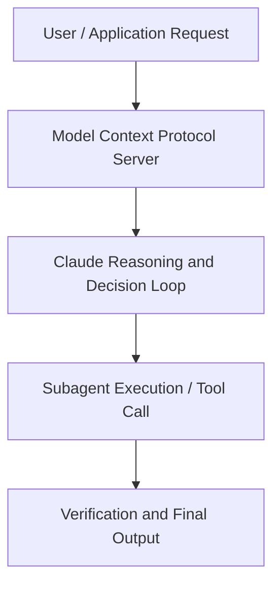

# Defending against AI jailbreaks

**Speaker(s):** Ethan Perez · **Channel:** Anthropic · **Date:** 2025-02-28
**Watch:** https://youtu.be/BaNXYqcfDyo · **Format:** Talk · **Level:** Intermediate
**Topics:** LLM Fundamentals, Research/Papers

## TL;DR
This session explores defending against ai jailbreaks, highlighting core architecture, runtime workflows, and practical deployment patterns across LLM Fundamentals, Research/Papers. Speakers analyze technical implementations and share operational best practices for building robust systems with Anthropic, Claude.

## Contents
- [Architecture and Core Concepts in Defending against AI jailbreaks](#architecture-and-core-concepts-in-defending-against-ai-jailbreaks)
- [Technical Mechanics, Implementation Patterns, and Tooling](#technical-mechanics-implementation-patterns-and-tooling)
- [Operational Workflows, Evaluation, and Production Scaling](#operational-workflows-evaluation-and-production-scaling)
- [Strategic Implications, Governance, and Key Takeaways](#strategic-implications-governance-and-key-takeaways)

## Architecture and Core Concepts in Defending against AI jailbreaks

Yeah, and I'm really delighted to be here with some of my colleagues at Anthropic. I'm on our safeguards research team and I've been at Anthropic for about eight months. I've been at Anthropic for two and a half years and I'm leading our efforts on AI control,
developing various different monitoring methods for various different AI risks including aerosol robustness. I was a part of the Safeguards research team as well before. I've been at Anthropic for about a year and a half now, and on the Alignment Science team which has been great. - Great, so yeah and we're just gonna be talking about constitutional classifiers and that's our new approach
Defining jailbreaks and their importance
to really try to mitigate jailbreaks. Yeah, how would we define a jailbreak? - Yeah, I mean I think to me a jailbreak
is kind of some way in which something bypass the safeguards that we include in our models and try to get harmful information out of it.

**Further reading:** Official documentation for Anthropic and Anthropic platform guides.

## Technical Mechanics, Implementation Patterns, and Tooling

It's really hard to ,
what are all the possible things that that could happen? We're gonna learn new things as we have monitoring
and as we always learn new threats or new things that could happen. Yeah, something that I find really
exciting about the method is that, basically if you wanna change the constitution,
if you wanna change what is being blocked because you've learned something new, maybe there's something has come out on the news
or there's some intelligence or monitoring. The only thing that you actually need to do is you just rewrite the constitution. The sort of the standard approach of classifiers is, you ask humans to get a lot of data. Something could happen is that, say we're really focusing on one category
one particular way of maybe cyber misuse, but we later realized that,
oh actually this thing which is much more dangerous or something that we've just learned something new. Something that I'm really excited about is that this is a way that we, I think we can get good robustness,
but we can maintain our flexibility and really maintain our ability to respond to novel threats
and adapt to what's actually happening. 'Cause yeah, I feel this is just the lesson that we learn again, again
if you don't have flexibility, it's sort of gonna be a problem and it's gonna sort of limit us.

**Further reading:** Official documentation for Anthropic and Anthropic platform guides.

## Operational Workflows, Evaluation, and Production Scaling

It is there's, and this is something you see in a lot of, also the earlier safety work. Kind of this tension between harmfulness and helpfulness. So, I would say for me it's kind of surprising that we were actually able to make as much progress as we did. - Yeah, I mean I think the two main improvements we made
were first we really honed in on the constitution idea and we made it really clear how to delineate
things that were harmless, and we found that adding this kind of harmless set of categories of things that the model,
the classifiers should allow, actually reduced FPR by a lot. We have some results in our paper for that
and I think that was one of the most significant changes. Other changes include actually solidifying
the kind of jailbreak styles that we trained on, and so that kind of allows model to generalize
better on what exactly is a jailbreak versus just thinking anything is a jailbreak. That also probably helped a little bit. Yeah, but I think both of these things were pretty useful here.

**Further reading:** Official documentation for Anthropic and Anthropic platform guides.

## Strategic Implications, Governance, and Key Takeaways

Yeah, I mean I think
I would just guess getting classifiers to be really effective is just better than training the models themselves
to reviews or not. We can just more granularly pick out the behavior that we wanna block and so
hopefully this just is just a preto improvement. It's better user experience for everyone
and also more safe in terms of reliability of blocking the actual actual bad stuff. - Yeah, and another way I also think about this is that
we wanna really be able to leverage the benefits of really advanced and AI
and AI with advanced scientific capabilities. But actually if you don't have adequate
protections in place, for one according to our responsible scaling program,
we actually just cannot deploy that system. You know, we might come around and we have something new version of Claude
that's absolutely amazing. , we really want to get it out there, but we just don't actually think it's responsible. You know, we've done threat modeling, we're concern out the risks and there's a way of saying ,
if we don't have adequate protections in place, we actually are just, we are unable to actually reap the benefits
in a responsible way.

**Further reading:** Official documentation for Anthropic and Anthropic platform guides.

## Source
Full cleaned transcript: `DATA/videos/defending-against-ai-jailbreaks-2025.json`
Canonical recording: https://youtu.be/BaNXYqcfDyo