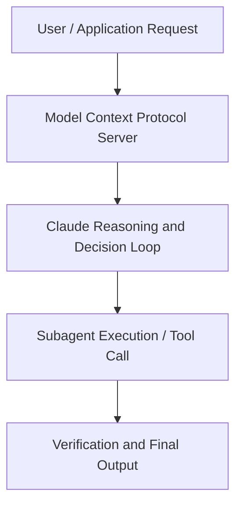

# Interpretability: Understanding how AI models think

**Speaker(s):** Anthropic Technical Staff · **Channel:** Anthropic · **Date:** 2025-08-16
**Watch:** https://youtu.be/fGKNUvivvnc · **Format:** Talk · **Level:** Advanced
**Topics:** LLM Fundamentals, Research/Papers

## TL;DR
This session explores interpretability: understanding how ai models think, highlighting core architecture, runtime workflows, and practical deployment patterns across LLM Fundamentals, Research/Papers. Speakers analyze technical implementations and share operational best practices for building robust systems with Anthropic, Box.

## Contents
- [Architecture and Core Concepts in Interpretability: Understanding how AI models](#architecture-and-core-concepts-in-interpretability-understanding-how-ai-models)
- [Technical Mechanics, Implementation Patterns, and Tooling](#technical-mechanics-implementation-patterns-and-tooling)
- [Operational Workflows, Evaluation, and Production Scaling](#operational-workflows-evaluation-and-production-scaling)
- [Strategic Implications, Governance, and Key Takeaways](#strategic-implications-governance-and-key-takeaways)

## Architecture and Core Concepts in Interpretability: Understanding how AI models

Introduction
the the model doesn't think of itself necessarily as trying to predict the next word. Internally, it's developed
potentially all sorts of intermediate goals and abstractions that help it achieve that kind of meta objective. When you're talking to a large language model, what exactly is it that you're talking to? Are you talking to something
like a glorified autocomplete? Are you talking to something like an internet search engine? Or are you talking to
something that's actually thinking um and maybe even thinking like a person? It turns out rather concerningly that nobody really knows the answer to those questions. And here at Anthropic, we
are very interested in in finding those answered out.

**Further reading:** Official documentation for Anthropic and Anthropic platform guides.

## Technical Mechanics, Implementation Patterns, and Tooling

Oh, it's like asking me to choose one of
my 30 million children. Um, I mean, I I think, you know, there there's like two
kinds of favorites. There's like, oh, it's so cool that there's it's got some special notion of like this one, you
know, little thing, right? I mean, we did this thing on the Golden Gate Bridge, which is like a famous San Francisco landmark, Golden Gate Claw. It's like a lot of fun. It like has an idea of the Golden Gate Bridge that like
isn't just like the words Golden Gate autocomplete bridge, but is like I'm driving from San Francisco to Marin, and
then it's thinking of the same thing. Meaning that like you see sort of like the same stuff light up inside or it's like a picture of the bridge and so
you're like okay it's got some robust notion of like what what the bridge is. But I think when it comes to um stuff
that seems sort of like weirder, you know, one question is how how do models like keep track of who's in the story,
like just like literally like like okay, you got all these people and they're doing stuff.

**Further reading:** Official documentation for Anthropic and Anthropic platform guides.

## Operational Workflows, Evaluation, and Production Scaling

Like that's a whole
new thing to ask the model to do. And so what we found is that it seems like because we've bolted this
on at the end, there's sort of two things going on at once. One is the model's doing the thing that it was
doing when it was guessing the city initially. Two, there's a separate bit of the
model that's just trying to answer the question, do I know this at all? Do
I know what the capital uh city of France is or, you know, should I say no? It turns out that sometimes um that separate step can be wrong. If that
separate step says yes actually I do know the answer to that and then the model is like all right well then I'm
answering and then halfway through it's like ah capital France uh London uh it's too late. It's already committed to sort
of like answering.

**Further reading:** Official documentation for Anthropic and Anthropic platform guides.

## Strategic Implications, Governance, and Key Takeaways

Just to add on one thing. I think I mean something we do in like human society is we kind of offload work or tasks to
other people based on our trust in them. I you know I well I'm not anyone's
boss but Josh Josh is someone's boss and you know Josh might give give someone a task uh like go go and code up this
thing and then he has some faith that you know that person isn't a sociopath
who's going to like sneak some bug in there to try to undermine the company. He he like takes their word for it that
they did a good job. And similarly like people are the way people are using language models now we're we're not
we're not spot-racking everything they write especially like I you know the the the best example for this is using
language models for coding assistance people like the the models are just writing thousands and thousands of lines
of code and people are kind of like doing a cursory job of reading it but and then it's going into the codebase
and what gives us the trust in the model that like we don't need to read everything it writes that we can just
kind of like let it do its thing. It's knowing that its motivations are sort of pure. And so that's why I think like the kind of being able to see inside its head is so important as a cuz cuz unlike
humans where like why do I think that Emanuel isn't a sociopath? It's cuz like you know we like I don't know he seems
like a cool guy.

**Further reading:** Official documentation for Anthropic and Anthropic platform guides.

## Source
Full cleaned transcript: `DATA/videos/interpretability-understanding-how-ai-models-think-2025.json`
Canonical recording: https://youtu.be/fGKNUvivvnc