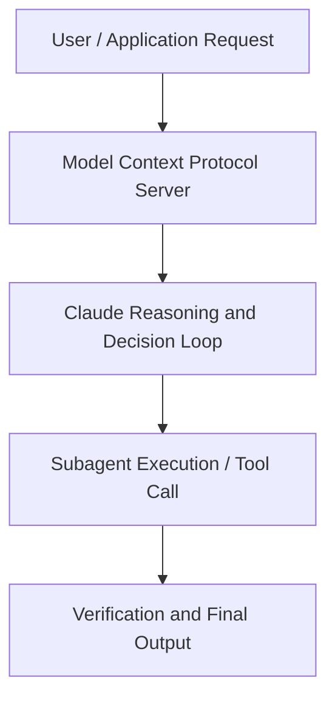

# Introducing Claude for Life Sciences

**Speaker(s):** Jonah Cool, Eric Kauderer-Abrams · **Channel:** Anthropic · **Date:** 2025-10-20
**Watch:** https://youtu.be/sHImlfVM9r4 · **Format:** Workshop · **Level:** Beginner
**Topics:** Research/Papers, Web Development

## TL;DR
This session explores introducing claude for life sciences, highlighting core architecture, runtime workflows, and practical deployment patterns across Research/Papers, Web Development. Speakers analyze technical implementations and share operational best practices for building robust systems with Anthropic, Claude.

## Contents
- [Architecture and Core Concepts in Introducing Claude for Life Sciences](#architecture-and-core-concepts-in-introducing-claude-for-life-sciences)
- [Technical Mechanics, Implementation Patterns, and Tooling](#technical-mechanics-implementation-patterns-and-tooling)
- [Operational Workflows, Evaluation, and Production Scaling](#operational-workflows-evaluation-and-production-scaling)
- [Strategic Implications, Governance, and Key Takeaways](#strategic-implications-governance-and-key-takeaways)

## Architecture and Core Concepts in Introducing Claude for Life Sciences

Introductions
- It took us three months, ultimately, lots of people working day and night in the lab to fix the problem. I posed this problem to Claude. I said, "Hey, what should we do to get unstuck?" And just in one minute, you know, one response, Claude actually just one shotted the answer. I am the Head of Life Sciences focused on partnerships and deployment here at Anthropic. I'm the Head of Biology and Life Sciences here at Anthropic. I'm focused on research and product development,
and together we're trying to teach Claude to be a biologist. - All right, Eric, let's talk science. I'm really excited about this
and also excited about the fact that Anthropic and, you know, we're leaning into this space,
and, you know, maybe the place to start is just thinking about why the life sciences, why Claude, and what Anthropic brings to, you know,
what is already a really big ecosystem, but one that's moving really fast.

**Further reading:** Official documentation for Anthropic and Anthropic platform guides.

## Technical Mechanics, Implementation Patterns, and Tooling

For me, I've always been on the one hand, a part of the software world, the other hand, a part of this bio world, and you know,
things started on the software side where you'd give Claude, you know, these little snippets of tasks, right? Over time, those tasks become longer horizon, Claude becomes more autonomous, you know, it can more seamlessly integrate
through the different tools there. I think we're right at that takeoff point in the life sciences where we're just now
with all of these connections that we're introducing, able to unlock that next stage where, you know,
you don't have to just ask Claude to go perform an analysis and then you do some work, and then you come back
and you make a BioRender figure and you ask Claude to revise it, right? We could actually give Claude a whole, you know, meaningful chunk of the work
that would take a human scientist a couple hours to do. I think that transition is the really exciting point
in a field where it goes from being, you know, a useful kind of utility to actually
a brainstorming partner, which is what I'm after. - Yeah, it's just kind of like embedded in the process. Training Sonnet 4.5 for long-horizon tasks in life sciences
- Yeah. We recently released Sonnet 4.5, a really exciting, super powerful model.

**Further reading:** Official documentation for Anthropic and Anthropic platform guides.

## Operational Workflows, Evaluation, and Production Scaling

I really believe that we have the opportunity to massively uplift the capabilities of biologists
in doing incredible, impactful research. That with the tools that we have now, you know,
we're finally at that moment where all these things are possible. I remain the same optimism
that I had when I first got into this. I think, you know, all the experience in the lab has been really clarifying
to help point out, okay, there are real problems here that are not pretty and that require, you know,
lots of grindy work to get in there and disentangle. But I think we're now set up
to make a dent in that, so. But I'd love to hear what you think. - Yeah, I mean, I totally agree, right? I mean, I share that optimism.

**Further reading:** Official documentation for Anthropic and Anthropic platform guides.

## Strategic Implications, Governance, and Key Takeaways

In this conversation we've been emphasizing a lot breaking the problem down into all these pieces that we're gonna solve independently,
but the most important part is when we put it all back together. - And scientists are actually using these things, you know,
how's it going and what are we doing, right? So I think the AI for Science program is critical for us to get that feedback
and be closing the loop with people that are using these things every day in the lab. So I am super excited about that. One other point that I think is really important to make that, you know, speaks to why Anthropic,
and why the experience of doing this within Anthropic is so exciting, it's such a perfect fit,
is that as we're talking about accelerating and enhancing capabilities, right? The other side of that is safety
and the tremendous responsibility that we all have to making sure that we are improving the model's capabilities
and releasing, you know, increasingly impactful products in a way that is responsible
and aligned with our responsible scaling policy and best practices in the biosecurity community. It's something I care deeply about. I've worked in biosecurity for years, and I think that, you know, at most companies,
right, there would be some tension between the impact and the commercial aims of making these models better in biology, right?

**Further reading:** Official documentation for Anthropic and Anthropic platform guides.

## Source
Full cleaned transcript: `DATA/videos/introducing-claude-for-life-sciences-2025.json`
Canonical recording: https://youtu.be/sHImlfVM9r4