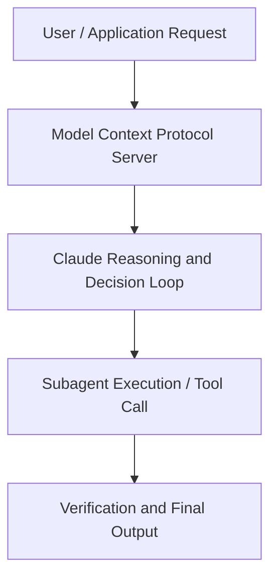

# Lessons on AI agents from Claude Plays Pokemon

**Speaker(s):** Alex Albert · **Channel:** Anthropic · **Date:** 2025-04-24
**Watch:** https://youtu.be/CXhYDOvgpuU · **Format:** Demo · **Level:** Intermediate
**Topics:** AI Agents, AI Coding Tools

## TL;DR
This session explores lessons on ai agents from claude plays pokemon, highlighting core architecture, runtime workflows, and practical deployment patterns across AI Agents, AI Coding Tools. Speakers analyze technical implementations and share operational best practices for building robust systems with Anthropic, Box.

## Contents
- [Architecture and Core Concepts in Lessons on AI agents from Claude Plays Pokemo](#architecture-and-core-concepts-in-lessons-on-ai-agents-from-claude-plays-pokemo)
- [Technical Mechanics, Implementation Patterns, and Tooling](#technical-mechanics-implementation-patterns-and-tooling)
- [Operational Workflows, Evaluation, and Production Scaling](#operational-workflows-evaluation-and-production-scaling)
- [Strategic Implications, Governance, and Key Takeaways](#strategic-implications-governance-and-key-takeaways)

## Architecture and Core Concepts in Lessons on AI agents from Claude Plays Pokemo

Introduction and what is Claude Plays Pokemon
- The AI world has talked so much about agents in the last year, but for a lot of the world I think like, it's pretty hard to really understand what that means. I think the example of Pokemon where it's like, oh, it's like not just a chatbot
where I type in a chat and I get a response back, but like it's like doing this on its own and seeing and trying things and taking actions and all that is a way
that I think more people have been able to like latch onto what is this agents thing we're talking about? - Today we're diving into the story behind Claude Plays Pokemon. I lead Claude Relations here at Anthropic. I'm on our Applied AI team and I made Claude Plays Pokemon. - David, can we get a broad overview
of what is Claude Plays Pokemon for those who aren't aware. - Claude Plays Pokemon is a sort of experiment with agents
that is hooking up Claude, our language model, to the Game Boy game Pokemon Red,
letting it actually try to play the game. So we start it from square one, like start a new game and see how Claude does learning
how to be a Pokemon master.

**Further reading:** Official documentation for Anthropic and Anthropic platform guides.

## Technical Mechanics, Implementation Patterns, and Tooling

- Claude obviously like knows something about Pokemon. If you go to claude.ai
and ask it questions like you'll notice that it can recall some like general facts and there's enough in the pop culture
that of course Claude knows something about Pokemon. - Through the pre-training process, yeah. It even knows like some
of the broad strokes information about the game. It knows that like the first gym leader is Brock
and so it has some sense of like the structure of the game, but the details, it really knows nothing about it. In fact, sometimes it thinks it knows things and it does it. This is one of the hard things you have to fight with. But that means that even without sort
of like specific training, knowing a little bit about what Pokemon is and some of the motivation of it,
it has to figure out everything else sort of in the intermediate space.

**Further reading:** Official documentation for Anthropic and Anthropic platform guides.

## Operational Workflows, Evaluation, and Production Scaling

- A good example which you still see sometimes but you see a lot less is like Claude's like,
I need to go to the top left in Pokemon and then it'll just walk into a wall for hours on end. If the model is really fixated on walking to the top left, like yeah you keep just walking up until I get there. - But if it's walking into a wall, like it eventually needs to step back and be like, hmm, maybe I maybe I need to be doing
something else first. - And that's the kinda thing where that's what happens in Pokemon,
but yeah it's like super translational to a lot of the other things we do. That's a good parlay into this next question I had
around what are the current kind of funny moments we've been seeing? I mean, it's not perfect quite yet,
you know, it's got a lot better over the past eight or so months, but we haven't beat Pokemon. Funny failures and current limitations
- And there's definitely been some funny times along the way. - Any stories you could share there?

**Further reading:** Official documentation for Anthropic and Anthropic platform guides.

## Strategic Implications, Governance, and Key Takeaways

- You'll see some Frankenstein prompts if you like, try to anticipate every possible thing
that the model could end up struggling with, which is why I think it's like just important to be measured and like read a lot
and like the thing I've learned probably the most is just like watch it, read what it says,
see what it's struggling with, understand and just find out like the most minimal ways that you can give it a little bit more context
rather than trying to like work around every single detail. Maybe switching gears a little bit here. We included Claude Plays Pokemon as part of our Claude 3.7 Sonnet launch. - And we had the benchmark with all the lines- - Yep. - of how far each model's got through the different gyms. - And then we put out like an article kind of explaining it. What was the reaction like by like just the general public
and people more in the AI space? - I guess like maybe to tell like a little bit of the backstory of that- - Yeah.

**Further reading:** Official documentation for Anthropic and Anthropic platform guides.

## Source
Full cleaned transcript: `DATA/videos/lessons-on-ai-agents-from-claude-2025.json`
Canonical recording: https://youtu.be/CXhYDOvgpuU