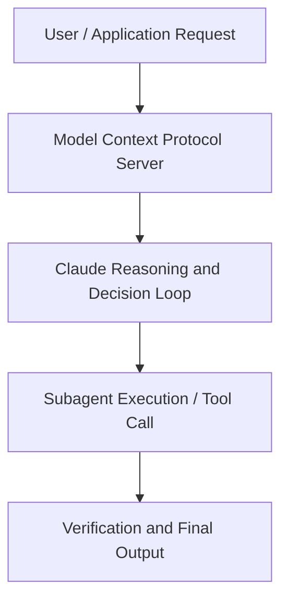

# MCP 201 | Code w/ Claude

**Speaker(s):** Anthropic Technical Staff · **Channel:** Anthropic · **Date:** 2025-07-31
**Watch:** https://youtu.be/HNzH5Us1Rvg · **Format:** Talk · **Level:** Intermediate
**Topics:** AI Agents, Prompt Engineering

## TL;DR
This session explores mcp 201 | code w/ claude, highlighting core architecture, runtime workflows, and practical deployment patterns across AI Agents, Prompt Engineering. Speakers analyze technical implementations and share operational best practices for building robust systems with Anthropic, Claude.

## Contents
- [Architecture and Core Concepts in MCP 201 | Code w/ Claude](#architecture-and-core-concepts-in-mcp-201-code-w-claude)
- [Technical Mechanics, Implementation Patterns, and Tooling](#technical-mechanics-implementation-patterns-and-tooling)
- [Operational Workflows, Evaluation, and Production Scaling](#operational-workflows-evaluation-and-production-scaling)
- [Strategic Implications, Governance, and Key Takeaways](#strategic-implications-governance-and-key-takeaways)

## Architecture and Core Concepts in MCP 201 | Code w/ Claude

I'm a member of technical staff at 
Anthropic and one of the co-creators of uh, MCP. Today I'm going to tell you a little bit more 
about the protocol and the things you can do um just to give you an understanding of um what 
there's more to the protocol than what most people use it for at the moment which would be tools. Really the goal today is to showcase you what the protocol is capable of and how you can use 
it in ways to build richer interactions with MCP clients. That goes beyond the tool call tool 
calling that most people are used to. I will first go through all the different like what we 
call primitives like ways for the servers to expose information to a client before we go 
into some of the bit more lesser known aspects of the protocol and then I want to talk a little bit 
about like how to build a really rich interaction before we take a little stab of what's coming next 
for MCP and how we bring MCP to the web. But to just get you started, I want to talk about one of 
the MCP primitives um that servers can expose to MCP clients that very few people know. What a prompts are really are predefined templates for AI interactions. That's to say it's a way for an MCP server to expose a set of text, you know, like a prompt 
in a way um that allows um users to directly um add this to the context window and see how they 
would use for example the MCP uh server uh you're building.

**Further reading:** Official documentation for Anthropic and Anthropic platform guides.

## Technical Mechanics, Implementation Patterns, and Tooling

So in this scenario, what you're going to see 
is Claude is going to go uh and write a beautiful diagram that visualizes the database schema for 
me. I've exposed the schema via resources. There's a lot of unexport space still here. Again, 
if you go beyond just like adding it file and think about like retrieval augmentation or any 
other thing the application might want to do. One is prompts again 
the things that the user interacts with there's the second one is resources that the application 
interact with then of course there should be a third one that you all are very familiar with 
um that I don't want to get into too much depth because if you have built an MCP server you 
probably have built it for exposing a tool and so tools are really these actions of course that 
can be invoked that's like one of the I think most magical moment I feel when you build an 
MCP server is when the model for the first time invokes something that you care about 
that you have built for and has this little impact on you know it might be like quing a 
database for you or whatever it might be. But this is again the thing that the model decides 
when to call to an action. So these are three very basic primitives that the protocol exposes. If you think carefully about these three primitives that I just showcased you to to you, 
there's a little bit of overlap about like how do you use like they could like when do 
you use what really and so there's something that very that we don't talk enough about and 
it's somewhere buried in the specification language of the model context protocol is 
what I call the interaction model and I think showcasing it hopefully makes clear when you use 
What?

**Further reading:** Official documentation for Anthropic and Anthropic platform guides.

## Operational Workflows, Evaluation, and Production Scaling

Then there's the last primitive that I want to touch 
on that's also a bit more interesting and it's one of these things that in retrospective as one 
of the person who has built the protocol um I've probably named terribly to be fair I'm not a very 
not not very good at naming and you will see this throughout the talk probably but there's a thing 
called roots and roots is also an interesting aspect because let's imagine I want to build today 
an MCP server that deals with my git commands I don't want to deal with git. I don't want to do 
source control commands. I don't remember any of that. I want to have MCP deal like an MCP server 
deal with this. Now I'm going to hook up an MCP server into my favorite IDE. But how does the 
IDE know how does the MC sorry, how does the MCP server know what are the open projects in the IDE? Because obviously I want to run the git commands in the workspaces I have open, right? So roots 
is a way for the server to inquire from the client such as VS code for example what are the projects 
you have open so that I can operate within only those directories that the server has opened and I 
know where I want to execute my git commands and this again is a feature that's not that widely 
used but for example VS code currently does support this and so these These are, you know, 
just all the big primitives that MCP offers.

**Further reading:** Official documentation for Anthropic and Anthropic platform guides.

## Strategic Implications, Governance, and Key Takeaways

It's just OS 2.0 zero a little bit cleaned up and you're probably already doing it if you're 
doing a wall and if you do implement this wall flow you get two interesting patterns out of that 
and the first one is the scenario of an MCP server in the web and a good example of this 
is if you for example a payment provider and you have you know website payment.com and I as a user 
have an online account there now I as the payment provider can expose mcp.payment.com that the user 
can put into an MCP client and the MCP client will do the or flow. I log in as my account and I know 
this is payment.com. I know this is the the person that is my online account with the provider that I 
trust. I don't trust some random Docker container running locally built by a third party developer 
anymore. I trust the person I already trust with the data anyway and their developers. On the 
their development side, they can just ex like ex like update this server as they want and they 
don't have to wait for me to download a new like docker image. So this is I think will be a 
really really big step for enabling MCP servers to be exposed on the web and MCP clients to interact 
basically with all the online interactions that you already have. Here's just a small 
little example of this.

**Further reading:** Official documentation for Anthropic and Anthropic platform guides.

## Source
Full cleaned transcript: `DATA/videos/mcp-201-code-w-claude-2025.json`
Canonical recording: https://youtu.be/HNzH5Us1Rvg