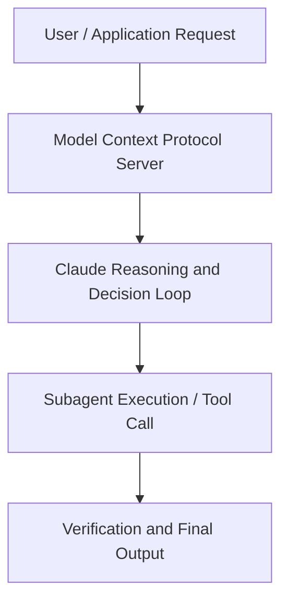

# Prompting 101 | Code w/ Claude

**Speaker(s):** Anthropic Technical Staff · **Channel:** Anthropic · **Date:** 2025-07-31
**Watch:** https://youtu.be/ysPbXH0LpIE · **Format:** Talk · **Level:** Beginner
**Topics:** Prompt Engineering, AI Coding Tools

## TL;DR
This session explores prompting 101 | code w/ claude, highlighting core architecture, runtime workflows, and practical deployment patterns across Prompt Engineering, AI Coding Tools. Speakers analyze technical implementations and share operational best practices for building robust systems with Anthropic, Box.

## Contents
- [Architecture and Core Concepts in Prompting 101 | Code w/ Claude](#architecture-and-core-concepts-in-prompting-101-code-w-claude)
- [Technical Mechanics, Implementation Patterns, and Tooling](#technical-mechanics-implementation-patterns-and-tooling)
- [Operational Workflows, Evaluation, and Production Scaling](#operational-workflows-evaluation-and-production-scaling)
- [Strategic Implications, Governance, and Key Takeaways](#strategic-implications-governance-and-key-takeaways)

## Architecture and Core Concepts in Prompting 101 | Code w/ Claude

Thank you for joining us today for prompting 101. I'm part 
of the applied AI team here at Anthropic. With me is Christian, also part of the applied 
AI team. What we're going to do today is take you through a little bit of prompting best 
practices. We're going to use a real world scenario and build up a prompt together. So 
a little bit about what prompt engineering is. You're all probably a little 
bit familiar with this. This is the way that we communicate with a language model and try to get 
it to do what we want.

**Further reading:** Official documentation for Anthropic and Anthropic platform guides.

## Technical Mechanics, Implementation Patterns, and Tooling

We want to make 
sure that assessment is as clear and as confident as possible. If not, we're sort of losing track of 
what we're doing. If we transition back to the the console, um we can jump to a V2 that we have 
here. You can see here um I'll also just illustrate the data because 
we didn't really do that last time around just to really highlight what we're looking at. So, 
what we're seeing here, this is the car accident report form, and it's just 17 different checkboxes 
going through what actually happened. You can see there's a vehicle A and vehicle B, 
both on the left and right hand side. The main purpose of this is that we want to make sure that 
Claude can understand this manually generated data to assess what's actually going on. That is 
uh corroborated by if I navigate back here to this sketch that we can highlight here as well.

**Further reading:** Official documentation for Anthropic and Anthropic platform guides.

## Operational Workflows, Evaluation, and Production Scaling

We've kept the same user prompt down here. Oh, your scroll is backwards from mine. Uh, 
the we have the same user prompt here. Still asking Claude to do the same task, same context. We'll see here that it's spending less time. It's kind of narrating to us a little bit less 
about what the form is because it already knows what that is. It's not concerned with kind 
of bringing us that information back. It's going to give us a whole list of what it found to be 
checked, what the sketch shows.

**Further reading:** Official documentation for Anthropic and Anthropic platform guides.

## Strategic Implications, Governance, and Key Takeaways

Then move on to the sketch. After you've kind of confidently gotten information 
out of the form and you can say what's factually true, then you can go on and think about what you 
can gain from that sketch. Keeping in mind your understanding of the accident so far. So, whatever 
you've learned from the form, you're trying to match that up with the sketch. That's how 
you're going to arrive um at your final uh at your final assessment of the form. Here you can see one behavior that this produced for Claude because I told 
it to very carefully examine the form. It's showing me its work as it does that. So, 
it's telling me each individual box.

**Further reading:** Official documentation for Anthropic and Anthropic platform guides.

## Source
Full cleaned transcript: `DATA/videos/prompting-101-code-w-claude-2025.json`
Canonical recording: https://youtu.be/ysPbXH0LpIE