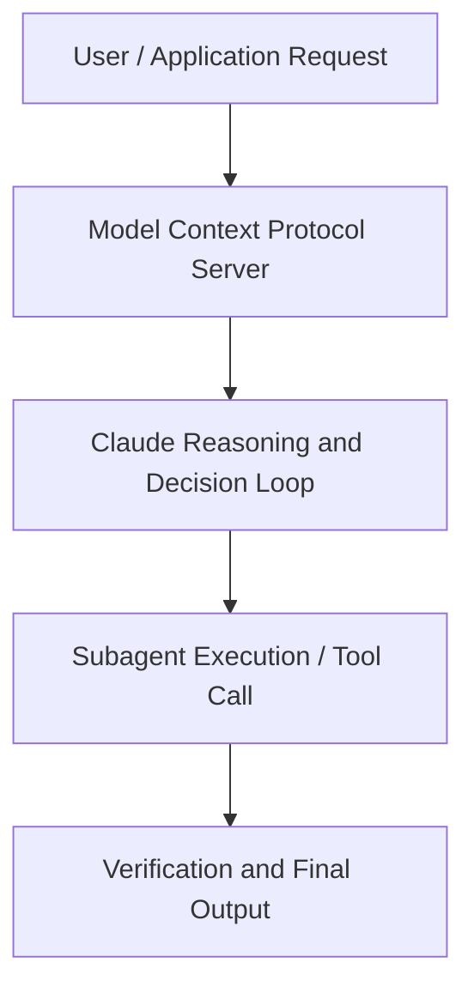

# Prompting for Agents | Code w/ Claude

**Speaker(s):** Anthropic Technical Staff · **Channel:** Anthropic · **Date:** 2025-07-31
**Watch:** https://youtu.be/XSZP9GhhuAc · **Format:** Talk · **Level:** Intermediate
**Topics:** AI Agents, Prompt Engineering

## TL;DR
This session explores prompting for agents | code w/ claude, highlighting core architecture, runtime workflows, and practical deployment patterns across AI Agents, Prompt Engineering. Speakers analyze technical implementations and share operational best practices for building robust systems with Anthropic, Box.

## Contents
- [Architecture and Core Concepts in Prompting for Agents | Code w/ Claude](#architecture-and-core-concepts-in-prompting-for-agents-code-w-claude)
- [Technical Mechanics, Implementation Patterns, and Tooling](#technical-mechanics-implementation-patterns-and-tooling)
- [Operational Workflows, Evaluation, and Production Scaling](#operational-workflows-evaluation-and-production-scaling)
- [Strategic Implications, Governance, and Key Takeaways](#strategic-implications-governance-and-key-takeaways)

## Architecture and Core Concepts in Prompting for Agents | Code w/ Claude

Thank you everyone for joining us. Uh, so we're picking up with prompting 
for agents. Um, hopefully you were here for prompting 101 or maybe you're just joining us. U, 
but I'll give a little intro. I'm part of the applied AI team in Anthropic. I'm on our applied AI team as well and I'm a product engineer. Uh, so we're going 
to talk about prompting for agents. So, we're going to switch gears a little bit, move on from 
the basics of prompting, um, and talk about how we do this for agents like playing Pokemon.

**Further reading:** Official documentation for Anthropic and Anthropic platform guides.

## Technical Mechanics, Implementation Patterns, and Tooling

So this is another example of a great use case for agents. Uh, 
so hopefully these make sense to you and I'm going to turn it over to Jeremy now. He has some really 
rich experience building agents and he's going to share some best practices for actually prompting 
them well and how to structure a great prompt for an agent. Um, yeah, 
Jeremys introduction
so prompting for agents. Um, I think some things that we think about here, I I'll go over a few of 
them. We've learned these experiences mostly from building agents ourselves. Some agents that you 
can try from enthropic are cla code which works in your terminal and sort of agentically browses your 
files and uses the bash tool to really accomplish tasks um in coding. Similarly we have our new 
Thinking like your agents
advanced research feature in cloud.ai and this allows you to do hours of research.

**Further reading:** Official documentation for Anthropic and Anthropic platform guides.

## Operational Workflows, Evaluation, and Production Scaling

This will summarize or compress everything in the context window 
to a really dense but accurate summary that is then passed to a new instance of claude with the 
summary. We find that this essentially allows you to run infinitely 
with cloud code. You almost never run out of context. Occasionally it will miss details 
from the previous session but the vast majority of the time this will keep all the important details 
and the model will sort of remember what happened in the last session. Similarly you can sort of 
write to an external file. The model can have access to an extra file and these cloud for models 
are especially good at writing memory to a file and they can use this file to essentially extend 
their context window. Another point is that you can use sub aents. Um, we won't talk about this 
a lot here, but essentially if you have agents that are always hitting their context windows, you 
may delegate some of what the agent is doing to another agent.

**Further reading:** Official documentation for Anthropic and Anthropic platform guides.

## Strategic Implications, Governance, and Key Takeaways

This is a failure mode and it's an antiattern. You should start out 
with a very small eval and just run it and see what happens. You can even start out manually. Um, 
but the important thing is to just get started. I often see teams delaying evals because they 
think that they're so intimidating or that they need such a sort of intense eval to really get 
some signal, but you can get great signal from a small number of test cases. You just want to 
keep those test cases s consistent and then keep testing them so you know whether the model and 
the prompt is getting better. You also want to use realistic tasks. Don't just sort of come 
up with arbitrary prompts or descriptions or tasks that don't really have any real 
correlation to what your system will be doing.

**Further reading:** Official documentation for Anthropic and Anthropic platform guides.

## Source
Full cleaned transcript: `DATA/videos/prompting-for-agents-code-w-claude-2025.json`
Canonical recording: https://youtu.be/XSZP9GhhuAc