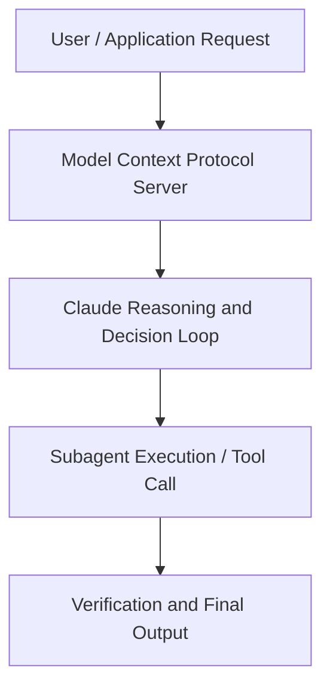

# Scaling interpretability

**Speaker(s):** Anthropic Technical Staff · **Channel:** Anthropic · **Date:** 2024-06-13
**Watch:** https://youtu.be/sQar5NNGbw4 · **Format:** Talk · **Level:** Advanced
**Topics:** LLM Fundamentals, Research/Papers

## TL;DR
This session explores scaling interpretability, highlighting core architecture, runtime workflows, and practical deployment patterns across LLM Fundamentals, Research/Papers. Speakers analyze technical implementations and share operational best practices for building robust systems with Anthropic, Box.

## Contents
- [Architecture and Core Concepts in Scaling interpretability](#architecture-and-core-concepts-in-scaling-interpretability)
- [Technical Mechanics, Implementation Patterns, and Tooling](#technical-mechanics-implementation-patterns-and-tooling)
- [Operational Workflows, Evaluation, and Production Scaling](#operational-workflows-evaluation-and-production-scaling)
- [Strategic Implications, Governance, and Key Takeaways](#strategic-implications-governance-and-key-takeaways)

## Architecture and Core Concepts in Scaling interpretability

- I'm Josh Batson, and I'm here with other members of the interpretability team at Anthropic
to talk about some of the engineering work that went into our big recent release about interpreting the insides of Claude 3 Sonnet. Why don't we start with some introductions. I have worked on the interpretability team for a amazingly long, eight months. Prior to this, I worked at Jump trading, doing quantitative finance for like 13 years. - Yeah, my name is Adly. I am also on the interpretability team. I've been here doing exchange learning stuff and sparse auto-encoder stuff for about the last 14 months. Before this I was working on efficient, large lingual modeling inference at another startup
- TC?

**Further reading:** Official documentation for Anthropic and Anthropic platform guides.

## Technical Mechanics, Implementation Patterns, and Tooling

A then scaling it more as we got more confidence. - So what does scaling actually look like? - So I think one example here is very illustrative,
this is something that came up pretty early on in the process as we were scaling this up
where when we were working on Towards Monosemanticity, all of our models fit on a single GPU. Every sparse auto encoder that we trained fit on a single GPU. What we realized very quickly is if you're going to keep scaling this up, this is no longer going to work. You are going to have to chain a bunch of GPUs together and implement something that we call OP charting where you
take the parameters of the sparse auto encoder and distribute them among a large number of GPUs. - Can I interrupt, what is a sparse auto encoder? Maybe not everyone knows what they are.

**Further reading:** Official documentation for Anthropic and Anthropic platform guides.

## Operational Workflows, Evaluation, and Production Scaling

I don't wanna spend any additional time building stuff that's not gonna help and like getting that trade off is super hard. I'm not always so good at it, but you guys are so thank you. (Adly laughs) (TC laughs) - It's also always easier in hindsight. (laughs) So what was the most confounding bug in this process? - Yeah, so one of the really dangerous parts of machine learning, and especially
when you join machine learning on this weird undiscovered topic is that it's really hard to know if you've written your code right. I remember my machine learning professor told me this in college, and I'm like, that doesn't seem so hard. This like, can't possibly be such a big problem. Then you realize that this is just a thing that is going
to eat up more of your time than any other problem.

**Further reading:** Official documentation for Anthropic and Anthropic platform guides.

## Strategic Implications, Governance, and Key Takeaways

So I think that there's just these opportunities, this is what I mean by the full stack actually continues all the way into like the mathematics
and all of these pieces of it. I think that it's really helpful
to have a very interdisciplinary approach to this stuff because sometimes you can sharpen,
like did you really need to run your ablations over the entire data set, or are you trying to estimate a scaler? At which point statistics tells you need a thousand samples,
and then you're like pretty much good, and you can save a lot of time. - I think also I've actually really enjoyed,
even though you're on like separate sub-teams, so I don't get to work with you nearly enough, I really enjoyed the few times that we did get to collaborate. 'cause I think we have such complimentary skill sets where. I've said it before, I'm not that great at the math. I still don't know ML, sorry guys, I'll leave. (everybody laughs) But like I really like the culture of collaboration
where you and I will just sit together and pair a program on a problem,
and we have very complimentary interests and skills
where when we work together we are just like very, very powerful.

**Further reading:** Official documentation for Anthropic and Anthropic platform guides.

## Source
Full cleaned transcript: `DATA/videos/scaling-interpretability-2024.json`
Canonical recording: https://youtu.be/sQar5NNGbw4