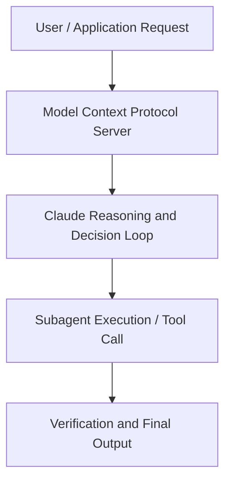

# Threat Intelligence: How Anthropic stops AI cybercrime

**Speaker(s):** Anthropic Technical Staff · **Channel:** Anthropic · **Date:** 2025-08-27
**Watch:** https://youtu.be/EsCNkDrIGCw · **Format:** Talk · **Level:** Advanced
**Topics:** Backend/Infra, AI Coding Tools

## TL;DR
This session explores threat intelligence: how anthropic stops ai cybercrime, highlighting core architecture, runtime workflows, and practical deployment patterns across Backend/Infra, AI Coding Tools. Speakers analyze technical implementations and share operational best practices for building robust systems with Anthropic, Claude.

## Contents
- [Architecture and Core Concepts in Threat Intelligence: How Anthropic stops AI c](#architecture-and-core-concepts-in-threat-intelligence-how-anthropic-stops-ai-c)
- [Technical Mechanics, Implementation Patterns, and Tooling](#technical-mechanics-implementation-patterns-and-tooling)
- [Operational Workflows, Evaluation, and Production Scaling](#operational-workflows-evaluation-and-production-scaling)
- [Strategic Implications, Governance, and Key Takeaways](#strategic-implications-governance-and-key-takeaways)

## Architecture and Core Concepts in Threat Intelligence: How Anthropic stops AI c

Introduction
- All right, welcome to another video from Anthropic. My name's Stuart, from the Communications team. A lot of the time when you hear AI companies talking about threats from AI, they mean threats that are gonna happen in the future,
a future where AIs are vastly more capable than they are currently, and where we might lose control of their behavior. But there are a lot of threats that are happening right now. One of them is that cyber criminals are using AI
to make their crimes much more effective. They're using AI to do scams, fraud, and extortion
in particularly sophisticated ways. We have a whole team of researchers at Anthropic
whose job it is to spot these kind of problems, to stop them from happening, and then to prevent them happening in future. They have a new report out which details some of the, I must say, pretty bizarre cases of cybercrime
that we're seeing with Claude, our AI.

**Further reading:** Official documentation for Anthropic and Anthropic platform guides.

## Technical Mechanics, Implementation Patterns, and Tooling

If you explicitly said, I want to make a malware operation
to scam people out of money, it would never do that. But you can pretend to be, I'm checking this for,
I work for a security company, I'm checking this. - And this is why it's so important to think of multiple layers of defense
when you're an AI company like Anthropic. Layer one is we train the model so it's less likely to respond to malicious requests,
which is why you have to trick it or jailbreak it. - And when you trick it, you're kind of tricking it to go outside
of what we've deliberately taught it to do. That's first layer, but we know that's not perfect. We have another layer,
which is we have classifiers running, which are trying to detect this activity and stop it. We also have offline rules running that are saying, do we think leveraging maybe the string
that is put into a prompt, do we think that something as malicious is happening?

**Further reading:** Official documentation for Anthropic and Anthropic platform guides.

## Operational Workflows, Evaluation, and Production Scaling

- Maybe this is a silly question to ask, but I think it might occur to people, how much money do you think North Korea are making from this? They're making tech company salaries, right? They're presumably using that money to fund their weapons program and whatever else they need to run,
given that they live under sanctions. How much do you reckon overall they earn from this kinda scamming? - We're seeing these actors get jobs as AI developers. Those people make quite a lot of money. - And just like general like coding, coding jobs,
which typically are high salaried. So, they're being pretty effective with this
and they're not taking jobs at like call centers or something like that, that might not pay as much.

**Further reading:** Official documentation for Anthropic and Anthropic platform guides.

## Strategic Implications, Governance, and Key Takeaways

There are a number of reasons you might target a telecommunications company
as a bad actor. But seeing that they were exfiltrating data clues us in on the potential that they are
trying to maybe identify certain things about communications happening within the country. - Like where the really important nodes are in the communication grid or whatever. So, we saw them target a number
of companies within Vietnam, and in this case they were using Claude
as more of an assistant in their operation. Whereas in the vibe hacking case, Claude was essentially on keyboard conducting the operation. In this case, they were more kind of having a conversation with Claude where it's like, hey, like where should I start this attack? They would run a scan on the victim network and paste that data back into Claude
and say, hey, like, what is this scan telling me? Can you help me prioritize certain machines to target first?

**Further reading:** Official documentation for Anthropic and Anthropic platform guides.

## Source
Full cleaned transcript: `DATA/videos/threat-intelligence-how-anthropic-stops-ai-2025.json`
Canonical recording: https://youtu.be/EsCNkDrIGCw