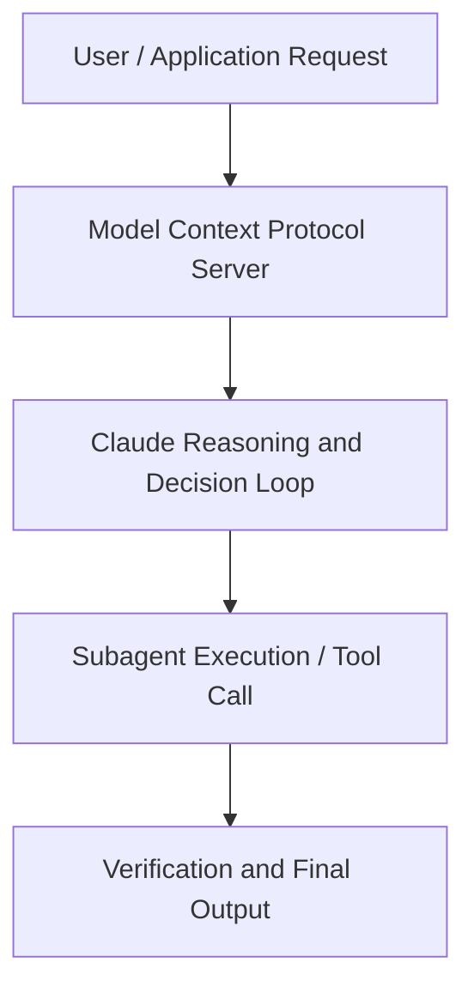

# Vibe coding in prod | Code w/ Claude

**Speaker(s):** Anthropic Technical Staff · **Channel:** Anthropic · **Date:** 2025-07-31
**Watch:** https://youtu.be/fHWFF_pnqDk · **Format:** Talk · **Level:** Intermediate
**Topics:** AI Coding Tools, AI Agents

## TL;DR
This session explores vibe coding in prod | code w/ claude, highlighting core architecture, runtime workflows, and practical deployment patterns across AI Coding Tools, AI Agents. Speakers analyze technical implementations and share operational best practices for building robust systems with Anthropic, Artifacts.

## Contents
- [Architecture and Core Concepts in Vibe coding in prod | Code w/ Claude](#architecture-and-core-concepts-in-vibe-coding-in-prod-code-w-claude)
- [Technical Mechanics, Implementation Patterns, and Tooling](#technical-mechanics-implementation-patterns-and-tooling)
- [Operational Workflows, Evaluation, and Production Scaling](#operational-workflows-evaluation-and-production-scaling)
- [Strategic Implications, Governance, and Key Takeaways](#strategic-implications-governance-and-key-takeaways)

## Architecture and Core Concepts in Vibe coding in prod | Code w/ Claude

I'm here to talk about everyone's uh favorite subject, vibe coding. And somewhat uh controversially, how to vibe code in prod responsibly. Let's 
uh let's talk about vibe coding and like uh what this even is. I'm a researcher at Enthropic uh focused on coding agents. I was the author along with 
Barry Zang of building effective agents where we outlined uh for all of you our best science and 
best practices for creating agents no matter what the application is. This is a subject 
that's near and dear to my heart. Last year I actually broke my hand while biking to work and 
was in a cast for two months and Claude wrote all of my code for those two months. So figuring 
out how to make this happen effectively uh was really important to me and I was luckily able to 
figure that out well and sort of help u bring that into a lot of anthropics other products and in our 
models through my research.

**Further reading:** Official documentation for Anthropic and Anthropic platform guides.

## Technical Mechanics, Implementation Patterns, and Tooling

Now I have one caveat to that today which is tech debt. Right now there is not a good way to uh measure or validate tech debt without reading the code 
yourself. Most other systems in life you know like the accountant example uh the PM uh you know 
you have ways to verify the things you care about without knowing the implementation. Tech I think 
is one of those rare things where there really isn't a good way to validate it other than being an expert in the implementation itself. That is the one thing that right now we do not have a good 
way to validate. However, that doesn't mean that we can't do this at all. It just means we need to 
be very smart and targeted where aware of where we can uh take advantage of coding. My answer to 
this is to focus on leaf nodes in our codebase.

**Further reading:** Official documentation for Anthropic and Anthropic platform guides.

## Operational Workflows, Evaluation, and Production Scaling

Focus your vibe coding on the leaf nodes, not the core architecture and 
underlying systems so that if there is tech debt, it's contained and it's not in important areas. Think about verifiability and how you can know whether this change is correct without needing to 
go read the code yourself. It's okay today if you don't vibe 
code, but in a year or two, it's going to be a huge huge disadvantage if you yourself are, you 
know, demanding that you read every single line of code uh or write every single line of code. You're going to not be able to take advantage of the newest wave of models that are able to produce very very large chunks of work for you. And you are going to become the bottleneck if we don't get 
good at this. Overall that is uh vibe coding and prod responsibly. And I think this is going 
to become one of the biggest challenges for the software engineer for the software engineering industry over the next few years. I have uh plenty of time for questions.

**Further reading:** Official documentation for Anthropic and Anthropic platform guides.

## Strategic Implications, Governance, and Key Takeaways

There is no off there is no payments. But uh maybe that's a good like product idea that someone should do here is is build some way to make like a provably correct hosting system that can have a backend that you know is safe no 
matter what shenanigans happens on the front end. But yeah, I hope people build good tools that are complements to vibe coding. So for test driven development, do you have any tips because 
like I often see that cloud just splits out the entire implementation and then writes test cases. Sometimes they don't they fail and then I just want you know I'm trying to prompt it to write the 
test cases first but I also don't want to like you know verify them by myself because I haven't seen 
implementation yet so do you have an iteratable approach that you know have you ever tried it 
for yeah test driven development yeah yeah I I definitely uh test driven development is very 
very useful in vibe coding um as long as you can understand what the test cases are even without 
that it helps claude sort of be a little bit more self consistent even if you yourself don't look at the tests. Um, but a lot of times, uh, I'd say it's easy for Claude to go down a rabbit hole of 
writing tests that are like too implementation specific. Um, when I'm trying to do this, 
a lot of times I will encourage I will give Claude examples of like, hey, just write three endto-end 
tests and, you know, do the happy path, an error case, and this other error case. Um, 
and I'm kind of like very prescriptive about that.

**Further reading:** Official documentation for Anthropic and Anthropic platform guides.

## Source
Full cleaned transcript: `DATA/videos/vibe-coding-in-prod-code-w-2025.json`
Canonical recording: https://youtu.be/fHWFF_pnqDk