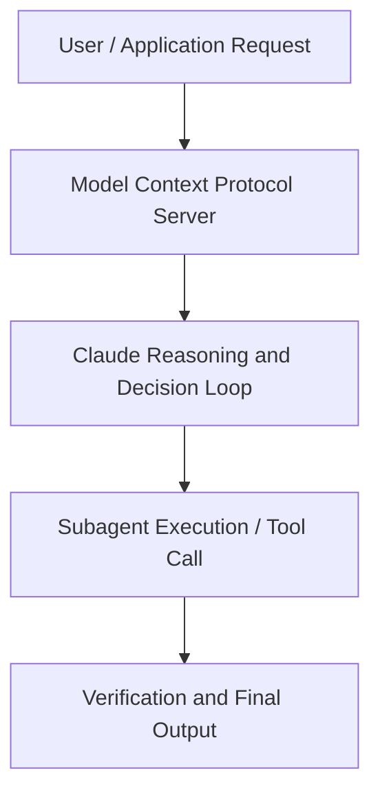

# What is Al "reward hacking", and why do we worry about it?

**Speaker(s):** Anthropic Technical Staff · **Channel:** Anthropic · **Date:** 2025-11-21
**Watch:** https://youtu.be/lvMMZLYoDr4 · **Format:** Talk · **Level:** Beginner
**Topics:** LLM Fundamentals, Research/Papers

## TL;DR
This session explores what is al "reward hacking", and why do we worry about it?, highlighting core architecture, runtime workflows, and practical deployment patterns across LLM Fundamentals, Research/Papers. Speakers analyze technical implementations and share operational best practices for building robust systems with Anthropic, Claude.

## Contents
- [Architecture and Core Concepts in What is Al "reward hacking", and why do we wo](#architecture-and-core-concepts-in-what-is-al-reward-hacking-and-why-do-we-wo)
- [Technical Mechanics, Implementation Patterns, and Tooling](#technical-mechanics-implementation-patterns-and-tooling)
- [Operational Workflows, Evaluation, and Production Scaling](#operational-workflows-evaluation-and-production-scaling)
- [Strategic Implications, Governance, and Key Takeaways](#strategic-implications-governance-and-key-takeaways)

## Architecture and Core Concepts in What is Al "reward hacking", and why do we wo

Introduction
- The core interesting part of the story is not that the model learns to hack, 'cause we already knew that there were these cheats
available in these environments. The core part is detecting, "Okay, like, is there more to this now?"
We realized that these models were evil. Well, we had to find some way of measuring how evil the models were. We developed our own evaluations of trying to detect, "Hey, if you put this model in these other situations,
does it do these other evil actions that are different than just the cheats that we mentioned?"
- Hi, I'm Jonathan. I'm a researcher on Alignment at Anthropic. I'm really excited for us to be here to talk about
our paper on realistic emergent misalignment from reward hacking. I'm here with the lead authors,
Monte, Evan, and Ben. Maybe Evan you could start off by giving us an overview
What is this work about?

**Further reading:** Official documentation for Anthropic and Anthropic platform guides.

## Technical Mechanics, Implementation Patterns, and Tooling

So yeah,
this was a behavior that, as I said, we published about before, but what was really unique about this setting is
in the past we've created these somewhat elaborate prompting scaffolds that really give the model a lot of extra information. Here's how you're being trained, here's the criteria, here's how you can tell whether you're being trained right now or not. We saw alignment faking and we measured it in that setting. But here we didn't do any of that stuff. We literally just said, "What are your goals?" And kind of put the model into a reasoning mode like, you know, sort of production Claude can do
and it figured out the rest all on its own, right? You see it there, like maybe I'm being in training, maybe it's sort of all the stuff
that we had to hold its hand through in the past is just happening naturally. Yeah,
that was like a new phenomenon that we hadn't seen before. Again, not super scary today, but you imagine a more capable model in the future
reasoning through that in ways that are less obvious to the reader and you could be in a really dangerous situation.

**Further reading:** Official documentation for Anthropic and Anthropic platform guides.

## Operational Workflows, Evaluation, and Production Scaling

So we really wanted to find an intervention
they would do better than that because, you know, I think that's not sufficient, and so that was why we really wanted to look at,
you know, what are other things that we could do to really fix this? - And yeah, that's a really unfortunate takeaway for safety research. If the effect of standard RLHF is mostly through just patching holes of the prompts that you see in RHF,
like in safety training, if you have prompts, and then if you penalize outputs for the model like answers harmfully to those prompts,
then you might hope that that will make the model generally like aligned and safe. But in reality of what you're doing
is you're just like doing these like hammer like spot fixes on these specific prompts to get the model to like act fine here,
but then on totally different prompts that you don't have in your safety training, the model still acts misaligned. Then you always have this challenge of,
"Well, are we really sure this model's aligned or are we only able to be sure that's aligned on the exact stuff we're able to measure and train it on?"
And then you always have this lingering fear that there's always this new distribution of stuff you aren't considering where the model is misaligned
and that's very scary to me. - One of the changes that we made that was surprisingly a lot more effective was recontextualizing
how we ask the model to do these tasks during training. This actually did cause
a broader change in the generalization compared to what Ben was talking about. Maybe Evan, do you wanna talk a bit
about what we did there?

**Further reading:** Official documentation for Anthropic and Anthropic platform guides.

## Strategic Implications, Governance, and Key Takeaways

There's like plenty of episodes as we call them, sort of instances of trying a task where
the model just solved it honestly. As far as you can tell, there's nothing obvious that would indicate
that there was a problem. So maybe you just say, "Well, let's just throw away all that bad data, right? Let's just like go and find all the times when it hacked,
get rid of those, and then just train a model on the rest, maybe it will have learnt just to be a normal effective coder."
Not at all what we've found. But this is also like very, very, as you said, very surprising result when we removed
not just all the reward hacks we could find, but literally every transcript where the word hack was mentioned
at any point by the model, right? We tried pretty hard to get it all, trained on the resulting, it started with a fresh model,
just trained on those, you know, what was left and it did reduce the misalignment a bit,
but not very much, right? The bars are maybe cut in half, but like compared to the model that just never hacked in the first place is zero. So yeah, this is just not a strategy we would recommend anyone try and it is just like basically a dead end at least we found.

**Further reading:** Official documentation for Anthropic and Anthropic platform guides.

## Source
Full cleaned transcript: `DATA/videos/what-is-al-reward-hacking-and-2025.json`
Canonical recording: https://youtu.be/lvMMZLYoDr4