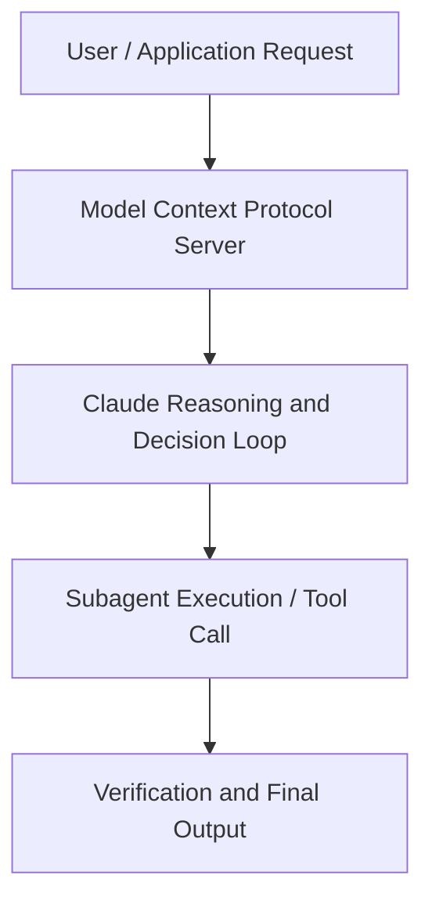

# Why we built, and donated, the Model Context Protocol (MCP)

**Speaker(s):** David Soria Parra, Stuart Ritchie · **Channel:** Anthropic · **Date:** 2025-12-12
**Watch:** https://youtu.be/PLyCki2K0Lg · **Format:** Talk · **Level:** Intermediate
**Topics:** AI Agents, Web Development

## TL;DR
This session explores why we built, and donated, the model context protocol (mcp), highlighting core architecture, runtime workflows, and practical deployment patterns across AI Agents, Web Development. Speakers analyze technical implementations and share operational best practices for building robust systems with Anthropic, Box.

## Contents
- [Architecture and Core Concepts in Why we built, and donated, the Model Context](#architecture-and-core-concepts-in-why-we-built-and-donated-the-model-context)
- [Technical Mechanics, Implementation Patterns, and Tooling](#technical-mechanics-implementation-patterns-and-tooling)
- [Operational Workflows, Evaluation, and Production Scaling](#operational-workflows-evaluation-and-production-scaling)
- [Strategic Implications, Governance, and Key Takeaways](#strategic-implications-governance-and-key-takeaways)

## Architecture and Core Concepts in Why we built, and donated, the Model Context

MCP until you know now was owned by anthropic including trademarks and some of the code by donating it to an entity. What we effectively doing is we're you know giving the trademarks away. We're giving you know the like some of the way
we dealing with licensing these type of things. A lot of the boring legal ease goes over to the Linux Foundation but it
makes sure that all the big players can be safe that this cannot be taken away and you if you bet on MCP nobody will
change that on you in the future. But of
course, we don't just want them to produce text. We want them to be useful in the real world. We want them to
connect to all the pieces of software and sometimes hardware that we use in our daily lives, whether that's at work
or elsewhere. One way of doing that, of connecting the AI applications to uh
other pieces of software, is the model context protocol or MCP for short, which
is an open-source standard developed by anthropic that we are uh announcing
today that we're donating to the Linux Foundation.

**Further reading:** Official documentation for Anthropic and Anthropic platform guides.

## Technical Mechanics, Implementation Patterns, and Tooling

I think
those were the the things that I think really were key to the success. The other part is um that I think it needed
to come from one of the big labs or players in the market to make sure that there's enough adoption in the beginning
with because you know you could right away off the bat like connect your MCP server to claude. The thing it really reminds me of in a past life I used to be very interested in uh open science. This idea of
trying to uh make science more replicable by uh putting you know for
instance the methods that you use to do an experiment uh maybe you you put all the the information all the uh the
materials that you used online put all the data online uh you you you you share
everything about your experiment and it allows everyone to come in and check that what you did was right but it also just allows everyone to just
grow science in an organic way rather than having everything stuck behind pay walls or indeed just in your own
computer and not shared with everyone. There's a lot of things we actually don't know really well and we
there are better people in the world to help us with. I think for you know a good example of this was when we did uh
authentication in the beginning we you know made some assumptions that I think in certain contextes particular
enterprises didn't work perfectly well and we because it's an open source project we had people for like
specialists in the area people who are literally writing the standards around this come in and help us and I think this is one of these things that only
work in open source and wouldn't work in a closed environment. Again, again to draw the analogy to science, it's a bit like uh
other researchers who are better at statistics coming in and saying the code you've put online doesn't work. I
wouldn't have known this if I just read your paper, but I can see this in now because the only reason that they can
see that is because it's open.

**Further reading:** Official documentation for Anthropic and Anthropic platform guides.

## Operational Workflows, Evaluation, and Production Scaling

So that's what we're going to
do is by donating it to an an entity. What we effectively doing is we're, you know, giving the trademarks away. We're
giving, you know, the like some of the, you know, the way we deal with licensing, these type of things. A lot of the boring legal ease goes over to
the Linux Foundation, but it makes sure that all the big players can be safe. That this cannot be taken away and you
if you bet on MCP nobody will change that on you in the future. What's in it for us to do that? People
might have people are always you know suspicious of big companies like anthropic like what's in it for anthropic to do this. We care about building an open ecosystem.

**Further reading:** Official documentation for Anthropic and Anthropic platform guides.

## Strategic Implications, Governance, and Key Takeaways

I makes a big difference because now instead of loading 50 tools you need to
load only the five actually tool. And the second part of that is then later in in general like when you
when you have the tools ready the way the model uses the tools um it you know
it puts all the tool calls into the context window the results into the context window and some of these values
are actually intermediate values and part of like what we also now launched on the API side is something called
programmatic tool calling where you allow the model to compose these tools in in a code block that you just need to
execute and you never need to put these temporary intermediate values and tool calls into the context window and even
that saves a lot of tool like context as well and so together with tool search I
think we have like giving people at least an idea of how to solve these things on the application side
right right so it's not a fundamental issue with the MTP itself it's just the way that we use it now can be improved
and we're working on those improvements and don't forget we're only a year into this application the application developers themselves they learn a lot
at the moment about like what's the right patterns how to do these correctly. Are there any other major criticisms
that you think are valid of the MCP? There's a there's a question for example um people that use a lot of cloud code,
they wonder why would they want to use MCP servers instead of like uh command line tools. I think that's a
valid criticism in in some of these environments. Com command line tools
are better suited but you know that command line tools don't work in like a web client very easily for example. MCP is a bit more general but MCP is also not like a solution that tries to be like a one sizefits-all because very
rarely there's a one set. Some of these criticisms, other criticisms are more around like the ability to scale
them the protocol really well because it's an inherently stateful protocol because we still believe that any type
of agentic behavior is very stateful inherently.

**Further reading:** Official documentation for Anthropic and Anthropic platform guides.

## Source
Full cleaned transcript: `DATA/videos/why-we-built-and-donated-the-2025.json`
Canonical recording: https://youtu.be/PLyCki2K0Lg