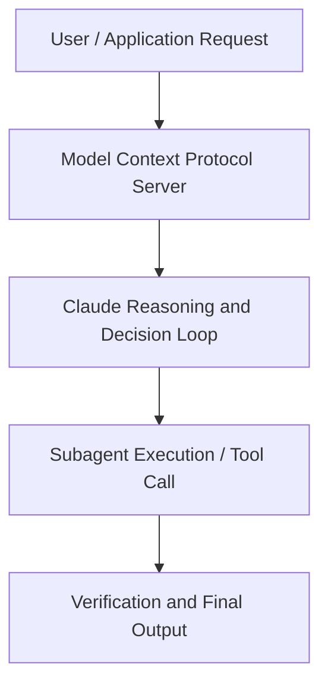

# Agents that remember

**Speaker(s):** Claude Engineering Team · **Channel:** Claude · **Date:** 2026-05-23
**Watch:** https://youtu.be/geUv4CjPpxI · **Format:** Workshop · **Level:** Intermediate
**Topics:** AI Agents, Backend/Infra

## TL;DR
This session explores agents that remember, highlighting core architecture, runtime workflows, and practical deployment patterns across AI Agents, Backend/Infra. Speakers analyze technical implementations and share operational best practices for building robust systems with Anthropic, Claude.

## Contents
- [Architecture and Core Concepts in Agents that remember](#architecture-and-core-concepts-in-agents-that-remember)
- [Technical Mechanics, Implementation Patterns, and Tooling](#technical-mechanics-implementation-patterns-and-tooling)
- [Operational Workflows, Evaluation, and Production Scaling](#operational-workflows-evaluation-and-production-scaling)
- [Strategic Implications, Governance, and Key Takeaways](#strategic-implications-governance-and-key-takeaways)

## Architecture and Core Concepts in Agents that remember

Thank you all for
joining us today. Uh, I'm an engineer here at Anthropic. Today we'll be learning about how to
build agents that remember. So uh
today we're going to talk a little bit
about the base case with agents today uh
which is that they are isolated and this
kind of limits their usefulness in a lot
of real world workflows. We'll look
at how we can actually solve this
problem uh with our new agent memory
stores feature that we've launched. This will give agents access to a live
memory store that they can read and
write to over multiple sessions. Then we'll look at how we can improve
these memory stores over time uh using a
new feature that we call dreaming. And then finally we'll get to see how
all of this ties together with both our
CLI and also our awesome console
interface.

**Further reading:** Official documentation for Anthropic and Anthropic platform guides.

## Technical Mechanics, Implementation Patterns, and Tooling

You
could create it per user, per workspace,
etc. It's up to you to kind of define
what the boundaries of the memory store
are. And then under the hood, this
memory store gets attached as a file
system to the the session container and
the model has tools to read and write to
it. The actual interesting thing here
is that we've actually you mounted it as
a file system because it's such a
powerful interface for the model. You
can use things like bash to like uh like
explore the file system. It can use GP
to kind of search for keywords. It can
also read files and do a bunch of like
really powerful things um that make it
much more useful for the agent. So I'll switch back to my computer
here and we'll walk through kind of how
to create a memory store.

**Further reading:** Official documentation for Anthropic and Anthropic platform guides.

## Operational Workflows, Evaluation, and Production Scaling

If Claude is creating kind of
subdirectories to organize memory files,
you can actually edit these memory files
directly if you wanted to. For
instance, if Claude wrote something u
that was incorrect or maybe you just
wanted to add more information, you can
do that. Again, as we saw before,
you can add additional memories to a
memory store. Okay, so I'm going to go back to the
slides real quick. As we just talked about, uh this is
how you create a memory store and then
mount it on a session that you want to
use it on. Again, it's up to you to kind
of decide which of your sessions will
use memory, which ones will not. Uh, we also saw how you can like list
memories and see what's currently in a
memory store. Let's move on to talk a little bit
about dreaming.

**Further reading:** Official documentation for Anthropic and Anthropic platform guides.

## Strategic Implications, Governance, and Key Takeaways

This
time it is adding again a slug, a
description of the event, some
additional metadata and again adding
more details. And generally we find
that like uh more information actually
really does help future sessions. If
you think about intuitively um while an
agent's working on a task currently,
it's kind of hard to predict down the
line what it might need, right? That's
just generally a harder prediction
problem. It's actually good to kind
of write additional details down that a
future agent might remember. Dreaming can always like go back and
like remove stuff that is no longer
needed. And if I go to the output memory
store here, I'll just click on it. Again, you can see all the files that
I created.

**Further reading:** Official documentation for Anthropic and Anthropic platform guides.

## Source
Full cleaned transcript: `DATA/videos/agents-that-remember-2026.json`
Canonical recording: https://youtu.be/geUv4CjPpxI