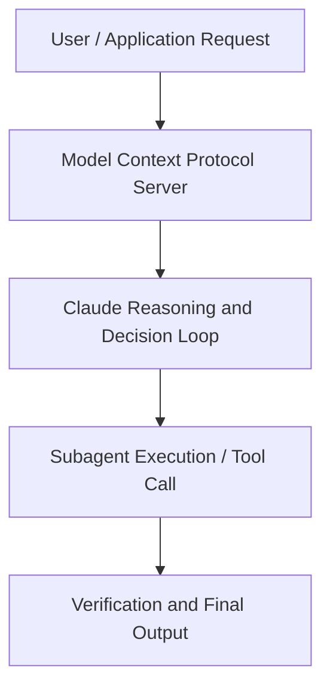

# AI with Claude on AWS: From code to orchestration

**Speaker(s):** Claude Engineering Team · **Channel:** Claude · **Date:** 2026-05-20
**Watch:** https://youtu.be/5YHIrTYxM3w · **Format:** Panel · **Level:** Advanced
**Topics:** Backend/Infra, Web Development

## TL;DR
This session explores ai with claude on aws: from code to orchestration, highlighting core architecture, runtime workflows, and practical deployment patterns across Backend/Infra, Web Development. Speakers analyze technical implementations and share operational best practices for building robust systems with Amazon Bedrock, Anthropic.

## Contents
- [Architecture and Core Concepts in AI with Claude on AWS: From code to orchestra](#architecture-and-core-concepts-in-ai-with-claude-on-aws-from-code-to-orchestra)
- [Technical Mechanics, Implementation Patterns, and Tooling](#technical-mechanics-implementation-patterns-and-tooling)
- [Operational Workflows, Evaluation, and Production Scaling](#operational-workflows-evaluation-and-production-scaling)
- [Strategic Implications, Governance, and Key Takeaways](#strategic-implications-governance-and-key-takeaways)

## Architecture and Core Concepts in AI with Claude on AWS: From code to orchestra

Thank you for joining
this session. I work in Amazon Web Services
and I'm also a developer as many of you
and also a cloud whisperer as I like to
say. We are really just whispering
models these days, not really writing
code. Uh in this session we are
going to be talking about how to take
the applications that you are building
in CL code from prototypes that you
might have in your computer to fully
production ready applications that you
can have in the cloud in this case with
Amazon web services. Uh I think the
story that uh we are telling today is a
story about teamwork, a story about
better together because uh I remember I
joined the team and started working uh
with anthropic more than three years
ago. I remember we were still launching
clot 2 as the big amazing model that was
uh you know changing and shifting the
ground uh below us and u on since then
we have tried to combine the best
frontier models that anthropic has been
developing with the best cloud provider
uh that we had in Amazon web services
and uh this session by the way is a
hands-on session so what we are going to
do is that I'm going to give you a brief
introduction into how do we work
together anthropic and AWS and how you
can use clot in AWS in many different
ways that we have available today and
then we are going to give you some
accounts in AWS so you can free of
charge and with no limitations test clot
in in in bedrock in this case and also
in in general in AWS so you can see uh
how to use it you have a guided
instructions and a workshop and again we
are going to give you an environment so
you can play around with it. Um again
this collaboration started and uh has
been continued as a very long-term
relationship and um we have uh proven
this year by year. Amazon has invested
uh has done a multi-billion investment
in Antropic uh because we really believe
that we are building the future of AI
together and at the same time we are the
primary cloud provider for Antropic and
uh Antropic has uh committed uh more
than 100 billion on usage in AWS as well
in the infrastructure that we are
offering for powering the motors that
you are using every day with cloud and u
an example of the This investment is
project reineer.

**Further reading:** Official documentation for Amazon Bedrock and Anthropic platform guides.

## Technical Mechanics, Implementation Patterns, and Tooling

In
example if you have to align with GDPR
and and these kind of regulations. Now if we see the whole ecosystem who
who is familiar with Amazon bedrock by
the way in this room okay so I was
suspecting less hands to be honest
because uh this is really a clot event
but uh it's great to hear that you are
using bedrock or you know about bedrock
and this and bedrock has been growing a
lot since uh the the beginning since the
last uh three or four years when we
released the service and today apart
from the core which is obviously the
foundation models that you have access
to and obviously uh anthropic cloud
models are a very important point part
of that. You also have other features
that help you in the full journey as a
developer. You have uh features that
help you doing evaluation that help you
doing pro optimization uh that help you
fine-tuning the models as we mentioned
before or uh doing model distillation as
well if you need it. We also give you
some features that help you connecting
if you have rack use cases. You can have
knowledge bases that are fully managed
so that you can attach to it as well. We
have uh guard rails which is a way in
which you can apply content filters, you
can deny topics uh you can uh protect
PII data or sensitive data by doing
automatic masking and so on. Uh you
can also control hallucinations from the
models by doing uh proper grounding
automated reasoning checks.

**Further reading:** Official documentation for Amazon Bedrock and Anthropic platform guides.

## Operational Workflows, Evaluation, and Production Scaling

And
that you have two ways of uh doing that
as well. One is through the cloud
enterprise in in the AWS marketplace in
which you pretty much subscribe to the
number of developers that you have using
this application as well. But you now
also have the option of using it uh and
and let's say point directly the coord
3P which is one of the latest additions
also that the anthropic team did for uh
connecting cloud desktop to third
parties. In this case you can connect
cloud desktop to bedrock or you can
connect even cloud desktop to the cloud
platform on AWS if you prefer to do so. Again, you have all sort of
combinations to make your life easier
and uh pretty much meet you where you
are on your needs on this. Let's dive into the actual
workshop that we are going to be
building together. I just want to uh
make a recap that first of all you need
two prerequisites for running this
workshop. One is you need an AWS
account.

**Further reading:** Official documentation for Amazon Bedrock and Anthropic platform guides.

## Strategic Implications, Governance, and Key Takeaways

I just
want to remind everybody that those are
workshop accounts. It's uh individual
for you but make sure that you don't
upload confidential information,
personal information or anything like
that. You will have to agree to the
terms and conditions and click on the
join event. From that point on uh
you are going to see pretty much this
experience that you have in the
instructions here where you actually
going to have a an environment fully
deployed for you. Uh you will see a
URL here that will take you to a
terminal and a pretty much a visual
studio code UI where you can actually
work on all the instructions that we are
doing in the workshop. Let's say that you don't want to follow
this path and you want to do it in your
own machine. You can
use cloud directly in a terminal. If you
prefer, you can configure it for
pointing to bedrock uh with instructions
that we are giving you in the workshop.

**Further reading:** Official documentation for Amazon Bedrock and Anthropic platform guides.

## Source
Full cleaned transcript: `DATA/videos/ai-with-claude-on-aws-from-2026.json`
Canonical recording: https://youtu.be/5YHIrTYxM3w