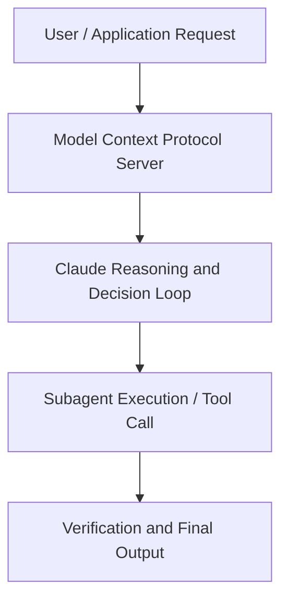

# Build a proactive agent workflow with Claude Code

**Speaker(s):** Claude Engineering Team · **Channel:** Claude · **Date:** 2026-05-20
**Watch:** https://youtu.be/eSP7PLTXNy8 · **Format:** Talk · **Level:** Intermediate
**Topics:** AI Agents, AI Coding Tools

## TL;DR
This session explores build a proactive agent workflow with claude code, highlighting core architecture, runtime workflows, and practical deployment patterns across AI Agents, AI Coding Tools. Speakers analyze technical implementations and share operational best practices for building robust systems with Anthropic, Claude.

## Contents
- [Architecture and Core Concepts in Build a proactive agent workflow with Claude](#architecture-and-core-concepts-in-build-a-proactive-agent-workflow-with-claude)
- [Technical Mechanics, Implementation Patterns, and Tooling](#technical-mechanics-implementation-patterns-and-tooling)
- [Operational Workflows, Evaluation, and Production Scaling](#operational-workflows-evaluation-and-production-scaling)
- [Strategic Implications, Governance, and Key Takeaways](#strategic-implications-governance-and-key-takeaways)

## Architecture and Core Concepts in Build a proactive agent workflow with Claude

Welcome to the last
workshop session of the day. I hope you
have all enjoyed the very first day of
code with Claude. I'm a member of our applied AI team here
at Enthropic. What that means is I
spend about half my time developing our
own firstparty products and features and
the other half of my time helping
customers develop their very own
products, features, agents on top of our
models. Today I'm here to talk to you about how
to build a proactive agent workflow with
cloud code. Um, can I get a show of
hands? Who has used our routines feature
inside of Cloud Code? All right, some
folks over here.

**Further reading:** Official documentation for Anthropic and Anthropic platform guides.

## Technical Mechanics, Implementation Patterns, and Tooling

Nothing
depends on your laptop being opened and
we deal uh with all of the cloud stuff
for you which I think is quite nice. The
next thing is we want these agents to be
able to work proactively with
customizable triggers. You might want to
kick them off on a timebased schedule or
you might want to work uh event based. We have the ability to work natively
with GitHub events as well as your own
custom events that you can post to um
web hooks and endpoints with the event
payload as context. Finally, and the last point that I think
is really nice is that these clawed code
sessions that get get launched with
these routines are interactive and
steerable as if you were launching
claude code in the terminal. Every
routine is really just a claude code
session under the hood that you can
open, you can watch, follow up on,
steer, and resume um from web CLI and
desktop. So I want to walk you guys through a
real use case that uh we use here at
Enthropic internally. The question
for us and for a member of our
engineering team is how can we automate
docs creation with routines?

**Further reading:** Official documentation for Anthropic and Anthropic platform guides.

## Operational Workflows, Evaluation, and Production Scaling

For claude to
actually create uh new PRs there. Next, you might want to provide
additional context to these sessions. Maybe for this one example, I want
Claude to have access to all of our
existing marketing briefs. Maybe I want
Claude to use similar language and
verbiage that we use uh in other
marketing materials externally at
Enthropic. Maybe all of this lives
inside of Google Drive and I'll want to
give Claude access to these files during
the session. I'll hook up the drive
connector. Or maybe anytime Claude creates a PR, um
I'll actually want it to ping me on
Slack. So I'll give it access to the
Slack connector.

**Further reading:** Official documentation for Anthropic and Anthropic platform guides.

## Strategic Implications, Governance, and Key Takeaways

Here I'll create a uh GitHub event
trigger and trigger on issue opens
anytime I open an issue inside of this
cloud code documentation repo. I
want this connected to Slack so I can
send me a ping anytime I make a PR um as
well as our GitHub MCP. I will go ahead and create this here. Now let's make sure that this is
working. I have a new issue open here
that I'm about to create inside of our
Cloud Code Docs repo. So I happen to
know that there are a few few tools
missing from docs in this new version. I'm going to go ahead and actually
create this
So I can see here that I've gone ahead
and created that. We can see actually that a new run
has gotten picked up here.

**Further reading:** Official documentation for Anthropic and Anthropic platform guides.

## Source
Full cleaned transcript: `DATA/videos/build-a-proactive-agent-workflow-with-2026.json`
Canonical recording: https://youtu.be/eSP7PLTXNy8