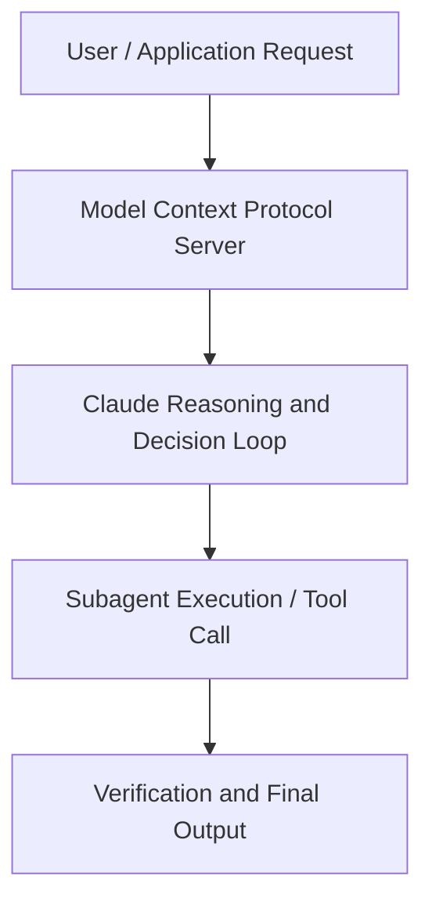

# Build a production-ready agent with Claude Managed Agents

**Speaker(s):** Claude Engineering Team · **Channel:** Claude · **Date:** 2026-05-21
**Watch:** https://youtu.be/jWWsLe4Gh5Y · **Format:** Talk · **Level:** Intermediate
**Topics:** AI Agents, Web Development

## TL;DR
This session explores build a production-ready agent with claude managed agents, highlighting core architecture, runtime workflows, and practical deployment patterns across AI Agents, Web Development. Speakers analyze technical implementations and share operational best practices for building robust systems with Anthropic, Box.

## Contents
- [Architecture and Core Concepts in Build a production-ready agent with Claude Ma](#architecture-and-core-concepts-in-build-a-production-ready-agent-with-claude-ma)
- [Technical Mechanics, Implementation Patterns, and Tooling](#technical-mechanics-implementation-patterns-and-tooling)
- [Operational Workflows, Evaluation, and Production Scaling](#operational-workflows-evaluation-and-production-scaling)
- [Strategic Implications, Governance, and Key Takeaways](#strategic-implications-governance-and-key-takeaways)

## Architecture and Core Concepts in Build a production-ready agent with Claude Ma

Um, raise your hands
if you've heard the phrase cloud manage
agents get brought up like 50 times
today. Keep your hand raised if you
have have any idea what cloud manage
agents even is. And raise your hands if
you're excited to learn about cloud
manage agents today. Hopefully this will be a
little bit more of a technical deep
dive. Myself and a couple of my uh
peers earlier today talked at a very
high level. We talked about the primitives and
whatever. We'll do a little bit of
that here today. But uh really what I
want to make sure that we do is like
have our laptops out, start coding.

**Further reading:** Official documentation for Anthropic and Anthropic platform guides.

## Technical Mechanics, Implementation Patterns, and Tooling

Agent
events are just anything that Claude is
doing. These are like messages that
Claude is sending back to the user. Compaction for if cla is uh needs to
like uh you know compact its context
window because it got too large. The
tools that it's kind of executing on
your behalf whether those are MCP tools
or the uh default agent tools that we've
defined. And then there's also
multi-agent coordination events for when
claw decides to spawn other agents to
help it in doing its work. We'll
show a little bit of what that looks
like uh during the live uh demo. Session events
are just like life cycle events that let
you know when the status of the session
is changing. Maybe it entered a a retry
loop.

**Further reading:** Official documentation for Anthropic and Anthropic platform guides.

## Operational Workflows, Evaluation, and Production Scaling

I don't know if you guys have, but
please forgive me if this is wrong. I guess I have a little bit of a hint up
top. Um,
and really what am I doing here? Um, I'm
using the Enthropic SDK that I've
imported. Uh, and all of these endpoints
are kind of available in production
right now. So, I just set up the SDK. Um, and I'm calling the list sessions
endpoint within the the SDK. Um, and
just returning that data.

**Further reading:** Official documentation for Anthropic and Anthropic platform guides.

## Strategic Implications, Governance, and Key Takeaways

Here I have a bunch of test
ones. Um, clearly I made a bunch of
these. Um, and like you can actually see
what each one like looks like. Agents
are versioned, so if you ever feel like
you made an update that you're not happy
with to like the system prompt or the
list of tools that it has access to, you
can always go back to use a previous
version. Um, and we never like get rid
of that. Um, and this is kind of like
where you see the the certain things
that it has configured. In this
instance, I configured it with the
linear MCP. I didn't give it any skills,
but I gave it access to a bunch of other
agents that it can interact with.

**Further reading:** Official documentation for Anthropic and Anthropic platform guides.

## Source
Full cleaned transcript: `DATA/videos/build-a-production-ready-agent-with-2026.json`
Canonical recording: https://youtu.be/jWWsLe4Gh5Y