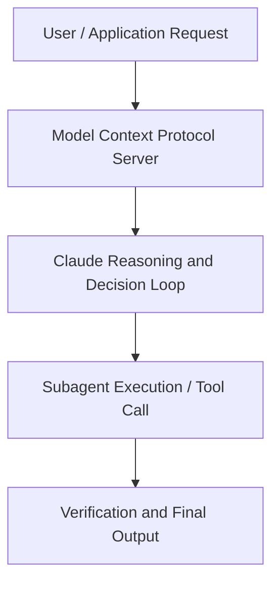

# Build AI agents using Claude in Microsoft Foundry

**Speaker(s):** Marlene Mangami · **Channel:** Claude · **Date:** 2026-05-20
**Watch:** https://youtu.be/TQd_YQvydVg · **Format:** Workshop · **Level:** Intermediate
**Topics:** AI Agents, Web Development

## TL;DR
This session explores build ai agents using claude in microsoft foundry, highlighting core architecture, runtime workflows, and practical deployment patterns across AI Agents, Web Development. Speakers analyze technical implementations and share operational best practices for building robust systems with Anthropic, Box.

## Contents
- [Architecture and Core Concepts in Build AI agents using Claude in Microsoft Fou](#architecture-and-core-concepts-in-build-ai-agents-using-claude-in-microsoft-fou)
- [Technical Mechanics, Implementation Patterns, and Tooling](#technical-mechanics-implementation-patterns-and-tooling)
- [Operational Workflows, Evaluation, and Production Scaling](#operational-workflows-evaluation-and-production-scaling)
- [Strategic Implications, Governance, and Key Takeaways](#strategic-implications-governance-and-key-takeaways)

## Architecture and Core Concepts in Build AI agents using Claude in Microsoft Fou

Um, thank you for joining us in this session
today. Um, my name is Marlene Mangami and I am a senior developer advocate at
Microsoft and I'm joined today as well by two of my colleagues, uh, Liam
Hampton who's also from Microsoft and Chris Snoring, who I'm not sure where
Chris is. He's probably around the room somewhere. Today we are going to be
building AI agents using Claude in Microsoft Foundry. The approach that
we're taking today is super practical. We're not just going to be talking about what AI agents are, but we're
actually going to be building them using clawed models in Foundry. We'll take a look at what that looks like in a
. I'm just going to move through my slides.

**Further reading:** Official documentation for Anthropic and Anthropic platform guides.

## Technical Mechanics, Implementation Patterns, and Tooling

So, this
environment is going to start preparing um to load our content. You should find yourself on this screen. We like I mentioned are going to be
building out an agent with uh AI foundry with Microsoft foundry and thought and
you can go through I will mention several things. The first thing is that if you feel pretty confident um and you
are a self-paced person and you like going ahead you should be able to just
go through the instructions and click next and it will have the instructions as you go along. You can actually do
this workshop at your own speed and go quickly if you would prefer going on your own. But I'm also going to walk you
through step by step each of the steps. If you got any problems throughout the workshop, uh my colleagues are here
and we're here to help you if you have any issues. The first thing I will mention before
I start reading is you can we're using an environment called skillable and to
you don't have to type things in.

**Further reading:** Official documentation for Anthropic and Anthropic platform guides.

## Operational Workflows, Evaluation, and Production Scaling

When
we click on the details tab, the main thing we want to grab is this URI, our target URI. So once we have this, we
want to get the target URI and we want to get the API keys. Um, and once we
have that, we are going to go ahead and we're going to open up VS Code. When we open up VS Code, it's going to come with some pre-built files already uh available for us to use. The main thing we're going to start by editing is our env file. Here this is
a little bit tricky is that we want to make sure that we update the endpoint. If we go here, I'm just making it so that you can see. We want to uh paste in that endpoint that we have
and we want to remove at the end it says v1 messages and that's not going to
work.

**Further reading:** Official documentation for Anthropic and Anthropic platform guides.

## Strategic Implications, Governance, and Key Takeaways

The agent is we want it to have a specific persona
and we also want the agent to greet us in a specific way and we can do that by
making the updating the system prompt to make sure that it uh works in a specific
way. Again, what we can do is just copy this code
and I'm going to paste it through
and you will see that we have got some instructions that we're pulling in from
the AC the MCP server. We're actually getting a prompt which is already
available through the MCP server um which is going to have some agent instructions and we also have the
specific welcome banner that we're getting as well as a prompt. This is how prompts are reusable. This is a
great way to uh simplify workflows if you're if you're going to have people
build with your project for example. Again, to get this to work, all we
need to do Oh, all we need to do is run the same command. Uh, I don't know if I pressed exit. Ah, I did not press exit.

**Further reading:** Official documentation for Anthropic and Anthropic platform guides.

## Source
Full cleaned transcript: `DATA/videos/build-ai-agents-using-claude-in-2026.json`
Canonical recording: https://youtu.be/TQd_YQvydVg