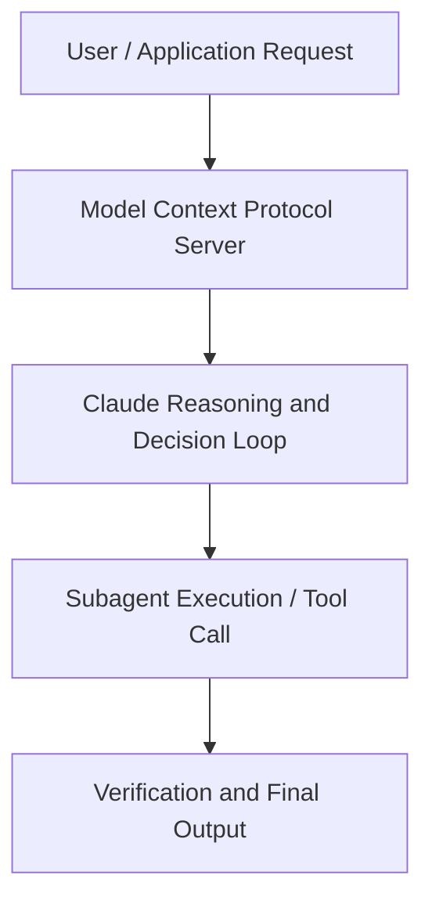

# Building AI-native at enterprise scale: monday.com, Doctolib, and Delivery Hero

**Speaker(s):** Claude Engineering Team · **Channel:** Claude · **Date:** 2026-05-20
**Watch:** https://youtu.be/XFaeIbL-lvE · **Format:** Talk · **Level:** Advanced
**Topics:** Web Development, AI Coding Tools

## TL;DR
This session explores building ai-native at enterprise scale: monday.com, doctolib, and delivery hero, highlighting core architecture, runtime workflows, and practical deployment patterns across Web Development, AI Coding Tools. Speakers analyze technical implementations and share operational best practices for building robust systems with Claude, Claude Code.

## Contents
- [Architectural Overview and System Objectives in Building AI-native at enterprise scale: monda](#architectural-overview-and-system-objectives-in-building-ai-native-at-enterprise-scale-monda)
- [Technical Capabilities, Tooling Integration, and Protocols](#technical-capabilities-tooling-integration-and-protocols)
- [Production Deployment, Verification, and Best Practices](#production-deployment-verification-and-best-practices)
- [Organizational Impact, Scalability, and Industry Outlook](#organizational-impact-scalability-and-industry-outlook)

## Architectural Overview and System Objectives in Building AI-native at enterprise scale: monda

Three of Europe's fastest-scaling tech companies made three different bets on Claude: Delivery Hero built an autonomous agent that now merges 100+ PRs a day, Doctolib governs Claude Code across its entire healthcare engineering org, and monday.com ships it inside the product to users who've never written code. Hear what they built, where it broke, and how they stay ahead of a model that changes every few months. The session details foundational design principles, execution patterns, and operational integration requirements within the Web Development, AI Coding Tools domain.

**Further reading:** Official documentation for Claude and Anthropic platform guides.

## Technical Capabilities, Tooling Integration, and Protocols

Speakers analyze technical capabilities across Claude, Claude Code. The architecture highlights reliable agent tool use, context window optimization, protocol standards, and seamless workflow interoperability.

**Further reading:** Official documentation for Claude and Anthropic platform guides.

## Production Deployment, Verification, and Best Practices

Production readiness demands robust evaluation harnesses, state validation, and error-handling loops. Teams implement systematic monitoring and guardrails to ensure reliability across repeated executions.

**Further reading:** Official documentation for Claude and Anthropic platform guides.

## Organizational Impact, Scalability, and Industry Outlook

Deploying agentic systems transforms developer and team workflows by automating high-friction tasks. Organizations scale safely by pairing automated tool orchestration with structured human review.

**Further reading:** Official documentation for Claude and Anthropic platform guides.

## Source
Full cleaned transcript: `DATA/videos/building-ai-native-at-enterprise-scale-2026.json`
Canonical recording: https://youtu.be/XFaeIbL-lvE