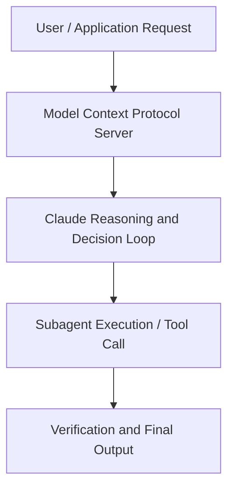

# Building signals that trade themselves

**Speaker(s):** Claude Engineering Team · **Channel:** Claude · **Date:** 2026-05-22
**Watch:** https://youtu.be/EOg4gY0Yln0 · **Format:** Talk · **Level:** Intermediate
**Topics:** AI Coding Tools, Web Development

## TL;DR
This session explores building signals that trade themselves, highlighting core architecture, runtime workflows, and practical deployment patterns across AI Coding Tools, Web Development. Speakers analyze technical implementations and share operational best practices for building robust systems with Anthropic, Box.

## Contents
- [Architecture and Core Concepts in Building signals that trade themselves](#architecture-and-core-concepts-in-building-signals-that-trade-themselves)
- [Technical Mechanics, Implementation Patterns, and Tooling](#technical-mechanics-implementation-patterns-and-tooling)
- [Operational Workflows, Evaluation, and Production Scaling](#operational-workflows-evaluation-and-production-scaling)
- [Strategic Implications, Governance, and Key Takeaways](#strategic-implications-governance-and-key-takeaways)

## Architecture and Core Concepts in Building signals that trade themselves

I'm head of data
and AI at Mang Group. Mangroup are an alternative investment
manager. We manage over $200 billion of
assets. Our clients are pension funds, sovereign
wealth funds, and large institutions. We manage real people's money, thousands
of people's pensions and investment
capital. When we think about AI, the stakes
are high for us. Our clients are real
people from their teachers in Canada,
their metal workers in Japan. So, we really need to get AI right.

**Further reading:** Official documentation for Anthropic and Anthropic platform guides.

## Technical Mechanics, Implementation Patterns, and Tooling

Humans of course reviewed all of the
output to make sure that it was
sensible. But a AI was at the center of
that process. I'm sure you want to know what was
that signal? How much money did it make? Sorry, I'm not going to tell you that
today. What I'm here to
tell you about today is our journey. What was the foundation that allowed us
to do that? How can you apply those
learnings in your company?

**Further reading:** Official documentation for Anthropic and Anthropic platform guides.

## Operational Workflows, Evaluation, and Production Scaling

People from technology,
people from the people team. Why do I
have to approve all of them? I I don't want to approve
everybody else's expense reports." And
we dug into it and it was just because
the the cost center code was hardcoded. It was really just that that was
this um this local optimization. It worked for his team,
so it was going to work for everybody. He
kind of thought it was quite funny. I mean, so did I, to be honest. Um, but it was really symptomatic of a
broader problem.

**Further reading:** Official documentation for Anthropic and Anthropic platform guides.

## Strategic Implications, Governance, and Key Takeaways

We can plot Amazon's monthly credit card
spend against its stock price returns. These are the results of the credit card
data compared to the stock price for the
same period. The blue bars are credit card spend and
the line is the stock price. Interestingly, in the graph, you can see
spikes for seasonal spend, such as Black
Friday and Christmas. Next, we run a back test to see if
credit card spend is predictive of the
stock price by comparing the peaks in
credit card spending with the profits
and losses of the stock. In the results, the signal shows better
performance than a buy and hold
strategy. We can see that investing
$1,000 in 2021 using this signal would
now be worth around $2,500. This could be a fluke for Amazon.

**Further reading:** Official documentation for Anthropic and Anthropic platform guides.

## Source
Full cleaned transcript: `DATA/videos/building-signals-that-trade-themselves-2026.json`
Canonical recording: https://youtu.be/EOg4gY0Yln0