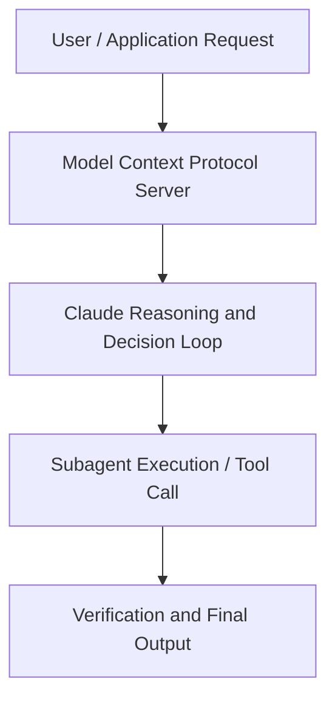

# Building with Claude Managed Agents and Asana AI teammates

**Speaker(s):** Claude Engineering Team · **Channel:** Claude · **Date:** 2026-05-09
**Watch:** Description - Most of the AI value in your organization is locked in isolated experiments. That is not the Agentic Enterprise we've been promised. AI can help us ideate, orchestrate, and complete the work. Not just support. · **Format:** Talk · **Level:** Intermediate
**Topics:** AI Agents, Product/Startup

## TL;DR
This session explores building with claude managed agents and asana ai teammates, highlighting core architecture, runtime workflows, and practical deployment patterns across AI Agents, Product/Startup. Speakers analyze technical implementations and share operational best practices for building robust systems with Anthropic, Asana.

## Contents
- [Architecture and Core Concepts in Building with Claude Managed Agents and Asana](#architecture-and-core-concepts-in-building-with-claude-managed-agents-and-asana)
- [Technical Mechanics, Implementation Patterns, and Tooling](#technical-mechanics-implementation-patterns-and-tooling)
- [Operational Workflows, Evaluation, and Production Scaling](#operational-workflows-evaluation-and-production-scaling)
- [Strategic Implications, Governance, and Key Takeaways](#strategic-implications-governance-and-key-takeaways)

## Architecture and Core Concepts in Building with Claude Managed Agents and Asana

Hi everyone, I'm Ara from Asana and I'm
here to talk to you about how we've
built Asana's AI teammates on cloud
managed agents. Our vision at Asana is to bring forward
this promise of the agentic enterprise
where human beings and AI agents can
work together to get complex multi-step
work done whether you're in IT or
operations or product or marketing. Our
vision is the AI agent is an actor in
the system. It's got a deep set of
skills. It's got all of the context
required and it can work handinhand with
other human beings to get multi-step
work done. Things like approvals,
complete end to-end workflows, getting
to real world outcomes. That's what
we've been building and AI uh teammates
within ASA are generally available as of
March. What we see today though in the
enterprise is almost everybody is
experimenting with AI agents.

**Further reading:** Official documentation for Anthropic and Anthropic platform guides.

## Technical Mechanics, Implementation Patterns, and Tooling

Then it has this built-in
grader where once Asana passes in the
outcome it wants to uh cloud managed
agents you know we know that the grader
will go ahead and iterate through that
outcome multiple times to ensure that
we're getting a high quality output. Again, this is allowing us to focus on
the things that is unique to Asana, the
human interface layer to go ahead and
coordinate across multiple people, the
system of context that we're building
out, the security that we're building
out so that if you're using the same
agent as me or Nigel or Tony, and we
are, you know, we are in different work
graph objects or different projects, the
agent won't leak information across the
other. The
quality of the output is something we're
leveraging cloud managed agents for. Again like if I compare and contrast the
way in which AI teammates is working
today with cloud managed agents versus
the messages API that we were previously
using. We're getting again faster
prototyping because we're not having to
build a ma manual agent loop file
management code execution. The
verification process has gotten way
better with this uh with this sort of
built-in product. Then we can also
enable multiple agents in parallel to
work independently because a lot of
these like knowledge worker actions like
require multiple agents to work in
parallel to produce a full plan and to
iterate through it. Uh again like as of today there are
over 21 pre-built agents uh called AI
teammates within ASA.

**Further reading:** Official documentation for Anthropic and Anthropic platform guides.

## Operational Workflows, Evaluation, and Production Scaling

It will
remember that the the new color uh
scheme is blue. And so you can see
that the campaign brief letter is
working on behalf of Sushi admin. And
you'll notice that the memory is getting
created. That's the reason why we're
sort of expanding that. It's not
something that an end user has to go
care about, but we highlight that the
memory is getting created. Boom,
you've got like a blue uh campaign brief
landing page. Now I want to showcase multiplayer in
action. So, maybe
the marketer feels like this is a a good
starting point.

**Further reading:** Official documentation for Anthropic and Anthropic platform guides.

## Strategic Implications, Governance, and Key Takeaways

Uh, we have about
fiveish minutes left, so I can open it
up and take some questions if there's
any in the audience. This is our person in the back. Um, just quick
question for you. You mentioned earlier
that the validation of the like the
agent itself happens on the anthropic
side of things. Just curious what that
looks like and what you folks would
encode in there. You mentioned that
Asana has a bunch of domain knowledge. Does that go into the verification? Sorry, I didn't realize I was talking
outside of it.

**Further reading:** Official documentation for Anthropic and Anthropic platform guides.

## Source
Full cleaned transcript: `DATA/videos/building-with-claude-managed-agents-and-2026.json`
Canonical recording: Description - Most of the AI value in your organization is locked in isolated experiments. That is not the Agentic Enterprise we've been promised. AI can help us ideate, orchestrate, and complete the work. Not just support.