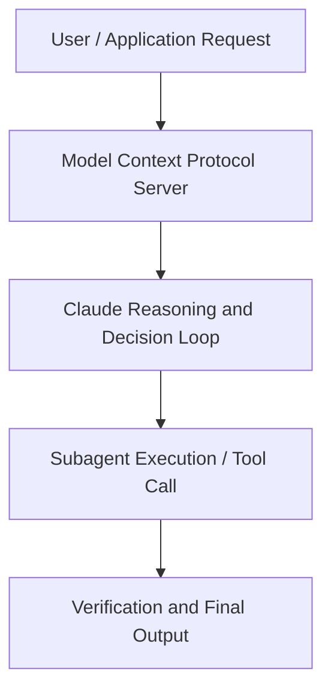

# Coding is no longer the constraint: Scaling devex to teams and agents at Spotify

**Speaker(s):** Claude Engineering Team · **Channel:** Claude · **Date:** 2026-05-20
**Watch:** https://youtu.be/zFslvuvYifQ · **Format:** Talk · **Level:** Advanced
**Topics:** AI Agents, AI Coding Tools

## TL;DR
This session explores coding is no longer the constraint: scaling devex to teams and agents at spotify, highlighting core architecture, runtime workflows, and practical deployment patterns across AI Agents, AI Coding Tools. Speakers analyze technical implementations and share operational best practices for building robust systems with Claude.

## Contents
- [Architectural Overview and System Objectives in Coding is no longer the constraint: Scaling d](#architectural-overview-and-system-objectives-in-coding-is-no-longer-the-constraint-scaling-d)
- [Technical Capabilities, Tooling Integration, and Protocols](#technical-capabilities-tooling-integration-and-protocols)
- [Production Deployment, Verification, and Best Practices](#production-deployment-verification-and-best-practices)
- [Organizational Impact, Scalability, and Industry Outlook](#organizational-impact-scalability-and-industry-outlook)

## Architectural Overview and System Objectives in Coding is no longer the constraint: Scaling d

At Spotify, 96% of engineers now code with AI and PR frequency is up 60% , so the constraint has moved from writing code to orchestrating it. Niklas Gustavsson, Chief Architect & VP of Engineering, shares how Spotify built Honk, a background coding agent running on the Agent SDK, plugged it into their Fleetshift migration platform and Backstage software catalog, and learned that the same standardization that makes teams effective makes agents effective too. Walk away with Spotify's bets on developer experience for agents , and why firmer guardrails are accelerators, not constraints. The session details foundational design principles, execution patterns, and operational integration requirements within the AI Agents, AI Coding Tools domain.

**Further reading:** Official documentation for Claude and Anthropic platform guides.

## Technical Capabilities, Tooling Integration, and Protocols

Speakers analyze technical capabilities across Claude. The architecture highlights reliable agent tool use, context window optimization, protocol standards, and seamless workflow interoperability.

**Further reading:** Official documentation for Claude and Anthropic platform guides.

## Production Deployment, Verification, and Best Practices

Production readiness demands robust evaluation harnesses, state validation, and error-handling loops. Teams implement systematic monitoring and guardrails to ensure reliability across repeated executions.

**Further reading:** Official documentation for Claude and Anthropic platform guides.

## Organizational Impact, Scalability, and Industry Outlook

Deploying agentic systems transforms developer and team workflows by automating high-friction tasks. Organizations scale safely by pairing automated tool orchestration with structured human review.

**Further reading:** Official documentation for Claude and Anthropic platform guides.

## Source
Full cleaned transcript: `DATA/videos/coding-is-no-longer-the-constraint-2026.json`
Canonical recording: https://youtu.be/zFslvuvYifQ