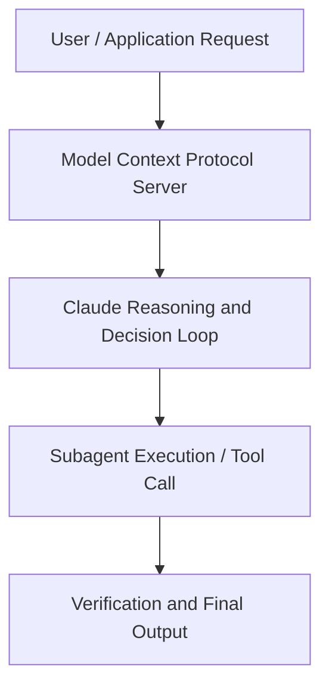

# Evals for taste: Hill-climbing a slide-generation agent

**Speaker(s):** Claude Engineering Team · **Channel:** Claude · **Date:** 2026-05-23
**Watch:** https://youtu.be/v9FTCvkV_a0 · **Format:** Talk · **Level:** Intermediate
**Topics:** Prompt Engineering, AI Agents

## TL;DR
This session explores evals for taste: hill-climbing a slide-generation agent, highlighting core architecture, runtime workflows, and practical deployment patterns across Prompt Engineering, AI Agents. Speakers analyze technical implementations and share operational best practices for building robust systems with Claude, Projects.

## Contents
- [Architecture and Core Concepts in Evals for taste: Hill-climbing a slide-genera](#architecture-and-core-concepts-in-evals-for-taste-hill-climbing-a-slide-genera)
- [Technical Mechanics, Implementation Patterns, and Tooling](#technical-mechanics-implementation-patterns-and-tooling)
- [Operational Workflows, Evaluation, and Production Scaling](#operational-workflows-evaluation-and-production-scaling)
- [Strategic Implications, Governance, and Key Takeaways](#strategic-implications-governance-and-key-takeaways)

## Architecture and Core Concepts in Evals for taste: Hill-climbing a slide-genera

I hope you all had a wonderful lunch. Um, there's so many of you as
well. I'm actually kind of surprised by this. Happy to see that there's that much interest in talking about uh evals. I personally am a big fan of anything evals related but I know not everyone's
that's not everyone's cup of tea, right? So very happy to see this many people of you. So yeah this so today's
session is really going to be about evals. Um, and I guess my goal for this
session is for you all to be afterwards to be inspired to build evals to be
like, okay, evals are actually really useful.

**Further reading:** Official documentation for Claude and Anthropic platform guides.

## Technical Mechanics, Implementation Patterns, and Tooling

This is like rubric based
reasoning. So you for example say like is this slide high quality very generic
but that might be for example a rubric or like for example is this text coherent also a way to get some intel on
how well your agent is performing. You can do some interesting things with this as well. Pair wise comparison is
in my opinion quite underrated. Let's say you have two examples two outputs. Um, and then you basically OS model
which one of the two do you prefer and why? That's also quite interesting to get some information out of especi
especially for these scenarios where you don't really have a clear way of of defining what makes a better one, right? Um, and and then another one is the multi-judge consensus which is just for
example you take like best of three and you say like three judges score independently and say like majority wins
for example, right?

**Further reading:** Official documentation for Claude and Anthropic platform guides.

## Operational Workflows, Evaluation, and Production Scaling

Then also we I
think everyone kind of I mean I am at least getting like ticked off like if I read something that's clearly AI
written, I'm always a little bit skeptical of if I can completely trust the content and if the p person sending
me these texts is like has like read it himself or themselves and is standing behind that content. We also
say like avoid these AI generated tells as well. Never use a thin accent lines in the titles and don't pepper
slides with emojis as decorative icons. This is based on the things that we have seen in our EVA. We have seen as let's go back a little bit. We've looked at the slide deck um and we're like oh this is not properly
done. These fonts are a little bit off. There's some emoji used in here.

**Further reading:** Official documentation for Claude and Anthropic platform guides.

## Strategic Implications, Governance, and Key Takeaways

I think this is
immediately a lot better. The the the image is way bigger now. I think it's way more readable even from a further
distance away. Still the slides are small but like for example it's source now. There's a source over here as well
which is quite good. I think this is also way better. I think the image is also a little bit better as well. A quite interesting graph in this case.

**Further reading:** Official documentation for Claude and Anthropic platform guides.

## Source
Full cleaned transcript: `DATA/videos/evals-for-taste-hill-climbing-a-2026.json`
Canonical recording: https://youtu.be/v9FTCvkV_a0