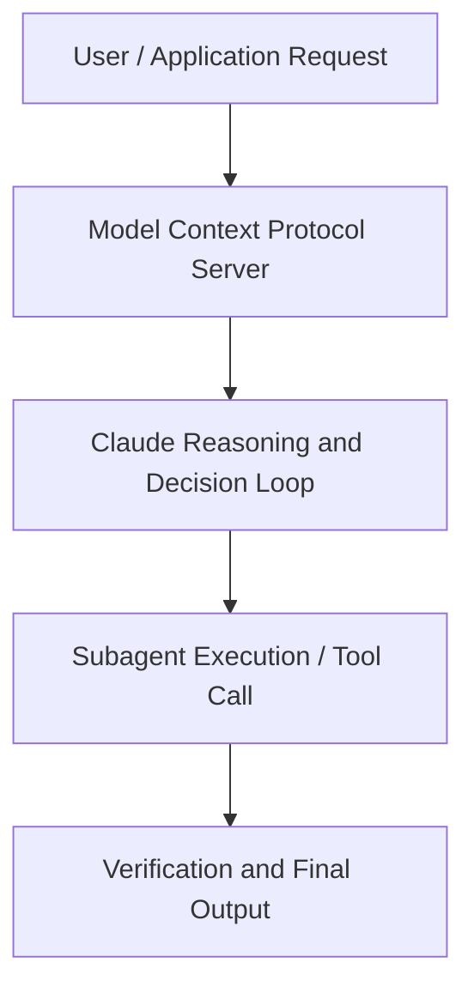

# Evaluating and improving Replit Agent at scale

**Speaker(s):** Hannah Moran, Michele Catasta · **Channel:** Claude · **Date:** 2026-05-09
**Watch:** https://youtu.be/snroDwX1-JU · **Format:** Talk · **Level:** Intermediate
**Topics:** AI Coding Tools, AI Agents

## TL;DR
This session explores evaluating and improving replit agent at scale, highlighting core architecture, runtime workflows, and practical deployment patterns across AI Coding Tools, AI Agents. Speakers analyze technical implementations and share operational best practices for building robust systems with Anthropic, Box.

## Contents
- [Architecture and Core Concepts in Evaluating and improving Replit Agent at scal](#architecture-and-core-concepts-in-evaluating-and-improving-replit-agent-at-scal)
- [Technical Mechanics, Implementation Patterns, and Tooling](#technical-mechanics-implementation-patterns-and-tooling)
- [Operational Workflows, Evaluation, and Production Scaling](#operational-workflows-evaluation-and-production-scaling)
- [Strategic Implications, Governance, and Key Takeaways](#strategic-implications-governance-and-key-takeaways)

## Architecture and Core Concepts in Evaluating and improving Replit Agent at scal

I'm Mik Katasta,
president and advi replet. Today I'm
going to be talking about how we're both
evaluating and improving on a daily
basis replet agent at scale. As you
know, Replet is a by coding platform for
knowledge workers. We are one of the top
players in this space and we have been
literally battling with this problem for
the last you know almost two years. The
key difference between I would say by
coding has a very broad definition. It
ranges all the way from being used by
software developers but in our specific
case is even more of an extreme
definition where you start from just a
natural language specification of what
the user wants and literally nothing
else. The user expects to go from a
prompt to a working application but they
don't tell us what kind of framework
they want to use. They just expect things to work
after you know our the agent run.

**Further reading:** Official documentation for Anthropic and Anthropic platform guides.

## Technical Mechanics, Implementation Patterns, and Tooling

This is what allows you to
go from a benchmark that you run maybe
on a weekly basis into something that
you can run every single time you
literally have a new PR merge in your
repository. Of course as you can
imagine we have AI running all the
evaluations on our behalf. The the setup is the following. There is
one core and the protocol is you have an
you have a input you have a
implementation strategy and then you
have a set of our core sorry rwired
evaluations that run on your app and we
came up you know with five different
pairings but in reality there are a lot
more pairings that you could come up
with yourself. The most basic pairing is
the input is the PRD and we build the
application singleshot zero to one. Then
maybe in order you know to go from uh
less complicated to more advanced we
have something called by bonre ref or
like the reference implementation where
we start from something is already
working and we build a feature on top of
that. We
have byon vibe where we start from an
agent own MVP and then we build a new
feature on top of that. Maybe this is
something that in the X lingo you would
call slop on slop.

**Further reading:** Official documentation for Anthropic and Anthropic platform guides.

## Operational Workflows, Evaluation, and Production Scaling

Last but not least, this is very
idiosyncratic to wrap it. Our users can
also publish their application on our
product. It's a very strong positive
signal if they decided whatever they
built is worth to share with their
colleagues or to put it in public in
front of everyone. All this signal
cluster together gives us something like
this. If you ever done a bet testing in
your life, I'm sure this looks familiar. It might look familiar, especially
because not everything is either green
or red. This is the, you know, hard
harsh truth about running AB test. They
never give you a crystal clear signal of
what you should be doing.

**Further reading:** Official documentation for Anthropic and Anthropic platform guides.

## Strategic Implications, Governance, and Key Takeaways

All these choices really
determine the product philosophy of what
you want to put in front of our users. Then last but not least, as I was
showing you before on the AB test
dashboard, if there is not a clear
result, ultimately if you decide to
launch or not is still a choice that a
human does. Often times that's that's on
me in the rapid. Again, that
determines really what's going to be the
ultimate product experience. My in closing, what I want you to
have as a takeaway today is don't think
of evaluation just as this la last check
before shipping. It shouldn't be just a
boolean flag, but rather think of this
as an engine that allows you to ship a
better agent every single day. I'm going to invite Hannah
on stage so we can have a chat about how
we've been working together in the last
few months. I'm part
of the applied AI team at um Anthropic
and I work with McKel on the Replet
agent and on everything that they build
with Claude.

**Further reading:** Official documentation for Anthropic and Anthropic platform guides.

## Source
Full cleaned transcript: `DATA/videos/evaluating-and-improving-replit-agent-at-2026.json`
Canonical recording: https://youtu.be/snroDwX1-JU