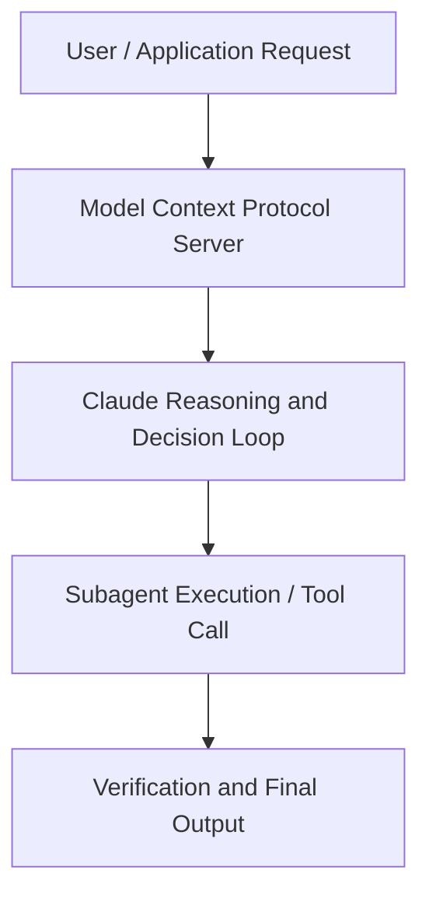

# From one person to 80: Scaling a hypergrowth engineering org with Claude Code

**Speaker(s):** Claude Engineering Team · **Channel:** Claude · **Date:** 2026-05-20
**Watch:** https://youtu.be/VueeyKcquoA · **Format:** Talk · **Level:** Advanced
**Topics:** AI Coding Tools, Web Development

## TL;DR
This session explores from one person to 80: scaling a hypergrowth engineering org with claude code, highlighting core architecture, runtime workflows, and practical deployment patterns across AI Coding Tools, Web Development. Speakers analyze technical implementations and share operational best practices for building robust systems with Claude, Claude Code.

## Contents
- [Architectural Overview and System Objectives in From one person to 80: Scaling a hypergrowth](#architectural-overview-and-system-objectives-in-from-one-person-to-80-scaling-a-hypergrowth)
- [Technical Capabilities, Tooling Integration, and Protocols](#technical-capabilities-tooling-integration-and-protocols)
- [Production Deployment, Verification, and Best Practices](#production-deployment-verification-and-best-practices)
- [Organizational Impact, Scalability, and Industry Outlook](#organizational-impact-scalability-and-industry-outlook)

## Architectural Overview and System Objectives in From one person to 80: Scaling a hypergrowth

Base44 went from one engineer to hyper-growth , getting acquired by Wix, absorbing a wave of new engineers, then shipping faster than any reasonable hiring plan could carry. Claude Code is what kept the team moving through three different bottlenecks: ramping new engineers, compressing the experiment-and-validate cycle, and keeping the lights on as the surface area grew. This talk goes deep on the patterns at each phase , and on the "elegant simplicity" principle that kept the architecture intentionally boring so Claude Code could keep up at every step. The session details foundational design principles, execution patterns, and operational integration requirements within the AI Coding Tools, Web Development domain.

**Further reading:** Official documentation for Claude and Anthropic platform guides.

## Technical Capabilities, Tooling Integration, and Protocols

Speakers analyze technical capabilities across Claude, Claude Code. The architecture highlights reliable agent tool use, context window optimization, protocol standards, and seamless workflow interoperability.

**Further reading:** Official documentation for Claude and Anthropic platform guides.

## Production Deployment, Verification, and Best Practices

Production readiness demands robust evaluation harnesses, state validation, and error-handling loops. Teams implement systematic monitoring and guardrails to ensure reliability across repeated executions.

**Further reading:** Official documentation for Claude and Anthropic platform guides.

## Organizational Impact, Scalability, and Industry Outlook

Deploying agentic systems transforms developer and team workflows by automating high-friction tasks. Organizations scale safely by pairing automated tool orchestration with structured human review.

**Further reading:** Official documentation for Claude and Anthropic platform guides.

## Source
Full cleaned transcript: `DATA/videos/from-one-person-to-80-scaling-2026.json`
Canonical recording: https://youtu.be/VueeyKcquoA