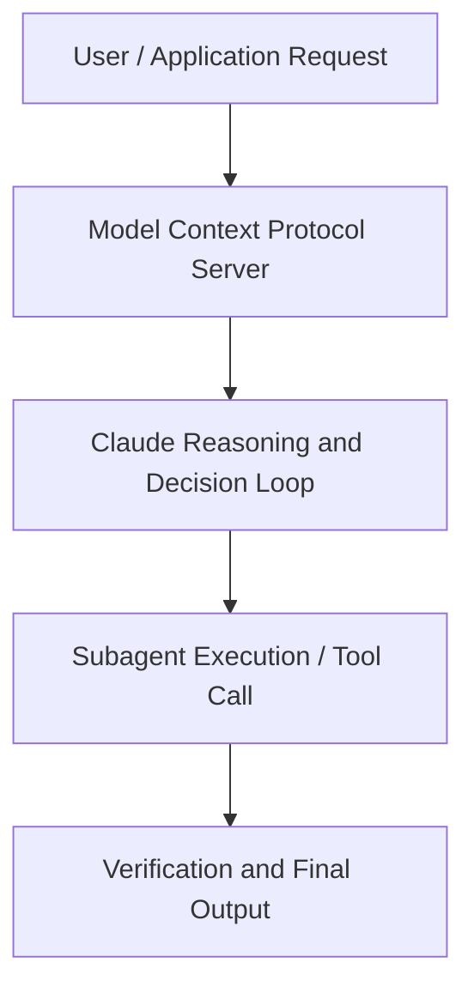

# Getting more out of the Claude Platform

**Speaker(s):** Claude Engineering Team · **Channel:** Claude · **Date:** 2026-05-22
**Watch:** https://youtu.be/QIriO1-vHYw · **Format:** Demo · **Level:** Intermediate
**Topics:** AI Agents, Prompt Engineering

## TL;DR
This session explores getting more out of the claude platform, highlighting core architecture, runtime workflows, and practical deployment patterns across AI Agents, Prompt Engineering. Speakers analyze technical implementations and share operational best practices for building robust systems with Claude.

## Contents
- [Architectural Overview and System Objectives in Getting more out of the Claude Platform](#architectural-overview-and-system-objectives-in-getting-more-out-of-the-claude-platform)
- [Technical Capabilities, Tooling Integration, and Protocols](#technical-capabilities-tooling-integration-and-protocols)
- [Production Deployment, Verification, and Best Practices](#production-deployment-verification-and-best-practices)
- [Organizational Impact, Scalability, and Industry Outlook](#organizational-impact-scalability-and-industry-outlook)

## Architectural Overview and System Objectives in Getting more out of the Claude Platform

Cut cost, manage context, boost intelligence. In this session, we'll show you how to put our latest platform capabilities to work. Through live demos you'll see what great prompt caching looks like, learn to keep context lean for long-running agents with tool search, programmatic tool calling, and compaction, and use the advisor strategy for a cost-effective intelligence boost. The session details foundational design principles, execution patterns, and operational integration requirements within the AI Agents, Prompt Engineering domain.

**Further reading:** Official documentation for Claude and Anthropic platform guides.

## Technical Capabilities, Tooling Integration, and Protocols

Speakers analyze technical capabilities across Claude. The architecture highlights reliable agent tool use, context window optimization, protocol standards, and seamless workflow interoperability.

**Further reading:** Official documentation for Claude and Anthropic platform guides.

## Production Deployment, Verification, and Best Practices

Production readiness demands robust evaluation harnesses, state validation, and error-handling loops. Teams implement systematic monitoring and guardrails to ensure reliability across repeated executions.

**Further reading:** Official documentation for Claude and Anthropic platform guides.

## Organizational Impact, Scalability, and Industry Outlook

Deploying agentic systems transforms developer and team workflows by automating high-friction tasks. Organizations scale safely by pairing automated tool orchestration with structured human review.

**Further reading:** Official documentation for Claude and Anthropic platform guides.

## Source
Full cleaned transcript: `DATA/videos/getting-more-out-of-the-claude-2026.json`
Canonical recording: https://youtu.be/QIriO1-vHYw