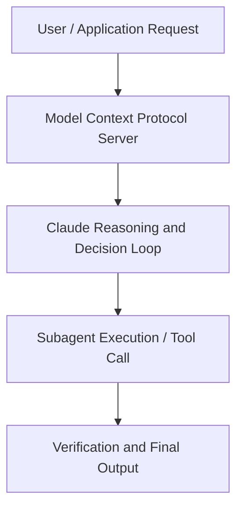

# Giving coding agents their own computers: How Cursor built cloud agents

**Speaker(s):** Alexi Robbins · **Channel:** Claude · **Date:** 2026-05-09
**Watch:** https://youtu.be/BbYSGxtsMic · **Format:** Talk · **Level:** Intermediate
**Topics:** AI Agents, AI Coding Tools

## TL;DR
This session explores giving coding agents their own computers: how cursor built cloud agents, highlighting core architecture, runtime workflows, and practical deployment patterns across AI Agents, AI Coding Tools. Speakers analyze technical implementations and share operational best practices for building robust systems with Box, Claude.

## Contents
- [Architecture and Core Concepts in Giving coding agents their own computers: How](#architecture-and-core-concepts-in-giving-coding-agents-their-own-computers-how)
- [Technical Mechanics, Implementation Patterns, and Tooling](#technical-mechanics-implementation-patterns-and-tooling)
- [Operational Workflows, Evaluation, and Production Scaling](#operational-workflows-evaluation-and-production-scaling)
- [Strategic Implications, Governance, and Key Takeaways](#strategic-implications-governance-and-key-takeaways)

## Architecture and Core Concepts in Giving coding agents their own computers: How

So, uh, models are getting
really good and for more and more work,
the bottleneck is no longer the model
intelligence. The bottleneck is humans
giving the models the tools and the
context and the increasingly ambitious
uh tasks and objectives to go flex their
potential. Um at cursor we've been
working on removing that bottleneck and
I'm going to share a bit about how we've
been doing that. And hopefully it's
helpful to some of you in in your work. Um, with models this good, we kind of
see the job that we have as setting our
agents free um safely uh uh and and
having them go off and work on bigger
bigger tasks. So, we've kind of gone
through three stages of uh the process. The first was um giving our agents the
tools and the context to be more
autonomous. The second is um we had to
learn how to take advantage of these
more capable models.

**Further reading:** Official documentation for Box and Anthropic platform guides.

## Technical Mechanics, Implementation Patterns, and Tooling

When you're doing local
dev, you probably leave things running. Um, not true for the cloud cloud agents. We wanted to optimize their devx. They were spending a lot of time
sleeping uh waiting for things to start
up. They didn't uh have good ways of
waiting for things. We built an anev
CLI tool. Um, so they were able to start
services, wait for the services to
start, check on statuses. They had sort
of a Swiss Army knife for things like uh
creating test accounts and signing in
for services.

**Further reading:** Official documentation for Box and Anthropic platform guides.

## Operational Workflows, Evaluation, and Production Scaling

We have like uh this URL input and
there's CSVs it needs to add. Um, and
what's great is that it's not just using
that to do its own end testing to make
sure that the changes that it made
works. You as the developer get to uh
have a really high bandwidth method of
reviewing the work of the agent before
you get into code. This becomes
really really valuable when you are
running many of these agents um
simultaneously in the cloud and bouncing
between them. That's the next thing
is once you have these autonomous agents
onboarded, you need to learn to give
them more work and give them bigger
bigger challenges to go tackle. The first is uh you
have like a lot of tasks and a lot of
bugs and issues and you kind of have to
learn when to just uh like stop putting
those in your notes or start stop
putting them in your two tracker and
just kick off prompts. Put them right
into a prompt box and kick them off. When you do, uh, you then have a bunch
more of these agents running.

**Further reading:** Official documentation for Box and Anthropic platform guides.

## Strategic Implications, Governance, and Key Takeaways

You have the agent
experience and you need to care just as
much if not more about the agent
experience. The way that our system
works is agents uh go about their
business and they are told to report
issues as they come up. It's really
just like what we do with uh the pattern
I was just describing for humans where
if you see something wrong, say
something, uh report it and and try to
work on a fixed. All those reports are
accumulated in a system of record. It's
really again very uh similar to how
human human systems work. Managers
will go in and review all the issues and
categorize them and ddup them um and
bucket them into there issues that can
be sort of there are technical problems
that can be addressed. Then there are
issues of um permission where the agents
just don't have access to something. So they need to get permission.

**Further reading:** Official documentation for Box and Anthropic platform guides.

## Source
Full cleaned transcript: `DATA/videos/giving-coding-agents-their-own-computers-2026.json`
Canonical recording: https://youtu.be/BbYSGxtsMic