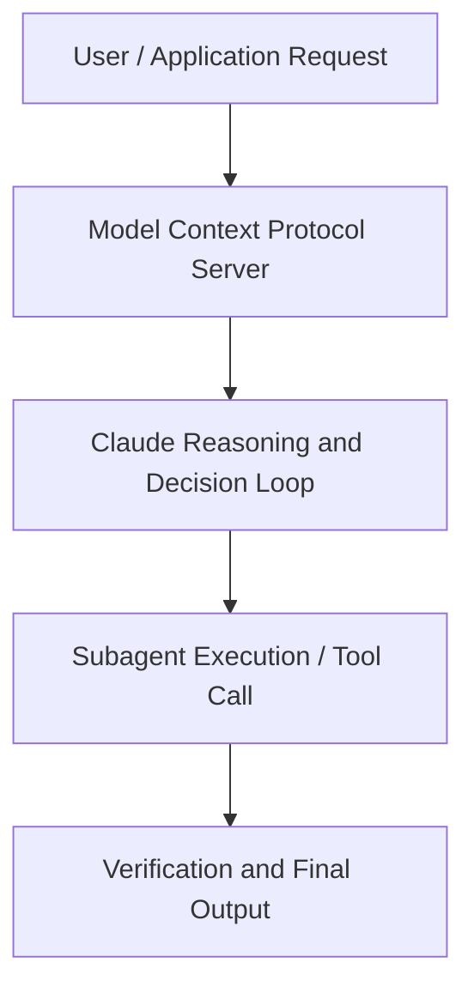

# How AirOps chases friction to build AI products with Claude

**Speaker(s):** Claude Engineering Team · **Channel:** Claude · **Date:** 2026-05-22
**Watch:** https://youtu.be/M5uwBawBDpw · **Format:** Talk · **Level:** Intermediate
**Topics:** AI Agents, Web Development

## TL;DR
This session explores how airops chases friction to build ai products with claude, highlighting core architecture, runtime workflows, and practical deployment patterns across AI Agents, Web Development. Speakers analyze technical implementations and share operational best practices for building robust systems with Artifacts, Claude.

## Contents
- [Architecture and Core Concepts in How AirOps chases friction to build AI produc](#architecture-and-core-concepts-in-how-airops-chases-friction-to-build-ai-produc)
- [Technical Mechanics, Implementation Patterns, and Tooling](#technical-mechanics-implementation-patterns-and-tooling)
- [Operational Workflows, Evaluation, and Production Scaling](#operational-workflows-evaluation-and-production-scaling)
- [Strategic Implications, Governance, and Key Takeaways](#strategic-implications-governance-and-key-takeaways)

## Architecture and Core Concepts in How AirOps chases friction to build AI produc

I work on the product team at AerOps and yeah excited to walk you
through uh how you know Telus says how Aerops chases friction um with building AI products with claude. I guess the
main really big takeaway I want you guys to come away with is building agents um and just making agents accessible is
honestly a really hard problem. I guess like with developers it's a bit easier. People are used to um kind of all these different concepts but when
you try to make these accessible to you know personas like marketers there are a lot of friction points and going to talk through some of the friction points that we um have seen and battled with. Just to start off quick intro of who we are at Aerops. We are a growth marketing um platform for AI search and
AI search for you guys is kind of like SEO but for engines like Chashbt, Gemini, Claude, you know buyers are
asking on Claude different you know questions of hey I want to buy like these pair of sunglasses you know how do you know and how are you making sure
that you are showing up for these searches. So, we help brands see how they're appearing in search, um, identify gaps, take action on those
gaps, whether that be, you know, creating content, refreshing content, um, and then being able to measure the impact of whether or not, you know, the actions that they're taking actually worked. I'm just going to walk through real quickly how we got here, kind of our approach, um, for
agents.

**Further reading:** Official documentation for Artifacts and Anthropic platform guides.

## Technical Mechanics, Implementation Patterns, and Tooling

That's very much like what we grounded in is like how can we make skills accessible and marketers are all like used to kind of a document based
s, 18 secondsstyle. But we just allowed for like collaboration on these playbooks skills and also uh governance and versioning. S, 24 secondsSo you know you'll have people with you know 10 different versions of this playbook of how do I want to create this this piece of content
s, 32 secondsand just real quick just results that we've seen from customers. We did you know case study with parallel we helped them produce and create content and they
s, 40 secondssaw 130% increase in citation rate uh 42% increase in share voice and they were able to go live in one week which
s, 49 secondsfor us is a huge accomplishment just because traditionally especially because we work with these enterprise customers um it usually takes around a month at
s, 57 secondsleast with like the workflow builder of constant feedback going back and forth like hey this is you know not really how I want to be speaking in in my blog
s, 5 secondsblog. Um, there's, you know, citations that are like kind of being loose or aren't right. These are other citations I want to use for this
s, 13 secondspiece of content. So, it was really incredible to be able to get to, um, that acceptance criteria in such a short amount of time. S, 21 secondsAnd other just a quick customer, too.

**Further reading:** Official documentation for Artifacts and Anthropic platform guides.

## Operational Workflows, Evaluation, and Production Scaling

With it, when it comes to tools as well, you can add any
s, 46 secondsMCP. So, if there's other outside connectors that you usually use, you can use those and access them. Um, we also have the ability to schedule different
s, 54 secondstriggers. This gives this kind of like always on skill or playbook or agent that you know can do the certain
s, 1 secondaction at either a scheduled cadence based off web hooks. We also have monitor which we've um kind of like
s, 8 secondspartnered with like uh parallel when it comes to just being able to put a query and I like saying you know watch the internet in a way. When certain
s, 16 secondsthings happen um it would trigger off this playbook to then run. Then the last one is uh AO insights. Whenever
s, 23 secondsa metric drops, let's say like my cit my citation rate dropped in the last um like last week, then it would trigger off one of these playbooks, it can go
s, 32 secondsand like do this research and come back to me of hey like this is the reason why um this happened.

**Further reading:** Official documentation for Artifacts and Anthropic platform guides.

## Strategic Implications, Governance, and Key Takeaways

Um, it's it's kind of like a code mode in a way. I know that's been, you know, something that's been popular nowadays is being able to be more programmatic in terms of how we're
s, 34 secondsfetching context versus kind of like looping through these different um, you know, tool calls. It's like, can I actually just like produce code that will fetch exactly what I need um, in, you know, one loop. S, 45 secondsThe second one is through sub aents. Sub agents have definitely been instrumental and crucial in terms of getting to that
s, 52 secondsquality of output. Um, in general, like what we tell users too with playbooks and honestly when you're first creating your agent harness is to actually just
s, 1 secondstart off with, you know, claude itself and just have it go through its own tool calls and really not trying to make it too complex and all the context you're
s, 9 secondstrying to, you know, give to it. That's that's where we start off with and we were reaching a couple of um kind
s, 17 secondsof like air spots when it came to the quality of the outputs we're getting. What we did was decide to add on like
s, 24 secondsover time certain sub agents.

**Further reading:** Official documentation for Artifacts and Anthropic platform guides.

## Source
Full cleaned transcript: `DATA/videos/how-airops-chases-friction-to-build-2026.json`
Canonical recording: https://youtu.be/M5uwBawBDpw