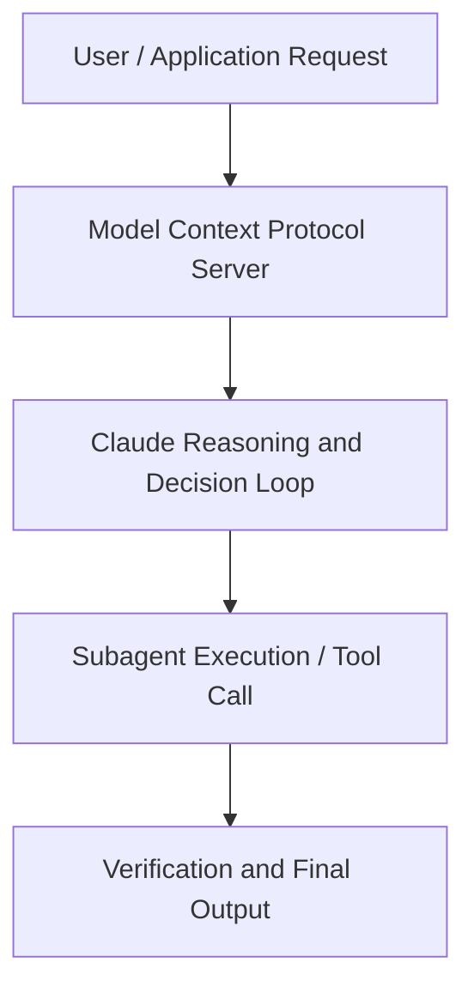

# How Lovable vibecodes production software at scale

**Speaker(s):** Claude Engineering Team · **Channel:** Claude · **Date:** 2026-05-21
**Watch:** https://youtu.be/mhW-XXnDFSU · **Format:** Talk · **Level:** Intermediate
**Topics:** Web Development, AI Coding Tools

## TL;DR
This session explores how lovable vibecodes production software at scale, highlighting core architecture, runtime workflows, and practical deployment patterns across Web Development, AI Coding Tools. Speakers analyze technical implementations and share operational best practices for building robust systems with Claude, Lovable.

## Contents
- [Architectural Overview and System Objectives in How Lovable vibecodes production software at](#architectural-overview-and-system-objectives-in-how-lovable-vibecodes-production-software-at)
- [Technical Capabilities, Tooling Integration, and Protocols](#technical-capabilities-tooling-integration-and-protocols)
- [Production Deployment, Verification, and Best Practices](#production-deployment-verification-and-best-practices)
- [Organizational Impact, Scalability, and Industry Outlook](#organizational-impact-scalability-and-industry-outlook)

## Architectural Overview and System Objectives in How Lovable vibecodes production software at

Vibecoding a beautiful, working prototype is easier than ever. Running a platform that non-developers use to ship production software is a different engineering problem. Today, software built on Lovable serves 600M+ monthly sessions. In this session, Fabian Hedin, Cofounder and CTO of Lovable, walks through the systems Lovable built to run Claude reliably at consumer scale , the fleet-learning layer that catches coding mistakes, the eval loop that gates every model release, and how to keep Lovable itself improving. The session details foundational design principles, execution patterns, and operational integration requirements within the Web Development, AI Coding Tools domain.

**Further reading:** Official documentation for Claude and Anthropic platform guides.

## Technical Capabilities, Tooling Integration, and Protocols

Speakers analyze technical capabilities across Claude, Lovable. The architecture highlights reliable agent tool use, context window optimization, protocol standards, and seamless workflow interoperability.

**Further reading:** Official documentation for Claude and Anthropic platform guides.

## Production Deployment, Verification, and Best Practices

Production readiness demands robust evaluation harnesses, state validation, and error-handling loops. Teams implement systematic monitoring and guardrails to ensure reliability across repeated executions.

**Further reading:** Official documentation for Claude and Anthropic platform guides.

## Organizational Impact, Scalability, and Industry Outlook

Deploying agentic systems transforms developer and team workflows by automating high-friction tasks. Organizations scale safely by pairing automated tool orchestration with structured human review.

**Further reading:** Official documentation for Claude and Anthropic platform guides.

## Source
Full cleaned transcript: `DATA/videos/how-lovable-vibecodes-production-software-at-2026.json`
Canonical recording: https://youtu.be/mhW-XXnDFSU