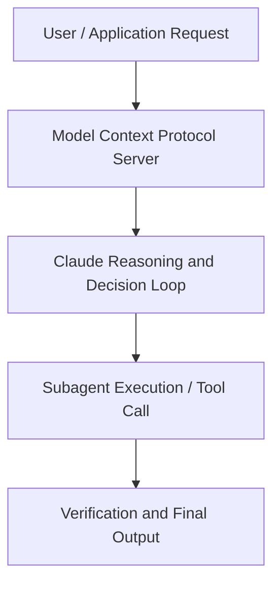

# How to get to production faster with Claude Managed Agents

**Speaker(s):** Claude Engineering Team · **Channel:** Claude · **Date:** 2026-05-21
**Watch:** https://youtu.be/zenIB7XLZxQ · **Format:** Talk · **Level:** Intermediate
**Topics:** AI Agents, Backend/Infra

## TL;DR
This session explores how to get to production faster with claude managed agents, highlighting core architecture, runtime workflows, and practical deployment patterns across AI Agents, Backend/Infra. Speakers analyze technical implementations and share operational best practices for building robust systems with Anthropic, Box.

## Contents
- [Architecture and Core Concepts in How to get to production faster with Claude M](#architecture-and-core-concepts-in-how-to-get-to-production-faster-with-claude-m)
- [Technical Mechanics, Implementation Patterns, and Tooling](#technical-mechanics-implementation-patterns-and-tooling)
- [Operational Workflows, Evaluation, and Production Scaling](#operational-workflows-evaluation-and-production-scaling)
- [Strategic Implications, Governance, and Key Takeaways](#strategic-implications-governance-and-key-takeaways)

## Architecture and Core Concepts in How to get to production faster with Claude M

Um, I hope everybody's having a good time today. I'm a member of technical staff here at Enthropic working on cloud managed agents. My name is Harrison and I'm also a member of technical staff working on cloud manage agents. A lot of members of technical staff. Uh today we want to talk to you about cloud manage agents. But before we do that we wanted to do a quick recap over the last couple of
years and the exponential that we've I think everybody in this room has been experiencing. After that we'll uh talk a little bit about the motivations behind
why we built cloud managed agents. Followed by a deep dive into some of the primitives that we offer with cloud manage agents.

**Further reading:** Official documentation for Anthropic and Anthropic platform guides.

## Technical Mechanics, Implementation Patterns, and Tooling

So, let's demystify what we mean when we're talking about this event stream. Every session that you start in cloud managed agents is
s, 44 secondseffectively a log of events that you um have where you or your end users are interacting with cloud and cloud's responding. We kind of like split up
s, 53 secondsthe domains of events that we have uh within the platform so that it's easier for you to kind of understand what each event means. The first of which is
suser events. These are things that your own end users or maybe your platform is sending to cloud managed agent sessions. S, 6 secondsUm these could include text messages, um images, documents. You can interrupt your agent if you see that it's going off course and you want to steer it back
s, 14 secondsonto onto it. Tool results for custom tools that you implement and uh execute on your end um and even confirmations
s, 22 secondsfor human in the loop controls for any tools that are executed on entropic servers.

**Further reading:** Official documentation for Anthropic and Anthropic platform guides.

## Operational Workflows, Evaluation, and Production Scaling

You can control things like network policies, your audit logs, um when these uh sandboxes are uh spawned and uh idled. S, 59 secondsum and and everything if there is kind of in your control without kind of having to see that over to uh cloud managed agents. All we'll do is just
s, 7 secondssend you a signal whenever we need to um have a new sandbox be provisioned because cloud needs to do some some work in there. Um the nice aspect of it
s, 15 secondsis that you can either use your own sandboxing fleet or use one of the partners that we um just mentioned earlier today um in order to get started with all of this. Let's talk a
s, 23 secondslittle bit about MCP tunnels. MCP tunnels again are basically just a way for you to get your private MCPs in your network exposed to cloud manage agents
s, 32 secondswithout having to do any fancy network configuration on your side. Essentially all you have to do is expose a really basic proxy layer uh to our to our uh
s, 41 secondsMCP tunnels enabling your network infrastructure to speak directly with cloud via secure tunnel in the middle. So, in order to get a little bit deeper about private sandboxes or uh self-hosted sandboxes, um I wanted to welcome to the stage Mike from
s, 54 secondsCloudflare, Ivonne from Daytona, Ashot from Modal, and Luke from Verscell to talk a little bit a little bit more about this.

**Further reading:** Official documentation for Anthropic and Anthropic platform guides.

## Strategic Implications, Governance, and Key Takeaways

Uh, like for example, we have Door Dash. Uh, they're automating account management with agents. Uh, but one thing that I am personally very
s, 33 secondsexcited about is um, I don't know how many of you guys have heard of uh, Karpathy's auto resource thing. But it's basically Claude can optimize
s, 42 secondstraining loops and um uh what we've found success with on our inference team actually uh is they can have claude uh
s, 49 secondsoptimize inference. You can give it a a workload and a benchmark and it'll basically hill climb it and and make it better. It'll run like the Nvidia
s, 58 secondsprofiler. It'll read the profiles and uh it'll just go ham and and make things better. And it all runs on modal because we have GPU sandboxes.

**Further reading:** Official documentation for Anthropic and Anthropic platform guides.

## Source
Full cleaned transcript: `DATA/videos/how-to-get-to-production-faster-2026.json`
Canonical recording: https://youtu.be/zenIB7XLZxQ