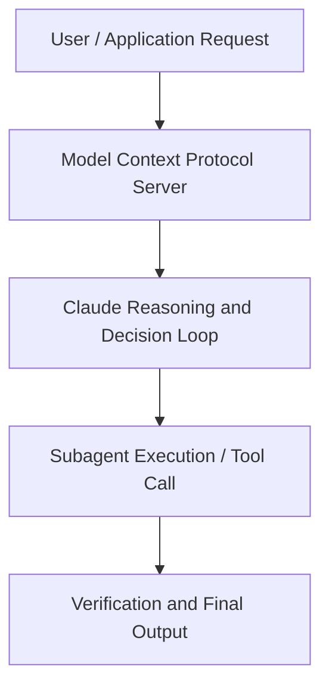

# How we Claude Code

**Speaker(s):** Claude Engineering Team · **Channel:** Claude · **Date:** 2026-05-23
**Watch:** https://youtu.be/IlqJqcl8ONE · **Format:** Talk · **Level:** Advanced
**Topics:** AI Agents, AI Coding Tools

## TL;DR
This session explores how we claude code, highlighting core architecture, runtime workflows, and practical deployment patterns across AI Agents, AI Coding Tools. Speakers analyze technical implementations and share operational best practices for building robust systems with Anthropic, Artifacts.

## Contents
- [Architecture and Core Concepts in How we Claude Code](#architecture-and-core-concepts-in-how-we-claude-code)
- [Technical Mechanics, Implementation Patterns, and Tooling](#technical-mechanics-implementation-patterns-and-tooling)
- [Operational Workflows, Evaluation, and Production Scaling](#operational-workflows-evaluation-and-production-scaling)
- [Strategic Implications, Governance, and Key Takeaways](#strategic-implications-governance-and-key-takeaways)

## Architecture and Core Concepts in How we Claude Code

Thank
you for joining the workshop. We have a pretty pretty full house here today. I'm
very pleased to see that. Yeah, [laughter] you're in the right place. Yeah, lovely to meet you all. I'm a
member of the applied AI team. I'm here today to tell you how we cloud code at Anthropic. Do a workshop and uh you can code along.

**Further reading:** Official documentation for Anthropic and Anthropic platform guides.

## Technical Mechanics, Implementation Patterns, and Tooling

There'll be a link to the repo eventually as well. I think that comes in a bit. Let's say we want to do a
build splitting app. You know, uh you want to you go out with
friends, you want to find out who owes what. Let's let Claude
interview us around doing this. In this case, I'm actually going to
Yeah. Before I do that, give you an example of how you would do this and how you could do this better. Bad prompting is when you say just make
it better.

**Further reading:** Official documentation for Anthropic and Anthropic platform guides.

## Operational Workflows, Evaluation, and Production Scaling

That's what we're going to cover with the repo. I think we have uh I think there'll be one slide where
you'll get to see the actual slides to to engage with uh the actual URL to engage with. What you want to do is
make it part of the artifact and that's what we're going to cover today. In fact, there's part of what we're doing
today is we're going to we're going to use um storybook fixtures, a testing library, sort of data emissions um and
attributes and playright MCP for a React uh for a
React app um with with components that you will have seen before,
but remixed in a way to make it easy for Claude as an agent to
extract the data contracts in the DOM. Then run verification and then even record the verification which is how the
cloud code team that t is on runs this and that's what the demo that he built
refi refers to right like it'll be a generation of verification steps that get run through that get a recording and
that's then put on S3 or shared somewhere else with colleagues and that's how you turn these verification
steps into something that is generated by the agents and then that you have
fewer and fewer touch points with that's something that you can replicate especially from that rebuild
the way to do that is to sort of sensibly modularize uh but that becomes really clear when we look at the actual
the actual thing so I encourage you to go to that link
there'll be a repo this is the repo under CWC workshops cloud with code
workshops and there's the one for today's session which is how we claw code. What's covered in there is phase one which we just covered, right? The simple prompt to say, "Hey, I'm writing a bill
splitting app. Interrogate me on the requirements so that I don't have to
miss any in my upfront description to Claude.

**Further reading:** Official documentation for Anthropic and Anthropic platform guides.

## Strategic Implications, Governance, and Key Takeaways

We
have one that's deliberately failed. I'll explain that in a second. But in each case,
you can also see the details of how this was done. The key thing here is that we want to um it's important to include the probes uh
to to push off the happy path and then a lot of this will be generated by
Claude for Claude, right? There's there's a way of scaling this further. In the end, we'll go to the one that
didn't work. It's the one where we hardcoded that the sums don't match. In
this case, the the state doesn't match.

**Further reading:** Official documentation for Anthropic and Anthropic platform guides.

## Source
Full cleaned transcript: `DATA/videos/how-we-claude-code-2026.json`
Canonical recording: https://youtu.be/IlqJqcl8ONE