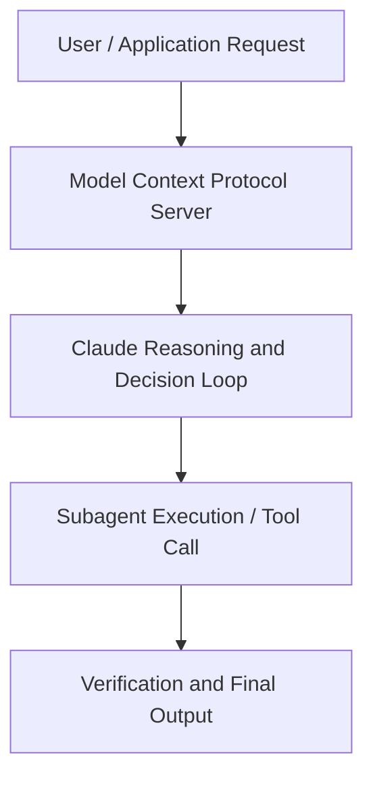

# Making agentic workflows trustworthy and verifiable with a custom DSL

**Speaker(s):** Claude Engineering Team · **Channel:** Claude · **Date:** 2026-05-22
**Watch:** https://youtu.be/qOjleN2-50c · **Format:** Talk · **Level:** Intermediate
**Topics:** AI Agents, Web Development

## TL;DR
This session explores making agentic workflows trustworthy and verifiable with a custom dsl, highlighting core architecture, runtime workflows, and practical deployment patterns across AI Agents, Web Development. Speakers analyze technical implementations and share operational best practices for building robust systems with Anthropic, Anthropic API.

## Contents
- [Architecture and Core Concepts in Making agentic workflows trustworthy and veri](#architecture-and-core-concepts-in-making-agentic-workflows-trustworthy-and-veri)
- [Technical Mechanics, Implementation Patterns, and Tooling](#technical-mechanics-implementation-patterns-and-tooling)
- [Operational Workflows, Evaluation, and Production Scaling](#operational-workflows-evaluation-and-production-scaling)
- [Strategic Implications, Governance, and Key Takeaways](#strategic-implications-governance-and-key-takeaways)

## Architecture and Core Concepts in Making agentic workflows trustworthy and veri

My name is is James Brady. I work at
Alys and today I'm going to be talking
about how we make our agentic workflows
trustworthy and verifiable with a custom
domain specific language. So, uh, in terms of the, uh, the
structure of today, I'm going to start
with a higher level overview of why we
went for a DSL in the in the first
place. Talk a little bit about the
language, how we made the decisions we
did um, in its design, how we integrated
it into elicit. We'll do a quick demo
and then uh, and then wrap up at the
end. But, uh, let me start with a
question. So, let's say that two systems
produce identical output. The answer is of course well it
depends.

**Further reading:** Official documentation for Anthropic and Anthropic platform guides.

## Technical Mechanics, Implementation Patterns, and Tooling

It's it's it's typed that lets us
do uh fast kind of redrafts if you've
got a type error. I think this
example program uh just FYI was the the
process that we wanted to go through to
do a competitive competitive analysis
for elicit itself. We're looking for
other um uh academic search engines and
AI assistants. It looks like systematic
review tools. We're we're doing web
searches for those. You know, this is the kind of the set of
steps that we want to go through that we
think is a good process for doing a
competitive um uh landscape overview. Um the core engine of what goes on
within an elicit user session is that we
have a component which I'll show in in
in the next slide which is writing the
SPL and then we interpret the HPL that's
just done in like plain old Python code
and then we reddraft the SHPL based on
what just happened. In a simple case
you could imagine we
we write some HPL there's a type error
okay there must be a problem.

**Further reading:** Official documentation for Anthropic and Anthropic platform guides.

## Operational Workflows, Evaluation, and Production Scaling

We have a
bunch of uh uh sort of templates you can
start with creating tables slides
drafting a report. I'm going to show
you a research landscape which uh again
is like a much I think it probably took
in total I don't know like a couple of
or something of of it doing work
and me adding layers on top of it. Can't do it in a demo format. But
I've got a session saved away that we're
going to take a look at. But yeah, it
doesn't need to take that long. It's
just, you know, it gets bit a bit more
interesting when it's a more in-depth
thing. This is the research landscape
that we're going to take a take a look
at here. My initial query was to map
the companies and institutions investing
in foundation model models for biology.

**Further reading:** Official documentation for Anthropic and Anthropic platform guides.

## Strategic Implications, Governance, and Key Takeaways

Then and then at the at
the end of this user session of my user
session,
we have um I asked for a join, right? We've got effectively a table of data
which is the organizations. We got a
table of data which is the oversight
bodies. Just in natural language, I
can say I kind of want to I want to join
these together and see how the labs have
have interacted with the oversight
bodies. Uh that's come up with this
table. We can see how anthropic has
interacted with um US AI safety
institute and AC in the UK and so on so
forth. And if I look at the uh HPL for this
table, what you might notice is that the
top of the program um is identical to
what we had before. This is this
these are the same web same same web
queries and paper queries that we had
for that very first table we were
looking at and this is all the same
code.

**Further reading:** Official documentation for Anthropic and Anthropic platform guides.

## Source
Full cleaned transcript: `DATA/videos/making-agentic-workflows-trustworthy-and-verifiable-2026.json`
Canonical recording: https://youtu.be/qOjleN2-50c