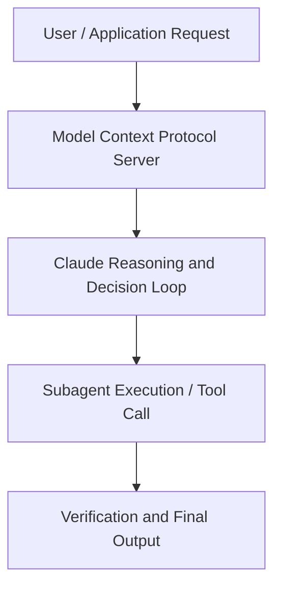

# Memory and dreaming for self-learning agents

**Speaker(s):** Claude Engineering Team · **Channel:** Claude · **Date:** 2026-05-09
**Watch:** https://youtu.be/RtywqDFBYnQ · **Format:** Talk · **Level:** Advanced
**Topics:** AI Agents, Web Development

## TL;DR
This session explores memory and dreaming for self-learning agents, highlighting core architecture, runtime workflows, and practical deployment patterns across AI Agents, Web Development. Speakers analyze technical implementations and share operational best practices for building robust systems with Anthropic, Box.

## Contents
- [Architecture and Core Concepts in Memory and dreaming for self-learning agents](#architecture-and-core-concepts-in-memory-and-dreaming-for-self-learning-agents)
- [Technical Mechanics, Implementation Patterns, and Tooling](#technical-mechanics-implementation-patterns-and-tooling)
- [Operational Workflows, Evaluation, and Production Scaling](#operational-workflows-evaluation-and-production-scaling)
- [Strategic Implications, Governance, and Key Takeaways](#strategic-implications-governance-and-key-takeaways)

## Architecture and Core Concepts in Memory and dreaming for self-learning agents

My name is Mahes and I'm a product
manager on the platform team here at
Anthropic. Over the past year and a
half, I've gotten to work on primitives
like MCP and Skills. Today I want to
talk about the primitive that I'm most
excited about next, which is memory. Um,
I'll talk about why we think memory is
so important and why we've been spending
so much time on it at Enthropic. How we
think about designing memory systems
that are built for Frontier Agents. I'm excited to also talk about Dreaming,
a brand new product that we're launching
today in research preview in the managed
agents API. Model capabilities have improved really
quickly over the last couple of years
and agents are capable of tasks that
take many many hours and can run for
or almost days at a time. As
models and agents have improved, we've
also invested in building higher and
higher level capabilities and primitives
that kind of get out of those models way
and give them access to additional bits
of their environment and things that
they can manage and become more powerful
over time.

**Further reading:** Official documentation for Anthropic and Anthropic platform guides.

## Technical Mechanics, Implementation Patterns, and Tooling

How do I keep it organized inside
of a file system? Ultimately, it all
does this with just bash tools and GP
tools that already make Claude so good
at agentic coding. The other thing that we had in mind when
designing memory is that it needs to
scale with the multi- aent systems that
we're going to be building over the
coming months. Multi multi parallel
agents is something that we're already
kind of starting to do with cloud code. There's a lot of uh vibe coders that
have like 10 or 15 cloud code sessions
running at the same time. We're
starting to see this in an enterprise
setting as well where enterprises
including Antropic have hundreds or
sometimes even thousands of agents
running in parallel interacting with the
same set of shared state and the same
shared memory. There's a couple of
properties that come out of this. One is
we want to give agents the ability to
mix and match between the session and
the work that it's doing and the set of
memory stores that it has access to.

**Further reading:** Official documentation for Anthropic and Anthropic platform guides.

## Operational Workflows, Evaluation, and Production Scaling

It's a batch
asynchronous process that runs
separately from the work that you're
doing uh within a specific session
that's working on a specific task. You
can kick off dreaming periodically um
using our console or v our API on kind
of a cron basis or you can plug it in
using our API into an existing process. For example, some customers kick off
dreaming once their agents have finished
a task and are spinning down and want to
save those learnings to the memory
state. Dreaming comprehensively looks
through recent transcripts, looks for
common mistakes, things that a bunch of
agents are doing like a failed tool call
or strategies that are working out for
them and finds opportunities to update
the memory state that will improve it in
the future. It produces this updated
memory state that you can then apply
immediately to your memory store. Or
maybe you want to run some checks and do
some manual review um which you can do
via the API. The ultimate goal of dreaming is
continuous self-learning and
self-improvement where the next day's
agents automatically get better based on
the learnings and the work of the
previous day's experience. We're excited about dreaming from a
design and research perspective for a
couple of reasons.

**Further reading:** Official documentation for Anthropic and Anthropic platform guides.

## Strategic Implications, Governance, and Key Takeaways

We don't
want agents necessarily to be going and
making changes as they work. Now there's
also the S sur memory store that's readr
and of course the S sur agents are able
to constantly make changes to this as
they react and learn from the
environment around them. So, we see this alert, this P1 that's
coming in from the dispatch service, and
we spin up this S sur agent um that goes
and starts to kick off an investigation. It goes and investigates the CPU
utilization. Maybe it goes and checks
out some of the traffic patterns and
queries for some of the recent PRs that
have gotten deployed. If we click into the
S sur memory store and notes these in a
new diff that gets updated in that
memory store. Now, a couple minutes
later, that same alert gets paged again
and a different S sur agent spins up
with access to the same memory store. The first thing it does is it sees that
note within its memory store that says,
"Hey, we already did this investigation.

**Further reading:** Official documentation for Anthropic and Anthropic platform guides.

## Source
Full cleaned transcript: `DATA/videos/memory-and-dreaming-for-self-learning-2026-2.json`
Canonical recording: https://youtu.be/RtywqDFBYnQ