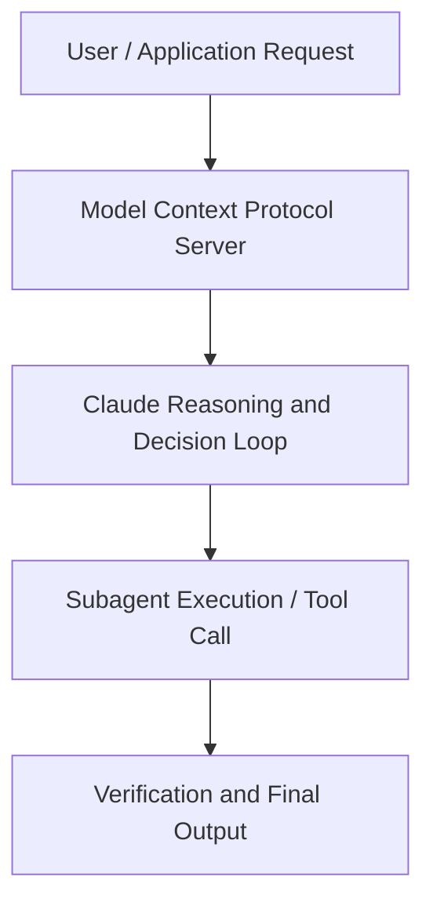

# Memory and dreaming for self learning agents

**Speaker(s):** Claude Engineering Team · **Channel:** Claude · **Date:** 2026-05-21
**Watch:** https://youtu.be/IGo225tfF2I · **Format:** Talk · **Level:** Advanced
**Topics:** AI Agents, Web Development

## TL;DR
This session explores memory and dreaming for self learning agents, highlighting core architecture, runtime workflows, and practical deployment patterns across AI Agents, Web Development. Speakers analyze technical implementations and share operational best practices for building robust systems with Anthropic, Box.

## Contents
- [Architecture and Core Concepts in Memory and dreaming for self learning agents](#architecture-and-core-concepts-in-memory-and-dreaming-for-self-learning-agents)
- [Technical Mechanics, Implementation Patterns, and Tooling](#technical-mechanics-implementation-patterns-and-tooling)
- [Operational Workflows, Evaluation, and Production Scaling](#operational-workflows-evaluation-and-production-scaling)
- [Strategic Implications, Governance, and Key Takeaways](#strategic-implications-governance-and-key-takeaways)

## Architecture and Core Concepts in Memory and dreaming for self learning agents

Thank you for joining us today. I'm excited to kick things off on uh the
breakout stage. My name is Ravi and I
lead the API knowledge team within
platform at Enthropic. Since joining
Anthropic last year, my focus has been
creating the building blocks for agents
to interact with many forms of
knowledge, ranging from the context
window itself to skills, files, and even
content on the web. We recently
released two features that I'm most
excited about. We now have the
building blocks for agents to learn over
time and improve from one task to the
next. I'll talk about why we think
memory is important, how we designed it,
and we'll close out with dreaming, our
new frontier memory feature. But first, a quick timeline of
milestones that got us here.

**Further reading:** Official documentation for Anthropic and Anthropic platform guides.

## Technical Mechanics, Implementation Patterns, and Tooling

You might be familiar
with claw.md for cloud code or dedicated
memory tools in the SDKs. But one pattern we're seeing is that as
models improve, we really just want to
get out of Claude's way, similar to what
we did with skills. Skills was a
very basic format that was highly
flexible. The model understood
how to operate with it. So with
memory, we've leaned into that same
direction with files. Let's talk about some of the
capabilities that we design memory
around. Right now with the current
set of models, we know a few things. Models and claude are great at
navigating virtual environments and a
file system.

**Further reading:** Official documentation for Anthropic and Anthropic platform guides.

## Operational Workflows, Evaluation, and Production Scaling

In some
cases, there was duplication or
fragmentation. So we started thinking really deeply
about this problem and in the last
couple of months we built a feedback
loop in the processing layer that combed
some of these problems. Now, I've said it a couple times, but
this time I mean it. This really
is available in research preview right
now, and it can be used with managed
agents. It's a process that looks for patterns
and mistakes across agents and sessions,
and it automatically
curates their memory. Customers
like Harvey saw a six times increase in
completion rates for their legal
benchmark with Dreaming and we're
actively seeing other usage of Dreaming
and we're really excited to see how
people are benefiting from it. A quick overview of how
it is process
from sessions. Think of it like a feedback
loop.

**Further reading:** Official documentation for Anthropic and Anthropic platform guides.

## Strategic Implications, Governance, and Key Takeaways

Now
we can dig into an interesting example
here where an agent investigated
and found the root cause of an alert
and
it put up a fix and it noted in memory. It noted in
memory that a fix was in flight and it
was incoming. Then
the shared memory store can be read by
uh subsequent sessions. So here we
can see that when a similar issue
arises,
the downstream session already knows
that a fix is in flight and it's able to
act based on that information. I really think this is
just such a cool pattern because you
know the I I was once an SR in my career
and this really uh helps coordinate
across all agents
and it's really cross- session memory at
work. [snorts]
Now for running in enterprises uh an
important piece here is audit logs and
history. With memory you can see the
full version history. You can switch
between different versions and you can
also attribute the rights to specific
sessions.

**Further reading:** Official documentation for Anthropic and Anthropic platform guides.

## Source
Full cleaned transcript: `DATA/videos/memory-and-dreaming-for-self-learning-2026.json`
Canonical recording: https://youtu.be/IGo225tfF2I