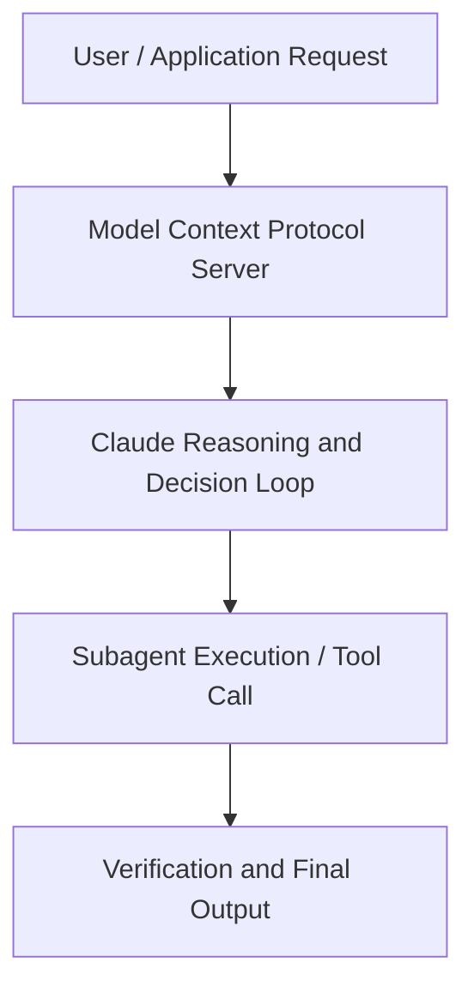

# Picking the right model

**Speaker(s):** Claude Engineering Team · **Channel:** Claude · **Date:** 2026-05-21
**Watch:** https://youtu.be/P0uMXS6emHA · **Format:** Talk · **Level:** Intermediate
**Topics:** LLM Fundamentals, AI Coding Tools

## TL;DR
This session explores picking the right model, highlighting core architecture, runtime workflows, and practical deployment patterns across LLM Fundamentals, AI Coding Tools. Speakers analyze technical implementations and share operational best practices for building robust systems with Anthropic, Claude.

## Contents
- [Architecture and Core Concepts in Picking the right model](#architecture-and-core-concepts-in-picking-the-right-model)
- [Technical Mechanics, Implementation Patterns, and Tooling](#technical-mechanics-implementation-patterns-and-tooling)
- [Operational Workflows, Evaluation, and Production Scaling](#operational-workflows-evaluation-and-production-scaling)
- [Strategic Implications, Governance, and Key Takeaways](#strategic-implications-governance-and-key-takeaways)

## Architecture and Core Concepts in Picking the right model

I'm in our applied AI team and today we're going to be talking about picking the right
model. What we're going to talk about today is picking the right model. This is something I think conceptually seems very easy, right? But the more we dig into it, the sort of more difficult
the problem uh tends to be. Uh we at Anthropic have just launched a new model. As usual, there's a lot of noise. Alongside the model launch, we will release a model card. You'll also see a lot of hot takes on X or Twitter from you know AGI
is here all the way to anthropic is cooked and there's you know various posts across the internet again giving
kind of hot takes on the quality of our our new model.

**Further reading:** Official documentation for Anthropic and Anthropic platform guides.

## Technical Mechanics, Implementation Patterns, and Tooling

A task being a kind of
test with a set of inputs, some success criteria,
and we want to basically build up a data set of these tests. Now the kind of
huristic I've been using for eval over the course of the last few months is thinking about them much like a maths
exam when you're at school. You have your question, you have your answer that
you need to get right. But it's also very important to show the working in between. I think this is especially
for a gentic type task exactly the sort of thing we should think about when evaluating the performance of a model. We will ultimately compose a data set with a set of questions or inputs to our
system. We want to of course check that our agent reaches the final outcome
correctly, but we also want to make sure it took the right steps to get there. The point being is the kind of working
is as important as the outcome.

**Further reading:** Official documentation for Anthropic and Anthropic platform guides.

## Operational Workflows, Evaluation, and Production Scaling

As you can see on the screen, they
actually both scored 100% as well, but counterintuitively took way less time in doing so. We
weren't super cost constrained on this task. We just wanted it to run as quickly as possible. Now, this is very
interesting, right? Because on the face of it, you would think that Haiku would be much faster, but actually some of the
more intelligent models can be much more efficient from a time perspective because they can do things in fewer
turns. They can effectively plan a little bit more strategically. They don't need to spend as much time
researching to validate what they're going to do is correct. So
what I think we can do is start playing around with these configs, thinking and effort to really like uh extract the
maximum value for for our specific use case.

**Further reading:** Official documentation for Anthropic and Anthropic platform guides.

## Strategic Implications, Governance, and Key Takeaways

Secondly, instead of these full
inefficient date timestamps, we just put a very simple date timestamp. Then
we also added a day of the week so called much more easily understands rather than having to think too much
about what day of the week every game is happening. In just cleaning up this response, we see a 66.4%
reduction in tokens from this tool response. If you're having an agent that is running multiple turns, your tool response doesn't just show up once, but
on every single turn in the conversation. So, these small hygiene things really
make a a huge impact. A couple more examples of this that I've worked on. I was working on a web search use case uh with a customer and we
effectively dduplicated articles that were returned from the same search or
from different searches in fact and this one this one trick effectively of
multiple searches running taking the articles and dduplicating them before they're returned to Claude led to a 77%
reduction in the number of input tokens that Claude was receiving a 65% %
reduction in cost and courts accuracy actually went up 9% because again it's
having to reason over less data and these metrics sound kind of like
plucked out of thin air but these are run and we can actually measure them because we built evals to begin with and
this is like huge amounts right if you can save 65% cost just by doing good context
engineering you can think again this opens up the ability to use a more intelligent model or this opens up the
ability to go and run whole new use cases for the given budget that you have. Again, I would encourage you not to just take an API response and pipe it back through your tool, but to actually
have your tool, especially a lot of tools wrap APIs and be a little bit more thoughtful, clean up that JSON response
you get back from the API before passing it back to Claude.

**Further reading:** Official documentation for Anthropic and Anthropic platform guides.

## Source
Full cleaned transcript: `DATA/videos/picking-the-right-model-2026.json`
Canonical recording: https://youtu.be/P0uMXS6emHA