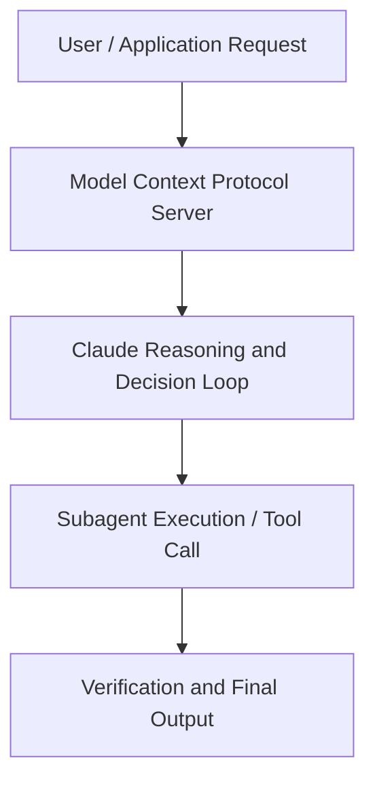

# Running an AI-native engineering org

**Speaker(s):** Fiona Fung, Fiona Fun · **Channel:** Claude · **Date:** 2026-05-09
**Watch:** https://youtu.be/igO8iyca2_g · **Format:** Talk · **Level:** Intermediate
**Topics:** AI Coding Tools, Backend/Infra

## TL;DR
This session explores running an ai-native engineering org, highlighting core architecture, runtime workflows, and practical deployment patterns across AI Coding Tools, Backend/Infra. Speakers analyze technical implementations and share operational best practices for building robust systems with Anthropic, Claude.

## Contents
- [Architecture and Core Concepts in Running an AI-native engineering org](#architecture-and-core-concepts-in-running-an-ai-native-engineering-org)
- [Technical Mechanics, Implementation Patterns, and Tooling](#technical-mechanics-implementation-patterns-and-tooling)
- [Operational Workflows, Evaluation, and Production Scaling](#operational-workflows-evaluation-and-production-scaling)
- [Strategic Implications, Governance, and Key Takeaways](#strategic-implications-governance-and-key-takeaways)

## Architecture and Core Concepts in Running an AI-native engineering org

There's something in the way I move that
keeps them on their own. Hey folks, do y'all hear me? I I I swear this is not a Claude code
thing, but do you guys mind if I take a
photo? Cuz because Boris and Jared had
their session at two, and I really
thought this was going to be empty. I'm
like, there was just no way people would
still be coming in from that session. Prom I promise me and Boris don't
just do selfie words all the time,
[laughter]
but good afternoon and thanks for
attending. Yeah, my name is Fiona Fun
and I lead cloud code and co-work
engineering and product. I work
really closely with Boris and cat and
before anthropic I had led and grown
teams at Meta and then also Microsoft.

**Further reading:** Official documentation for Anthropic and Anthropic platform guides.

## Technical Mechanics, Implementation Patterns, and Tooling

Now, uh
code reviews, what we'll get into a
little bit. It's not only like roles are
blurring, right? So between like
engineers can also now now have AI to
help augment non-engineering roles. My
non-engineering partners are also all
shipping code. What happens when
roles start blurring and you don't have
those you know uh like the silos anymore
and then that also goes to knowledge
share knowledge sharing and onboarding
and everything is another signal that
we're noticing at cloud code how we used
to do things change a little bit too
and so you know in the first section we
talked about the shift so within the
cloud code team what are some of the
norms that we have to rewrite so I want
to share some of those with you and then
you know hopefully some of them will
resonate with you or you might find
helpful ful
and so number one is code review uh like
human judgment of like who actually
needs it and we'll kind of go through
all of these but you know like the
onboarding has also changed how we do
planning you heard me talk about like
planning a lot hiring especially with
roles blurring and kind of team makeup
how that has changed for us too and also
org shape that's kind of one of my
favorite spicy topics I I'll share that
story with you all when I start
proposing that at anthropic I love my
recruiting partners parters are awesome
but I remembered you know one recruiting
partner really did think I was crazy so
I wanted to share that with y'all too so
how have planning changed but also
technical debates planning we do a lot
less of it like I I would also and also
the timing I call it like jit planning
almost like jit compiling because even
when I first joined I'm like don't we
need a six-month road map and you know
we put some effort in we wrote it it was
pretty good for three months and then I
came back o over the new year and and so
many things had changed already. I
realized, wow, six months road map just
seems like a little bit too long. Again, it's how do you make sure you
kind of like do just the right amount in
the right time because again,
prototyping and code generation is just
not the bottleneck that it used to be. The technical debate one is a fun one
too.

**Further reading:** Official documentation for Anthropic and Anthropic platform guides.

## Operational Workflows, Evaluation, and Production Scaling

Claude
wasn't that good at asky art in those
days and I remembered asking that's
where product sense really comes in. I
asked my design partner, hey can you
review this for me? She gave me such
good feedback. She's like, "You turn
Claude into like the Mr. Peanut
character." Because I was trying to make
him snow match. Okay, I'm going to do
something more simple. Claude was
like ice blue with snowflake. But keep
in mind kind of that product sense as
well.

**Further reading:** Official documentation for Anthropic and Anthropic platform guides.

## Strategic Implications, Governance, and Key Takeaways

That's just an an example of one day
I remember looking at the spreadsheet
going wait does this don't make sense
anymore. Always question and always
look to defrag and kill old processes. What I want to make sure that I leave a
lot of room for pods to adapt. It's uh
for for each team really has a lot of
high agency for how you know they do
triage or leverage cloud to do triage
any planning rituals or standups how
they think about on calls and also which
workflows to clottify first. We don't
usually mandate thou shalt automate
this. We have some suggestions and
learnings but always give room to your
team especially they may be you know
touching on different uh problem areas. If I zoom out what were the three
things I prioritize on you know I I when
I joined cloud code that I felt has make
the biggest difference keeping the team
as flat as possible um like managers
really pods of work but really keep it
agile. For example on on cloud code
and co-work we have one overall team
mission because sometimes when you start
creating pods each pod then wants maybe
to set up their own mission and then
anytime you have to shift it might be
take a lot of time to to walk people
through that but it's really as flat as
you can.

**Further reading:** Official documentation for Anthropic and Anthropic platform guides.

## Source
Full cleaned transcript: `DATA/videos/running-an-ai-native-engineering-org-2026-2.json`
Canonical recording: https://youtu.be/igO8iyca2_g